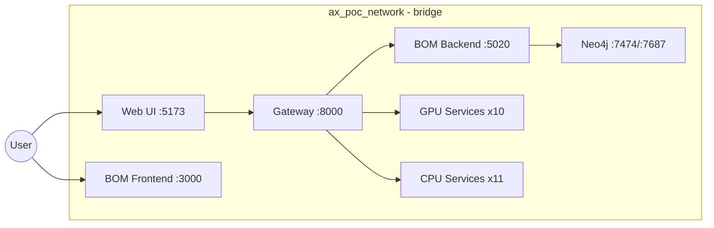
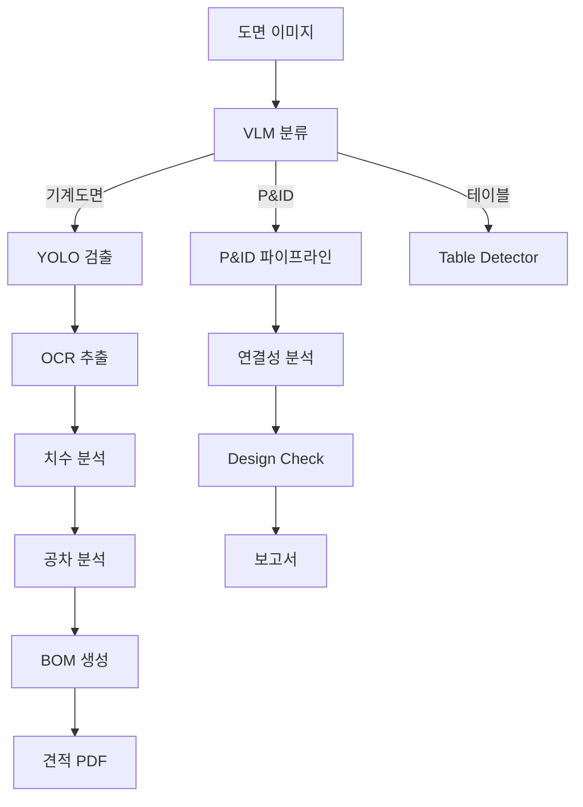

# Section 1: System Overview / 시스템 개요

## Pages (4)
1. **Architecture Map** - 전체 시스템 아키텍처 인터랙티브 맵
2. **Microservice Catalog** - 24개 서비스 상세 카탈로그
3. **Tech Stack** - 기술 스택 상세
4. **Port & Network Map** - 포트/네트워크 토폴로지

---

## Mermaid Diagrams

### 1. 21 Service Architecture Flowchart

```mermaid
flowchart TD
    subgraph Frontend
        WEB[Web UI :5173]
        BOM_FE[BOM Frontend :3000]
    end

    subgraph Orchestrator
        GW[Gateway API :8000]
    end

    subgraph Detection
        YOLO[YOLO v11 :5005]
        TABLE[Table Detector :5022]
    end

    subgraph OCR
        EDOCR[eDOCr2 :5002]
        PADDLE[PaddleOCR :5006]
        TESS[Tesseract :5008]
        TROCR[TrOCR :5009]
        ENS[OCR Ensemble :5011]
        SURYA[Surya OCR :5013]
        DOCTR[DocTR :5014]
        EASY[EasyOCR :5015]
    end

    subgraph Segmentation
        EDGE[EDGNet :5012]
        LINE[Line Detector :5016]
    end

    subgraph Preprocessing
        ESR[ESRGAN :5010]
    end

    subgraph Analysis
        SKIN[SkinModel :5003]
        PID[PID Analyzer :5018]
        DC[Design Checker :5019]
        BOM[Blueprint AI BOM :5020]
        COMP[PID Composer :5021]
    end

    subgraph Knowledge
        KN[Knowledge API :5007]
        NEO[Neo4j :7687]
    end

    subgraph AI
        VL[Vision-Language :5004]
    end

    WEB --> GW
    BOM_FE --> BOM
    GW --> YOLO & TABLE
    GW --> EDOCR & PADDLE & TESS & TROCR & ENS & SURYA & DOCTR & EASY
    GW --> EDGE & LINE
    GW --> ESR
    GW --> SKIN & PID & DC & BOM & COMP
    GW --> KN & VL
    KN --> NEO
```


### 2. Docker Network Graph


### 3. Data Flow TD


---

## React Components

### ArchitectureMap (React Flow)
```typescript
// Props
interface ArchitectureMapProps {
  services: ServiceInfo[];         // from apiRegistry.ts
  connections: Connection[];       // from docker-compose.yml
  onServiceClick: (id: string) => void;
  highlightCategory?: NodeCategory;
}

// Data source: docs-site/src/data/services.json
// Generated from: web-ui/src/config/apiRegistry.ts
```

### ServiceTable (React + Tailwind)
```typescript
interface ServiceTableProps {
  services: ServiceInfo[];
  sortBy?: 'name' | 'port' | 'category' | 'gpu';
  filterCategory?: NodeCategory;
  searchQuery?: string;
}

// Features: sortable columns, category filter, search, GPU badge
```

---

## Content Outline

### Page 1: Architecture Map
- Interactive React Flow diagram showing all 24 services
- Click service → sidebar with details (port, endpoints, GPU status)
- Color-coded by category (detection=blue, ocr=green, analysis=purple, etc.)
- Connection lines showing data flow

### Page 2: Microservice Catalog
- Filterable/sortable table of all 24 services
- Columns: Name, Port, Category, GPU, Status, Description
- Click row → expanded detail view with API endpoints

### Page 3: Tech Stack
- Frontend: React 19, TypeScript, Tailwind CSS, Zustand, React Flow
- Backend: FastAPI, Python 3.11, PyTorch, Ultralytics
- ML: YOLO v11, eDOCr2, PaddleOCR, Tesseract, TrOCR
- Infra: Docker Compose, Nginx, Neo4j, GitHub Actions

### Page 4: Port & Network Map
- Visual port map (5002-5022, 8000, 3000, 5173)
- Docker network topology
- Service dependencies

---

## Current Status & Roadmap
- **Current**: 24 services, 21 Docker containers, GPU 10 / CPU 11
- **Roadmap**: Kubernetes migration, service mesh, auto-scaling

## Maintenance Triggers
- New API service added → update service catalog + architecture map
- Port change → update port map
- Docker service added/removed → update network diagram
