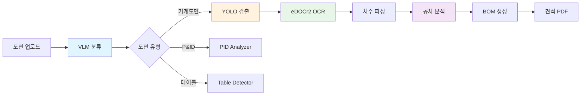
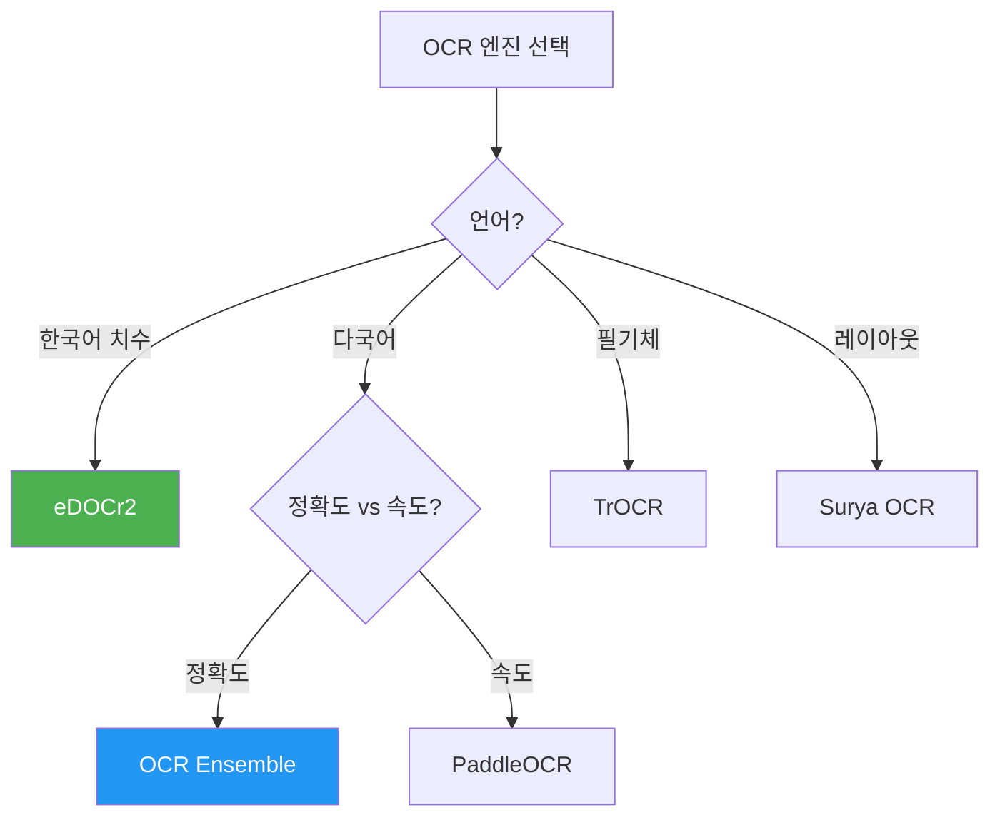
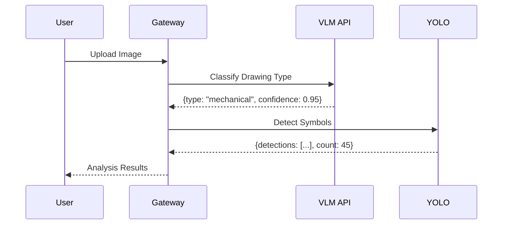

# Section 2: Analysis Pipeline / 분석 파이프라인

## Pages (6)
1. **Pipeline Overview** - 전체 분석 파이프라인 흐름
2. **VLM Classification** - 도면 유형 자동 분류
3. **YOLO Detection** - 심볼/부품 검출
4. **OCR Processing** - 8개 OCR 엔진 상세
5. **Tolerance Analysis** - 공차 분석 (SkinModel)
6. **Revision Comparison** - 리비전 비교

---

## Mermaid Diagrams

### 1. Analysis Pipeline LR


### 2. OCR Engine Selection TD


### 3. VLM Classification Sequence


### 4. YOLO Model Comparison
```mermaid
flowchart LR
    subgraph Models
        M1[YOLOv11n<br/>Fast, 3.2M params]
        M2[YOLOv11s<br/>Balanced, 9.4M]
        M3[YOLOv11m<br/>Accurate, 20.1M]
        M4[YOLOv11l<br/>Heavy, 25.3M]
    end

    subgraph Metrics
        MAP[mAP@50]
        SPD[Speed ms]
    end

    M1 --> MAP
    M2 --> MAP
    M3 --> MAP
    M4 --> MAP
```

---

## React Components

### PipelineViewer (React Flow)
```typescript
interface PipelineViewerProps {
  drawingType: 'mechanical' | 'pid' | 'table' | 'all';
  showMetrics?: boolean;
  interactive?: boolean;
}

// Features:
// - Toggle between drawing types to show different pipeline paths
// - Click node → show API details, processing time, sample output
// - Animated edges showing data flow direction
```

### YOLOModelComparison (Recharts)
```typescript
interface YOLOModelComparisonProps {
  models: ModelMetric[];  // mAP, speed, params for each model size
}

// Recharts grouped bar chart: mAP vs Speed for n/s/m/l models
```

### OCREngineMatrix
```typescript
interface OCREngineMatrixProps {
  engines: OCREngine[];  // 8 engines with capabilities
}

// Feature comparison matrix: language support, GPU, accuracy, speed
```

---

## Content Outline

### Page 1: Pipeline Overview
- End-to-end flow: Upload → Classify → Detect → OCR → Analyze → BOM → Quote
- Processing time benchmarks per stage
- Throughput: ~50 drawings/hour

### Page 2: VLM Classification
- Qwen2-VL model for drawing type classification
- Categories: mechanical, p&id, table, text, photo
- Accuracy: >95% on test set

### Page 3: YOLO Detection
- 73 detection classes (27 BOM + 46 annotation)
- SAHI support for high-resolution drawings
- Confidence threshold: 0.4 default
- Detection margin penalty for border regions

### Page 4: OCR Processing
- 8 engine comparison (eDOCr2, Paddle, Tesseract, TrOCR, Ensemble, Surya, DocTR, EasyOCR)
- Ensemble voting mechanism
- Korean dimension recognition specialization

### Page 5: Tolerance Analysis
- SkinModel Shapes for GD&T analysis
- Material types, manufacturing processes
- Correlation analysis

### Page 6: Revision Comparison
- Side-by-side revision overlay
- Change detection and highlighting
- Dimension delta tracking

---

## Data Sources
- `blueprint-ai-bom/backend/routers/analysis/core_router.py`
- `blueprint-ai-bom/backend/services/vlm_classifier.py`
- `blueprint-ai-bom/backend/services/dimension_service.py`
- `gateway-api/api_specs/yolo.yaml`
- `gateway-api/api_specs/edocr2.yaml`
- `gateway-api/api_specs/skinmodel.yaml`

## Maintenance Triggers
- New OCR engine added → update engine matrix
- YOLO model updated → update model comparison
- New detection classes → update class count
