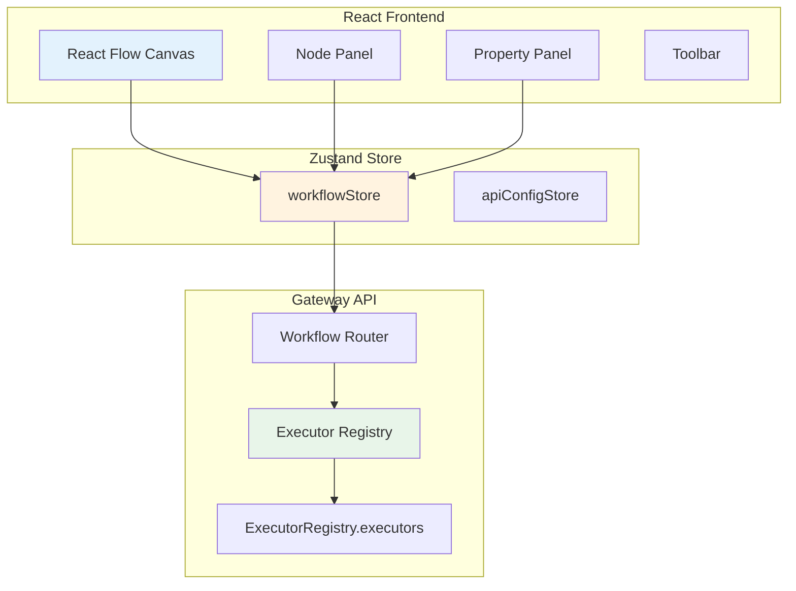
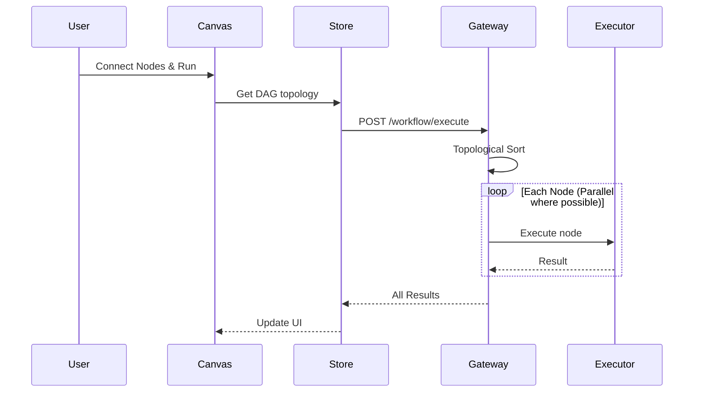
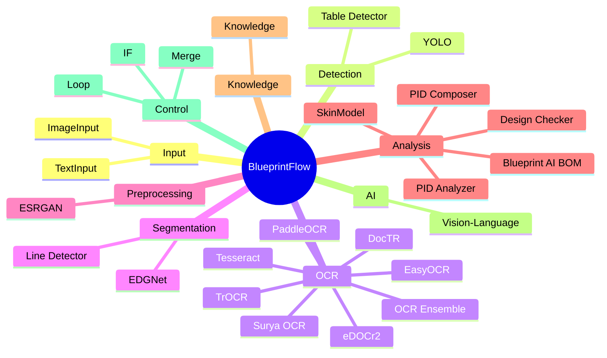

# Section 3: BlueprintFlow Builder / BlueprintFlow 빌더

## Pages (5)
1. **Builder Overview** - 비주얼 워크플로우 빌더 소개
2. **Node Catalog** - 29+ 노드 타입 카탈로그
3. **DAG Engine** - 의존성 기반 실행 엔진
4. **Templates** - 사전정의 워크플로우 템플릿
5. **Custom API Integration** - 커스텀 API 연동

---

## Mermaid Diagrams

### 1. Builder Architecture TD


### 2. Node Execution Sequence


### 3. Node Categories Mindmap


---

## React Components

### NodeCatalog (React + Tailwind)
```typescript
interface NodeCatalogProps {
  nodes: NodeDefinition[];
  filterCategory?: NodeCategory;
  searchQuery?: string;
  onNodeSelect?: (node: NodeDefinition) => void;
}

// Features:
// - Grid/List view toggle
// - Category tabs (input, detection, ocr, ...)
// - Search by name
// - Click card → parameter details, example I/O
// - Color-coded by category
```

### TemplateGallery
```typescript
interface TemplateGalleryProps {
  templates: WorkflowTemplate[];
  onPreview: (template: WorkflowTemplate) => void;
}

// Mini React Flow preview for each template
// Templates: Standard Analysis, P&ID Pipeline, OCR Comparison, etc.
```

### ExecutorTable
```typescript
interface ExecutorTableProps {
  executors: ExecutorInfo[];
}

// Table showing: Node Type → Executor → API Endpoint → Parameters
```

---

## Content Outline

### Page 1: Builder Overview
- Visual workflow editor built with React Flow
- Drag-and-drop node placement
- Real-time parameter configuration
- DAG-based parallel execution

### Page 2: Node Catalog
- 29+ node types across 9 categories
- Each node: icon, description, parameters, I/O types
- Category breakdown with usage examples

### Page 3: DAG Engine
- Topological sort for execution ordering
- Parallel execution of independent branches
- Error handling and partial results
- Executor registry pattern

### Page 4: Templates
- Pre-built workflow templates
- Standard Analysis, P&ID, OCR Comparison, BOM Generation
- Template parameters and customization

### Page 5: Custom API Integration
- Adding custom API nodes
- `scripts/create_api.py` scaffold
- Executor registration
- Node definition in `nodeDefinitions.ts`

---

## Data Sources
- `web-ui/src/config/nodes/*.ts` (10 category files)
- `gateway-api/blueprintflow/executors/executor_registry.py`
- `web-ui/src/config/templateDefinitions.ts`
- `web-ui/src/pages/blueprintflow/BlueprintFlowBuilder.tsx`
- `web-ui/src/store/workflowStore.ts`

## Maintenance Triggers
- New node type added → update Node Catalog page
- New template → update Templates page
- Executor changes → update DAG Engine page
