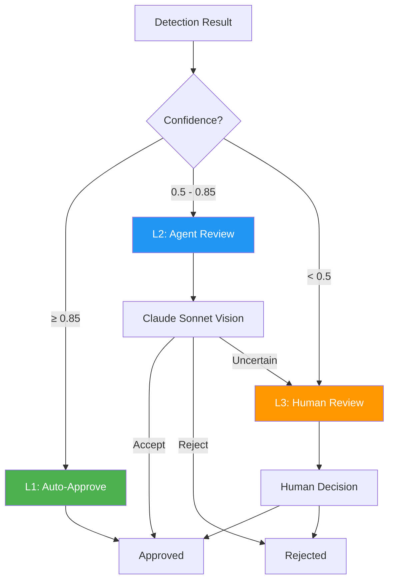
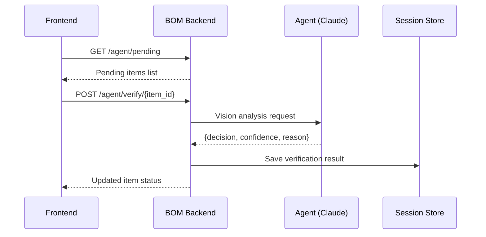

# Section 4: Agent Verification System / Agent 검증 시스템

## Pages (4)
1. **Verification Overview** - 3-Level 하이브리드 검증 소개
2. **3-Level Architecture** - L1 Auto / L2 Agent / L3 Human
3. **Agent API Reference** - 검증 API 엔드포인트 상세
4. **Dashboard & Metrics** - 검증 현황 대시보드

---

## Mermaid Diagrams

### 1. 3-Level Verification Flowchart


### 2. Agent API Sequence


### 3. Priority Matrix
```mermaid
quadrantChart
    title Verification Priority Matrix
    x-axis Low Confidence --> High Confidence
    y-axis Low Impact --> High Impact
    quadrant-1 Agent Review (L2)
    quadrant-2 Auto-Approve (L1)
    quadrant-3 Human Review (L3)
    quadrant-4 Agent + Confirm
```

---

## React Components

### VerificationFlow (React Flow)
```typescript
interface VerificationFlowProps {
  levels: VerificationLevel[];
  currentItems: VerificationItem[];
  stats: VerificationStats;
}

// Interactive 3-level diagram showing item flow
// Click level → see items at that stage
// Animated items moving through pipeline
```

### VerificationMetrics (Recharts)
```typescript
interface VerificationMetricsProps {
  stats: {
    total: number;
    l1Approved: number;
    l2Approved: number;
    l2Rejected: number;
    l3Pending: number;
    l3Completed: number;
  };
  history: DailyStats[];
}

// Pie chart: distribution by level
// Bar chart: daily verification volume
// Line chart: accuracy trend over time
```

---

## Content Outline

### Page 1: Verification Overview
- Problem: ML detection requires quality assurance
- Solution: 3-level hybrid verification
- Benefits: 80%+ auto-approved, human effort minimized

### Page 2: 3-Level Architecture
- **L1 Auto-Approve**: confidence ≥ 0.85, no human needed
- **L2 Agent Review**: Claude Sonnet vision analysis
- **L3 Human Review**: Complex cases, agent uncertain
- Confidence thresholds and tuning
- Keyboard shortcuts for rapid review

### Page 3: Agent API Reference
- `GET /agent/pending` - Pending verification items
- `POST /agent/verify/{item_id}` - Submit verification
- `GET /agent/stats` - Verification statistics
- `POST /agent/batch-verify` - Batch processing
- Request/response schemas

### Page 4: Dashboard & Metrics
- Real-time verification status
- Accuracy metrics (precision, recall, F1)
- Processing speed (items/minute)
- Active learning feedback loop

---

## Data Sources
- `blueprint-ai-bom/backend/routers/agent_verification_router.py`
- `blueprint-ai-bom/backend/services/active_learning_service.py`
- `blueprint-ai-bom/backend/services/agent_verify.py`

## Maintenance Triggers
- New verification level → update architecture diagram
- API endpoint changes → update API reference
- Threshold changes → update confidence values
