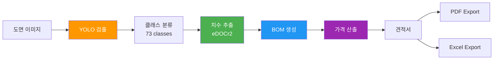
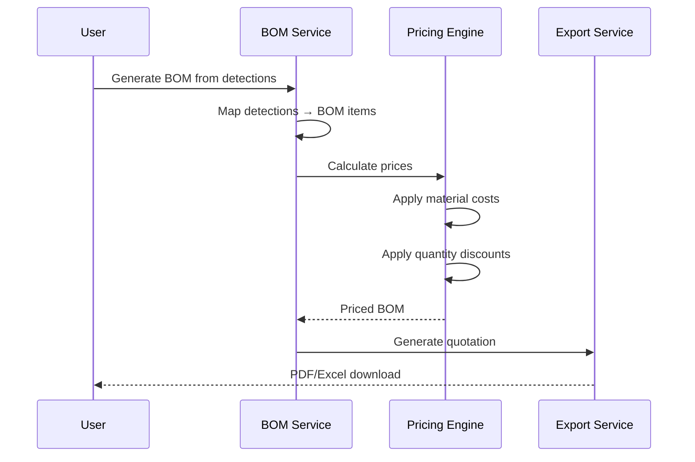
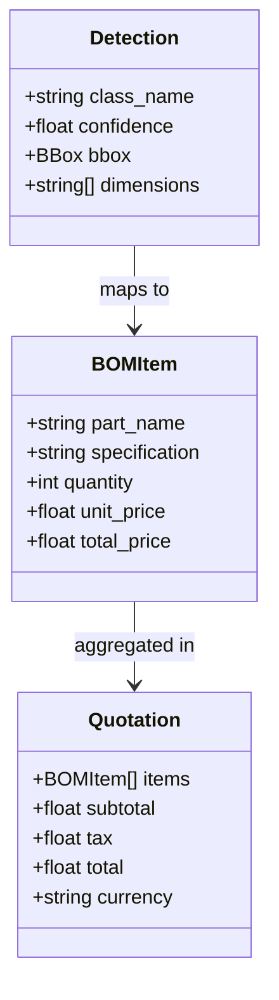

# Section 5: BOM Generation & Quoting / BOM 생성 및 견적

## Pages (5)
1. **BOM Pipeline** - 검출→BOM 변환 파이프라인
2. **Detection Classes (73)** - 전체 검출 클래스 갤러리
3. **Pricing Engine** - 가격 산출 엔진
4. **Export Formats** - Excel, PDF, JSON 내보내기
5. **PDF Report** - 견적 PDF 보고서

---

## Mermaid Diagrams

### 1. BOM Pipeline LR


### 2. Quotation Sequence


### 3. Detection → BOM Mapping


---

## React Components

### DetectionClassGallery
```typescript
interface DetectionClassGalleryProps {
  classes: DetectionClass[];  // 73 classes
  filterCategory?: 'bom' | 'annotation' | 'all';
  searchQuery?: string;
}

// Grid layout with example images
// 27 BOM classes + 46 annotation classes
// Click → class details, example detections, pricing info
```

### BOMTableDemo
```typescript
interface BOMTableDemoProps {
  bomItems: BOMItem[];
  editable?: boolean;
}

// Interactive BOM table showing typical output
// Sortable, editable quantities, real-time price calculation
```

### PricingBreakdown (Recharts)
```typescript
interface PricingBreakdownProps {
  quotation: Quotation;
}

// Stacked bar chart: cost breakdown by category
// Pie chart: material vs labor vs overhead
```

---

## Content Outline

### Page 1: BOM Pipeline
- End-to-end: Detection → Classification → Dimension → BOM → Quote
- Human-in-the-Loop verification at each stage
- 73 detection classes (27 BOM-relevant, 46 annotation)

### Page 2: Detection Classes
- 73 total classes with example images
- BOM classes: bolts, nuts, washers, bearings, seals, etc.
- Annotation classes: dimensions, tolerances, surface finish, etc.
- Class hierarchy and grouping

### Page 3: Pricing Engine
- Material cost database
- Quantity-based pricing tiers
- Manufacturing process multipliers
- Currency support

### Page 4: Export Formats
- Excel: structured BOM with pricing
- JSON: API-friendly format
- PDF: formatted quotation document
- Self-contained export package

### Page 5: PDF Report
- Quotation PDF layout
- Company branding customization
- Multi-page support
- Digital signature support

---

## Data Sources
- `blueprint-ai-bom/backend/services/bom_service.py`
- `blueprint-ai-bom/backend/services/cost_calculator.py`
- `blueprint-ai-bom/backend/services/quotation_service.py`
- `blueprint-ai-bom/backend/services/quotation_pdf_exporter.py`
- `models/yolo-api/classes_info_with_pricing.json`
- `models/yolo-api/class_examples/`

## Maintenance Triggers
- New detection class → update class gallery
- Pricing model change → update pricing engine page
- Export format added → update export page
