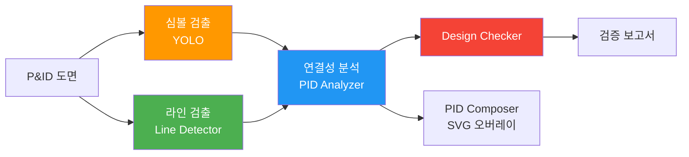
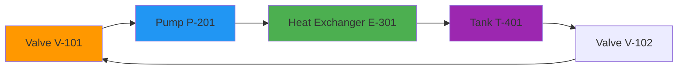
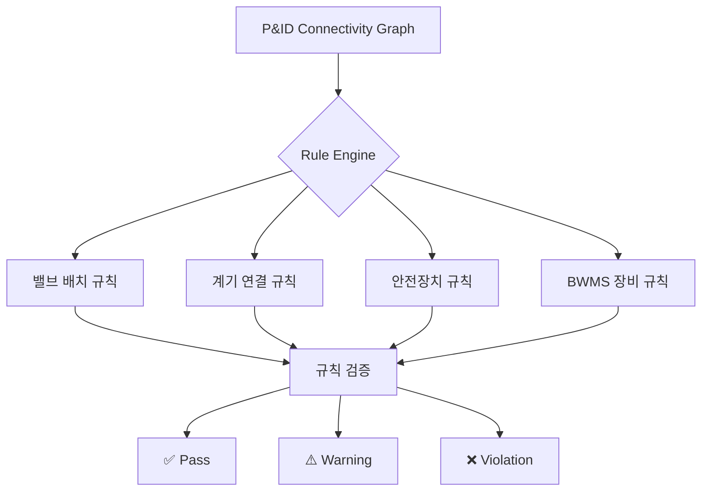
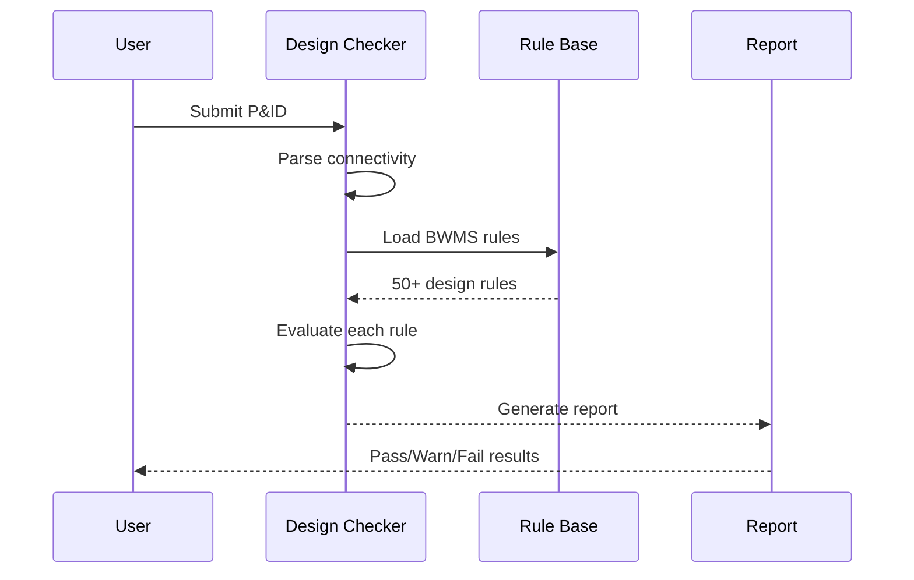

# Section 6: P&ID Analysis / P&ID 분석

## Pages (5)
1. **P&ID Overview** - P&ID 분석 파이프라인 소개
2. **Symbol Detection** - 심볼 검출 및 인식
3. **Line Detection** - 라인/배관 검출
4. **Connectivity Analysis** - 연결성 분석
5. **Design Checker** - 설계 규칙 검증

---

## Mermaid Diagrams

### 1. P&ID Pipeline LR


### 2. Connectivity Graph


### 3. Design Check Rule Engine TD


### 4. BWMS Equipment Sequence


---

## React Components

### PIDPipelineDiagram (React Flow)
```typescript
interface PIDPipelineDiagramProps {
  pipeline: PIDPipelineStep[];
  activeStep?: string;
  results?: PIDAnalysisResult;
}

// Interactive P&ID analysis pipeline
// Click step → see intermediate results
// Highlight active processing step
```

### ConnectivityGraph
```typescript
interface ConnectivityGraphProps {
  nodes: PIDSymbol[];
  edges: PIDConnection[];
  highlightPath?: string[];
}

// Interactive graph showing P&ID connectivity
// Click node → symbol details
// Trace flow path highlighting
```

### DesignCheckerResults
```typescript
interface DesignCheckerResultsProps {
  results: DesignCheckResult[];
  filterSeverity?: 'pass' | 'warning' | 'violation';
}

// Results table with severity badges
// Expandable rule details
// Filter by severity
```

---

## Content Outline

### Page 1: P&ID Overview
- P&ID (Piping and Instrumentation Diagram) analysis pipeline
- Symbol detection + Line detection → Connectivity → Design Check
- BWMS (Ballast Water Management System) specialization

### Page 2: Symbol Detection
- YOLO-based P&ID symbol detection
- Symbol categories: valves, pumps, instruments, tanks
- Detection confidence and NMS

### Page 3: Line Detection
- Line Detector API for pipe routing
- Line type classification (process, instrument, electrical)
- Intersection detection

### Page 4: Connectivity Analysis
- Graph-based connectivity analysis
- Equipment-to-equipment flow tracing
- BOM generation from P&ID

### Page 5: Design Checker
- Rule-based design verification
- BWMS equipment rules (50+)
- Compliance reporting
- Pass/Warning/Violation classification

---

## Data Sources
- `models/pid-analyzer-api/`
- `models/design-checker-api/bwms_rules.py`
- `models/line-detector-api/`
- `blueprint-ai-bom/backend/services/connectivity_analyzer.py`
- `models/pid-composer-api/`

## Maintenance Triggers
- New P&ID rules added → update Design Checker page
- Symbol classes changed → update Symbol Detection page
- Connectivity algorithm updated → update analysis page
