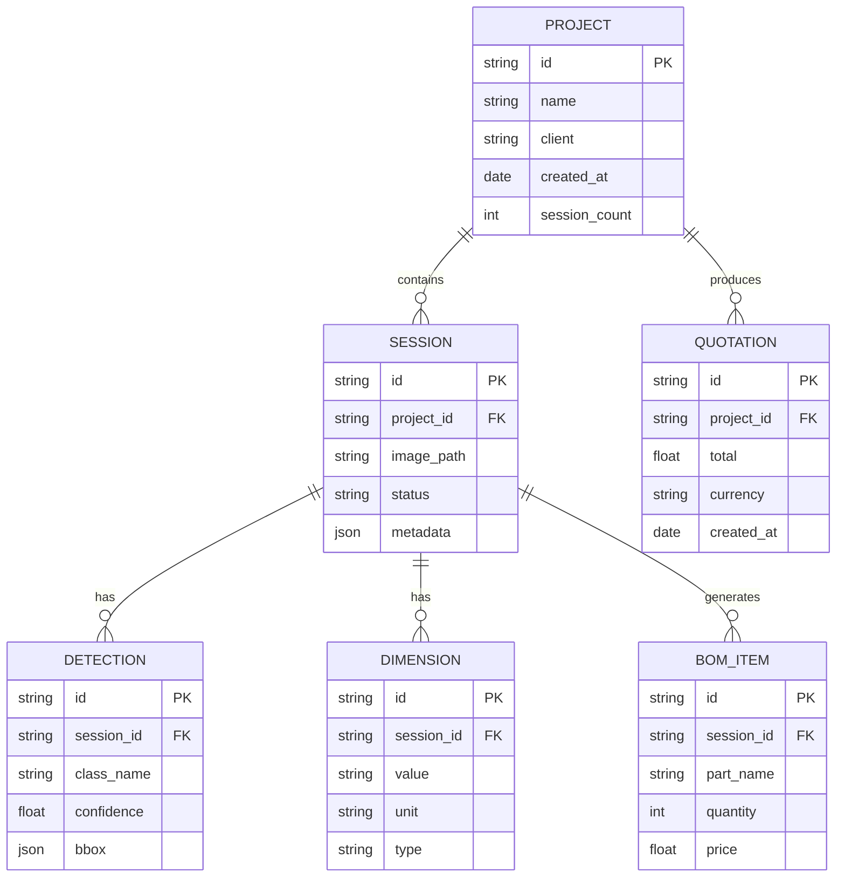
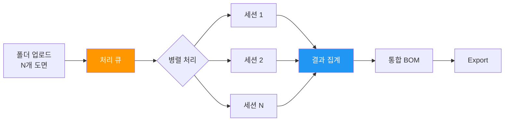
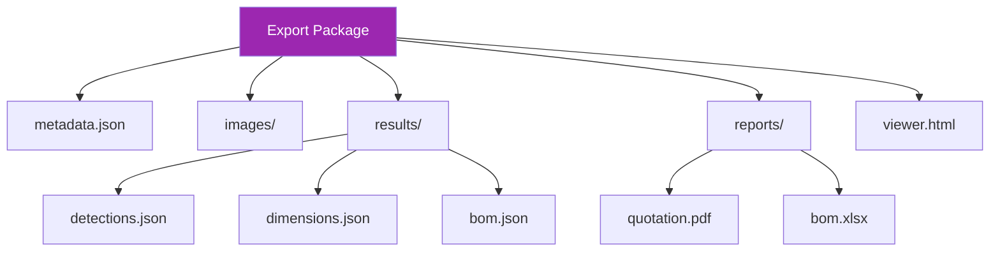

# Section 7: Batch Processing & Delivery / 배치 처리 및 납품

## Pages (4)
1. **Batch Processing** - 대량 도면 일괄 분석
2. **Project Management** - 프로젝트 계층 관리
3. **Export Package** - 납품 패키지 생성
4. **Self-contained Export** - 독립 실행 가능 내보내기

---

## Mermaid Diagrams

### 1. Project Hierarchy ER


### 2. Batch Processing LR


### 3. Export Package Structure TD


---

## React Components

### ProjectHierarchy (React Flow)
```typescript
interface ProjectHierarchyProps {
  project: Project;
  sessions: Session[];
  expandedSession?: string;
}

// Tree visualization: Project → Sessions → Detections/BOM
// Click session → expand to show results
// Drag to reorder sessions
```

### ExportPackageExplorer
```typescript
interface ExportPackageExplorerProps {
  packageStructure: FileNode[];
  onFileSelect: (path: string) => void;
}

// File tree view showing export package contents
// Preview files inline
// Download individual files or full package
```

---

## Content Outline

### Page 1: Batch Processing
- Upload folder of drawings → automatic parallel processing
- DSE Bearing project example: 53 sessions, 2,710 dimensions
- Progress tracking and status reporting
- Error handling and retry logic

### Page 2: Project Management
- Project → Session hierarchy
- Session status tracking (pending, processing, completed)
- Assembly group organization (T3~T8 + THRUST)
- Project-level BOM aggregation

### Page 3: Export Package
- Complete analysis results packaging
- JSON + Excel + PDF formats
- Image overlays with detection results
- Metadata for traceability

### Page 4: Self-contained Export
- Standalone HTML viewer
- No server dependency
- Offline-capable review tool
- Script generation for automation

---

## Data Sources
- `blueprint-ai-bom/backend/routers/batch_router.py`
- `blueprint-ai-bom/backend/services/project_service.py`
- `blueprint-ai-bom/backend/services/export_service.py`
- `blueprint-ai-bom/backend/services/self_contained_export_service.py`
- `blueprint-ai-bom/backend/services/export_script_generator.py`

## Maintenance Triggers
- Export format added → update Export page
- Batch processing changes → update Batch page
- Project hierarchy changes → update ER diagram
