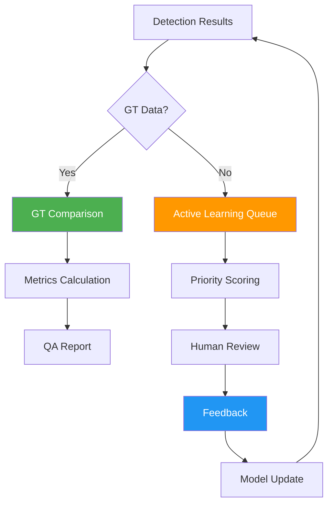
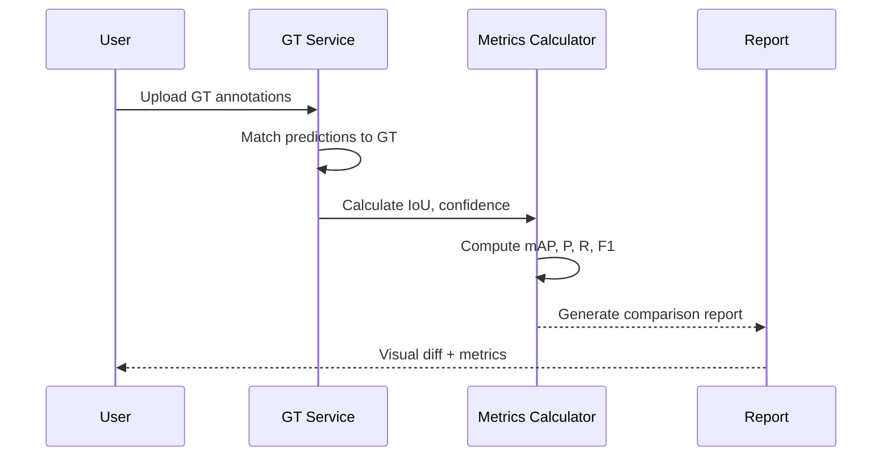
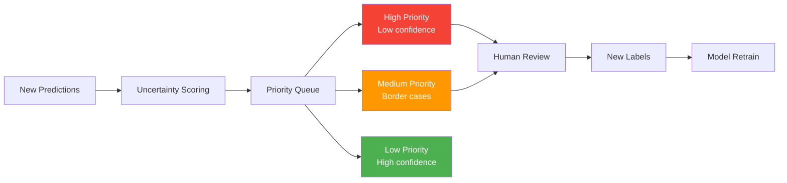
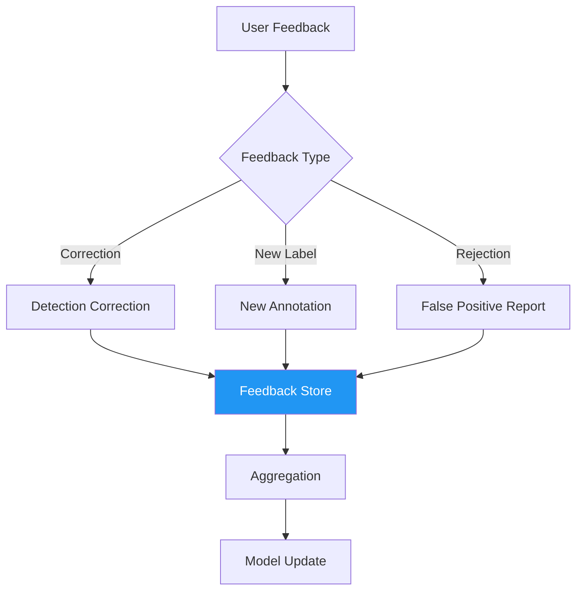

# Section 8: Quality Assurance / 품질 보증

## Pages (5)
1. **QA Overview** - 품질 보증 체계 개요
2. **Ground Truth Comparison** - GT 비교 분석
3. **Active Learning** - 능동 학습 파이프라인
4. **Feedback Pipeline** - 사용자 피드백 처리
5. **OCR Metrics** - OCR 성능 메트릭

---

## Mermaid Diagrams

### 1. QA Lifecycle TD


### 2. GT Comparison Sequence


### 3. Active Learning Priority Queue LR


### 4. Feedback Pipeline TD


---

## React Components

### QAMetrics (Recharts)
```typescript
interface QAMetricsProps {
  metrics: {
    mAP: number;
    precision: number;
    recall: number;
    f1: number;
  };
  history: MetricHistory[];
  perClass?: ClassMetric[];
}

// Line chart: metric trends over time
// Radar chart: P/R/F1/mAP overview
// Bar chart: per-class performance
```

### GTComparisonViewer
```typescript
interface GTComparisonViewerProps {
  predictions: Detection[];
  groundTruth: Detection[];
  image: string;
  showOverlay?: boolean;
}

// Side-by-side or overlay comparison
// Color-coded: TP=green, FP=red, FN=yellow
// IoU threshold slider
```

---

## Content Outline

### Page 1: QA Overview
- Quality assurance across the entire pipeline
- GT comparison + Active Learning + Feedback = continuous improvement
- Key metrics: mAP@50, Precision, Recall, F1

### Page 2: Ground Truth Comparison
- GT annotation format and upload
- Matching algorithm (IoU-based)
- Visual diff viewer
- Per-class and overall metrics

### Page 3: Active Learning
- Uncertainty-based sample selection
- Priority queue: low confidence → high priority
- Human-in-the-loop annotation
- Incremental model improvement

### Page 4: Feedback Pipeline
- User correction workflow
- Feedback types: correction, new label, rejection
- Aggregation and model update triggers
- Version tracking

### Page 5: OCR Metrics
- Character-level accuracy (CER)
- Word-level accuracy (WER)
- Dimension parsing accuracy
- Engine-specific benchmarks

---

## Data Sources
- `blueprint-ai-bom/backend/routers/gt_router.py`
- `blueprint-ai-bom/backend/services/active_learning_service.py`
- `blueprint-ai-bom/backend/services/feedback_pipeline.py`
- `blueprint-ai-bom/backend/routers/feedback_router.py`

## Maintenance Triggers
- New metric type → update QA Metrics page
- Feedback pipeline changes → update Feedback page
- Active learning algorithm changes → update AL page
