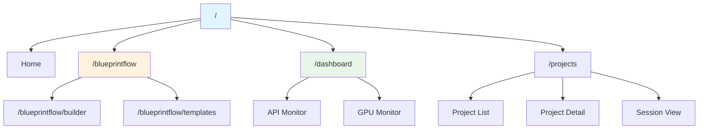
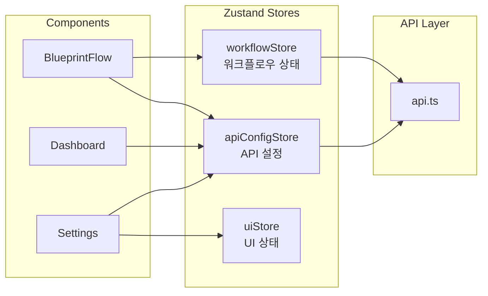
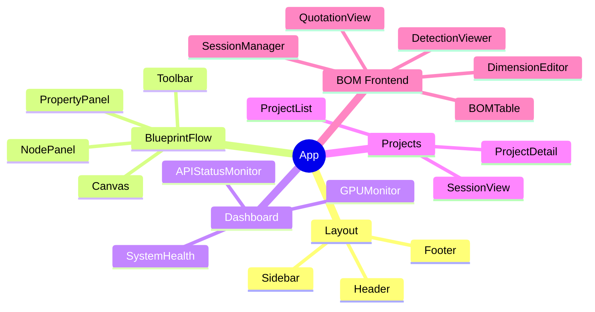
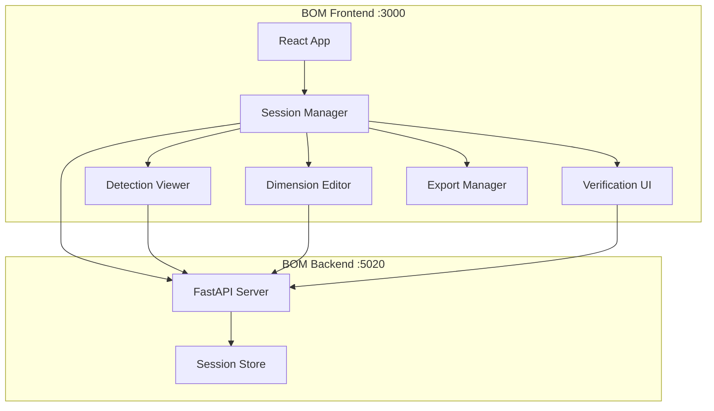

# Section 9: Frontend Architecture / 프론트엔드 아키텍처

## Pages (5)
1. **App Structure** - React 19 앱 구조
2. **Routing & Pages** - 라우팅 및 페이지 구성
3. **State Management** - Zustand 상태 관리
4. **Component Library** - 공통 컴포넌트 라이브러리
5. **BOM Frontend** - Blueprint AI BOM 프론트엔드

---

## Mermaid Diagrams

### 1. App Route Map TD


### 2. State Management LR


### 3. Component Hierarchy Mindmap


### 4. BOM Frontend Architecture TD


---

## React Components

### RouteMap (Interactive)
```typescript
interface RouteMapProps {
  routes: RouteInfo[];
  currentRoute?: string;
  onRouteClick: (path: string) => void;
}

// Clickable route tree
// Highlight current route
// Show page component and description
```

### StateFlow (React Flow)
```typescript
interface StateFlowProps {
  stores: StoreInfo[];
  components: ComponentInfo[];
  subscriptions: Subscription[];
}

// Interactive diagram showing state flow
// Stores → Components subscriptions
// Click store → see state shape
```

### ComponentTree
```typescript
interface ComponentTreeProps {
  root: ComponentNode;
  expandLevel?: number;
}

// Collapsible component hierarchy tree
// Show props interface for each component
// Link to source file
```

---

## Content Outline

### Page 1: App Structure
- React 19 with TypeScript
- Vite build system
- Tailwind CSS styling
- File structure: pages/, components/, store/, config/, lib/

### Page 2: Routing & Pages
- React Router v6
- Route hierarchy
- Page components and layouts
- Lazy loading strategy

### Page 3: State Management
- Zustand stores: workflowStore, apiConfigStore, uiStore
- Store patterns and best practices
- API integration layer (api.ts)
- Optimistic updates

### Page 4: Component Library
- Shared UI components
- Node components for BlueprintFlow
- Dashboard widgets
- Form components and validation

### Page 5: BOM Frontend
- Separate React app (port 3000)
- Session management interface
- Detection viewer with annotation tools
- Dimension editor with inline editing
- Verification UI with keyboard shortcuts

---

## Data Sources
- `web-ui/src/App.tsx`
- `web-ui/src/store/*.ts` (workflowStore, apiConfigStore)
- `web-ui/src/components/`
- `web-ui/src/pages/`
- `blueprint-ai-bom/frontend/`

## Maintenance Triggers
- New route added → update Route Map page
- New store created → update State Management page
- Component library changes → update Component Library page
- BOM frontend changes → update BOM Frontend page
