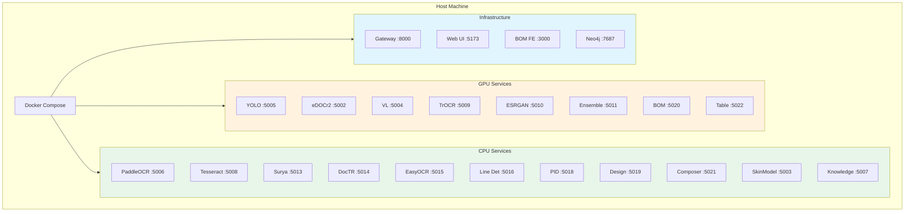
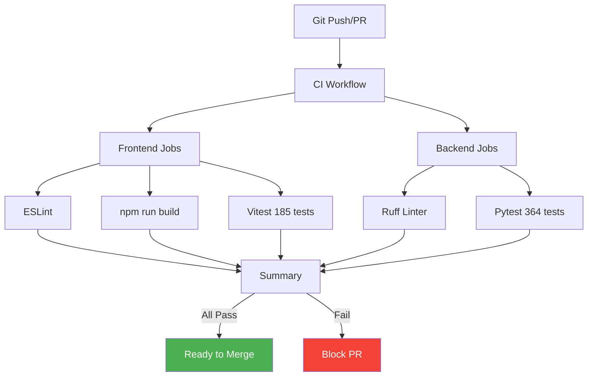
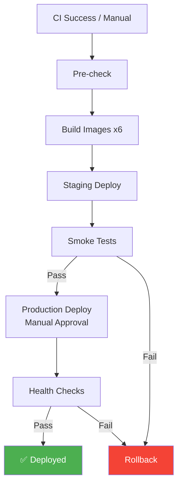
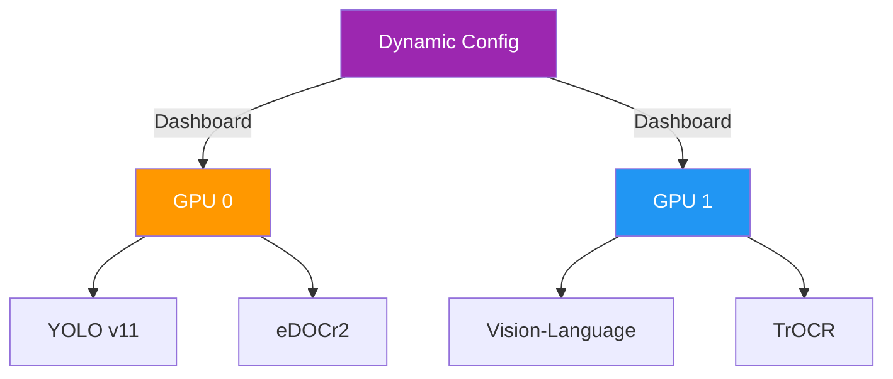

# Section 10: DevOps & Infrastructure / DevOps 및 인프라

## Pages (5)
1. **DevOps Overview** - DevOps 체계 개요
2. **Docker Compose** - 컨테이너 오케스트레이션
3. **CI Pipeline** - 지속적 통합
4. **CD Pipeline** - 지속적 배포
5. **GPU Configuration** - GPU 설정 및 할당

---

## Mermaid Diagrams

### 1. Docker Architecture Graph


### 2. CI Pipeline TD


### 3. CD Pipeline TD


### 4. GPU Allocation TD


---

## React Components

### CIPipelineViewer
```typescript
interface CIPipelineViewerProps {
  pipeline: CIStep[];
  currentRun?: CIRun;
  history: CIRun[];
}

// Visual CI pipeline with step status
// Click step → see logs, duration, test results
// History timeline
```

### ServicePortMap
```typescript
interface ServicePortMapProps {
  services: ServicePort[];
  groupBy?: 'category' | 'gpu' | 'status';
}

// Visual grid showing port allocation
// Color-coded by category
// Status indicators (running/stopped)
```

### DeploymentTimeline (Recharts)
```typescript
interface DeploymentTimelineProps {
  deployments: Deployment[];
  timeRange: [Date, Date];
}

// Timeline chart showing deployment history
// Mark success/failure/rollback events
// Duration metrics
```

---

## Content Outline

### Page 1: DevOps Overview
- Docker-based microservice architecture
- GitHub Actions CI/CD
- GPU resource management
- Monitoring and health checks

### Page 2: Docker Compose
- 21 containerized services
- Network: ax_poc_network (bridge)
- Volume mounts for model persistence
- GPU device reservation
- docker-compose.override.yml for local development

### Page 3: CI Pipeline
- Trigger: push to main/develop, PRs
- Frontend: ESLint → build → Vitest (185 tests)
- Backend: Ruff → Pytest (364 tests)
- Total: 549 tests
- Summary report generation

### Page 4: CD Pipeline
- Pre-check → Build → Staging → Production
- 6 Docker images built
- Smoke test suite
- Manual production approval gate
- Automatic rollback on failure

### Page 5: GPU Configuration
- Dynamic GPU allocation via Dashboard
- docker-compose.override.yml for GPU mapping
- Memory limit configuration
- Multi-GPU support

---

## Data Sources
- `docker-compose.yml`
- `.github/workflows/ci.yml`
- `.github/workflows/cd.yml`
- `gateway-api/routers/gpu_config_router.py`
- `gateway-api/routers/docker_router.py`

## Maintenance Triggers
- Docker service added/removed → update Docker page
- CI/CD workflow changed → update pipeline pages
- GPU config changes → update GPU page
