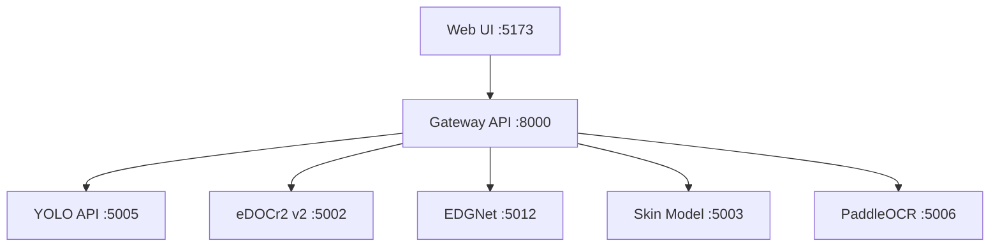

# 🏗️ System Architecture

**Detailed architecture and design decisions**

---

## 🎯 System Overview

### Core Purpose
Automated mechanical drawing analysis and manufacturing quote generation

### Tech Stack
- **Backend**: FastAPI (Python 3.10)
- **Frontend**: React + TypeScript
- **Models**: YOLO v11, eDOCr2, EDGNet, Skin Model
- **Deployment**: Docker Compose
- **GPU**: NVIDIA RTX 3080 (CUDA-enabled services)

---

## 📐 Microservices Architecture

### Service Map



### Service Responsibilities

**Gateway API** (Port 8000)
- Orchestrates all services
- Handles file uploads
- Manages pipeline execution (Speed/Hybrid modes)
- Generates quotes and PDFs
- **Status**: ✅ Healthy

**YOLO API** (Port 5005)
- Object detection on drawings
- 14 classes: dimensions, GD&T, surface roughness, text blocks
- Generates visualization images
- **Status**: ✅ Healthy (GPU)

**eDOCr2 v2 API** (Port 5002)
- High-precision OCR for engineering drawings
- Frame detection + table OCR
- GPU preprocessing for speed
- **Status**: ✅ Healthy (GPU)

**EDGNet API** (Port 5012)
- Segmentation into layers (contours, text, dimensions)
- Graph generation
- Bezier curve processing
- **Status**: ⚠️ Unhealthy (pre-existing issue)

**Skin Model API** (Port 5003)
- ML-based tolerance prediction
- GD&T validation
- Manufacturability analysis
- **Status**: ✅ Healthy

**PaddleOCR API** (Port 5006)
- Fast auxiliary OCR
- Used in YOLO Crop OCR strategy
- **Status**: ✅ Healthy (GPU)

---

## 🗂️ Modular Code Structure

**All APIs follow this pattern** (post-refactoring):

```
{api-name}/
├── api_server.py          (200-350 lines) ← Endpoints only
├── models/
│   ├── __init__.py        ← Exports
│   └── schemas.py         ← Pydantic models
├── services/
│   ├── __init__.py        ← Exports
│   └── {service}.py       ← Business logic
├── utils/
│   ├── __init__.py        ← Exports
│   └── helpers.py         ← Utility functions
├── Dockerfile
└── requirements.txt
```

**Benefits**:
- ✅ Files <200 lines (LLM-friendly)
- ✅ Clear separation of concerns
- ✅ Easy to test in isolation
- ✅ Consistent across all services

---

## 🔄 Data Flow

### Speed Mode Pipeline

```
1. Upload image → Gateway
2. Gateway → YOLO (detect objects)
3. Gateway → eDOCr2 (extract text)
4. Gateway → Skin Model (predict tolerances)
5. Gateway → Merge results
6. Gateway → Generate quote PDF
```

**Processing time**: ~19s

### Hybrid Mode Pipeline

```
1. Upload image → Gateway
2. Gateway → YOLO (detect objects)
3. For each YOLO bbox:
   - Crop region
   - Upscale if small
   - Gateway → eDOCr2 (precise OCR on crop)
4. Gateway → eDOCr2 (full image OCR)
5. Ensemble: Merge crop results + full results (weighted)
6. Gateway → Skin Model (predict tolerances)
7. Gateway → Generate quote PDF
```

**Processing time**: ~40-50s
**Accuracy**: ~95% (vs ~93% Speed mode)

---

## 🎨 Design Patterns

### Singleton Pattern
**Where**: eDOCr2 v2 API - OCRService
**Why**: Model loading is expensive, share instance across requests
```python
class OCRService:
    _instance = None
    def __new__(cls):
        if cls._instance is None:
            cls._instance = super().__new__(cls)
        return cls._instance
```

### Service Layer Pattern
**Where**: All APIs
**Why**: Separate business logic from HTTP layer
```python
# api_server.py
from services import YOLOInferenceService
yolo_service = YOLOInferenceService()
result = yolo_service.predict(image_bytes)
```

### Dependency Injection
**Where**: Gateway API - ensemble_service.py
**Why**: Loose coupling, testable
```python
def process_yolo_crop_ocr(
    image_bytes: bytes,
    yolo_detections: List,
    call_edocr2_ocr_func: Callable,  # ← Injected
    crop_bbox_func: Callable,        # ← Injected
    is_false_positive_func: Callable # ← Injected
):
    # Use injected functions
```

---

## 🔐 Security Considerations

### File Upload
- Size limit: 50MB
- Allowed types: .jpg, .png, .pdf
- Temporary storage: /tmp/{service}/uploads
- Auto cleanup: 1 hour

### API Access
- CORS: Enabled (*)
- Authentication: None (internal network)
- Rate limiting: None (TODO)

---

## 📊 Performance Characteristics

### Latency

| Operation | Target | Actual | Status |
|-----------|--------|--------|--------|
| YOLO inference | <1s | 0.26s | ✅ Excellent |
| eDOCr2 OCR | <30s | 17.8s | ✅ Good |
| PaddleOCR | <10s | 7.1s | ✅ Good |
| Gateway Speed | <20s | 18.9s | ✅ Good |
| Gateway Hybrid | <60s | 40-50s | ✅ Good |

### Throughput
- Concurrent requests: 5-10 (GPU limitation)
- Queue: None (TODO: Add Redis queue)

### Resource Usage
- GPU Memory: ~4GB (YOLO + eDOCr2 + PaddleOCR)
- CPU: 8 cores recommended
- RAM: 16GB recommended

---

## 🔧 Technology Decisions

### Why FastAPI?
- Async support for parallel API calls
- Automatic OpenAPI docs
- Pydantic validation
- Fast performance

### Why Docker Compose?
- Easy development setup
- Service isolation
- GPU pass-through support
- Production-like environment

### Why Modular Architecture?
- LLM-friendly file sizes (<200 lines)
- Testable components
- Reusable code
- Clear boundaries

---

## 🚧 Known Limitations

### EDGNet Container
- **Issue**: Container unhealthy
- **Impact**: Segmentation unavailable
- **Workaround**: Use `use_segmentation=false`
- **Status**: Under investigation

### No Caching
- **Impact**: Same image processed multiple times
- **Plan**: Add Redis caching (Phase 3)

### No Rate Limiting
- **Impact**: Potential resource exhaustion
- **Plan**: Add rate limiting (Phase 3)

---

## 🔗 Related Documents

- [QUICK_START.md](QUICK_START.md) - Get started quickly
- [WORKFLOWS.md](WORKFLOWS.md) - Common tasks
- [REFACTORING_COMPLETE.md](REFACTORING_COMPLETE.md) - Refactoring details

---

**Last Updated**: 2025-11-19
**Version**: 2.0 (Post-refactoring)
