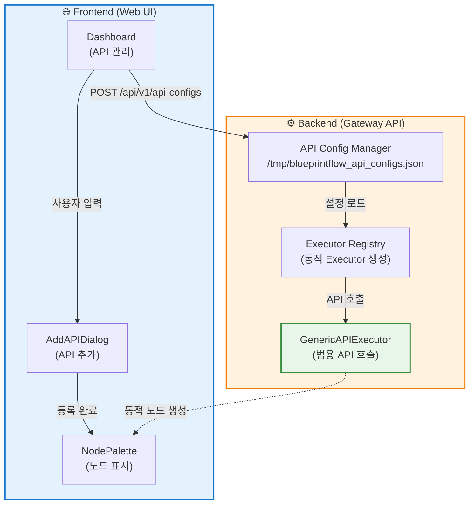

# 🚀 Dynamic API System Guide

## 개요

**Dynamic API System**은 코드 수정 없이 런타임에 새로운 API를 추가/제거할 수 있는 시스템입니다.

### ✅ 핵심 장점

1. **코드 수정 불필요**: YOLO를 다른 모델로 교체 시 코드 변경 없음
2. **재배포 불필요**: 서버 재시작 없이 API 추가/제거 가능
3. **설정 기반**: JSON 설정만으로 모든 API 정의
4. **자동 통합**: Dashboard에서 추가하면 BlueprintFlow에 자동 반영

---

## 🏗️ 시스템 아키텍처

### 시각적 구조도



### 상세 구조 (텍스트)

```text
┌─────────────────────────────────────────────────────────┐
│                 🌐 Frontend (Web UI)                     │
│  ┌──────────────┐  ┌──────────────┐  ┌───────────────┐ │
│  │  Dashboard   │→ │ AddAPIDialog │→ │ NodePalette   │ │
│  │  (API 관리)  │  │  (API 추가)  │  │  (노드 표시)  │ │
│  └──────────────┘  └──────────────┘  └───────────────┘ │
│         ↓                                        ↑       │
│    POST /api/v1/api-configs                     │       │
└─────────────────────────────────────────────────────────┘
                         │                         │
                         ↓                         ↑
┌─────────────────────────────────────────────────────────┐
│               ⚙️ Backend (Gateway API)                   │
│  ┌────────────────────────────────────────────────────┐ │
│  │  📋 API Config Manager                             │ │
│  │  - /tmp/blueprintflow_api_configs.json            │ │
│  │  - 영구 저장 및 관리                               │ │
│  └────────────────────────────────────────────────────┘ │
│         ↓                                               │
│  ┌────────────────────────────────────────────────────┐ │
│  │  🔧 Executor Registry (동적 Executor 생성)         │ │
│  │  - 기본: yolo, edocr2, edgnet, skinmodel, vl...  │ │
│  │  - 커스텀 API → GenericAPIExecutor 자동 사용      │ │
│  └────────────────────────────────────────────────────┘ │
│         ↓                                               │
│  ┌────────────────────────────────────────────────────┐ │
│  │  🚀 GenericAPIExecutor (범용 API 호출)             │ │
│  │  - REST API 호출 (POST/GET)                        │ │
│  │  - 이미지 처리 (multipart/form-data)              │ │
│  │  - 응답 매핑 (outputMappings)                     │ │
│  │  - 에러 처리 및 재시도                            │ │
│  └────────────────────────────────────────────────────┘ │
└─────────────────────────────────────────────────────────┘
```

---

## 📝 API Config 구조

### 최소 설정 예시

```json
{
  "id": "custom-detection",
  "name": "Custom Detection API",
  "displayName": "Custom Detector",
  "baseUrl": "http://custom-api:5000",
  "endpoint": "/api/v1/detect",
  "method": "POST",
  "icon": "🎯",
  "color": "#ff6b6b",
  "category": "api",
  "description": "사용자 정의 객체 검출 API",
  "enabled": true,
  "requiresImage": true,
  "inputs": [
    {
      "name": "image",
      "type": "string",
      "description": "Base64 인코딩된 이미지",
      "required": true
    }
  ],
  "outputs": [
    {
      "name": "detections",
      "type": "array",
      "description": "검출된 객체 목록"
    },
    {
      "name": "total_count",
      "type": "integer",
      "description": "검출 개수"
    }
  ],
  "parameters": [
    {
      "name": "confidence",
      "type": "number",
      "default": 0.5,
      "min": 0.0,
      "max": 1.0,
      "step": 0.05,
      "description": "신뢰도 임계값",
      "required": false
    }
  ],
  "outputMappings": {
    "detections": "data.results",
    "total_count": "data.count"
  }
}
```

### 필드 설명

| 필드 | 타입 | 필수 | 설명 |
|------|------|------|------|
| `id` | string | ✅ | 고유 식별자 (영문, 숫자, `-`, `_`) |
| `name` | string | ✅ | API 이름 |
| `displayName` | string | ✅ | UI 표시 이름 |
| `baseUrl` | string | ✅ | API 기본 URL (예: `http://api:5000`) |
| `endpoint` | string | ❌ | API 엔드포인트 (기본: `/api/v1/process`) |
| `method` | string | ❌ | HTTP 메서드 (`POST`, `GET`, 기본: `POST`) |
| `icon` | string | ✅ | 이모지 아이콘 (예: 🎯, 📝, 🔍) |
| `color` | string | ✅ | 노드 색상 (hex, 예: `#3b82f6`) |
| `category` | string | ✅ | 카테고리 (`api`, `control`) |
| `description` | string | ✅ | 노드 설명 |
| `enabled` | boolean | ❌ | 활성화 여부 (기본: `true`) |
| `requiresImage` | boolean | ❌ | 이미지 입력 필요 여부 (기본: `true`) |
| `inputs` | array | ✅ | 입력 스키마 |
| `outputs` | array | ✅ | 출력 스키마 |
| `parameters` | array | ❌ | 파라미터 정의 |
| `outputMappings` | object | ❌ | 응답 필드 매핑 |

---

## 🛠️ 사용 방법

### 1. Dashboard에서 API 추가

```
http://localhost:5173/dashboard
→ "API 추가" 버튼 클릭
→ API Config 입력
→ 저장
```

### 2. BlueprintFlow Builder에서 사용

```
http://localhost:5173/blueprintflow/builder
→ Node Palette에서 새 API 노드 확인
→ 드래그 앤 드롭으로 워크플로우에 추가
→ 실행
```

### 3. API Endpoints (Backend 직접 사용)

#### GET /api/v1/api-configs
**모든 Custom API 조회**

```bash
curl http://localhost:8000/api/v1/api-configs
```

**응답**:
```json
{
  "status": "success",
  "configs": [...],
  "count": 5
}
```

#### POST /api/v1/api-configs
**Custom API 추가**

```bash
curl -X POST http://localhost:8000/api/v1/api-configs \
  -H "Content-Type: application/json" \
  -d @api_config.json
```

#### PUT /api/v1/api-configs/{api_id}
**Custom API 업데이트**

```bash
curl -X PUT http://localhost:8000/api/v1/api-configs/custom-detection \
  -H "Content-Type: application/json" \
  -d '{"enabled": false}'
```

#### DELETE /api/v1/api-configs/{api_id}
**Custom API 삭제**

```bash
curl -X DELETE http://localhost:8000/api/v1/api-configs/custom-detection
```

---

## 🔄 YOLO를 다른 모델로 교체하는 방법

### 기존 방식 (❌ 비효율적)

1. `yolo_executor.py` 수정
2. `services/yolo_service.py` 수정
3. Docker 이미지 재빌드
4. 컨테이너 재시작
5. 배포

**문제**: 코드 수정 + 재배포 필요, 30분~1시간 소요

### 새로운 방식 (✅ 효율적)

1. Dashboard에서 새 API Config 추가
2. YOLO 노드 비활성화 (또는 삭제)
3. 새 모델 노드 사용

**장점**: 설정만 변경, 1분 소요, 재배포 불필요

### 예시: YOLOv11 → Faster R-CNN 교체

```json
{
  "id": "faster-rcnn",
  "name": "Faster R-CNN",
  "displayName": "Faster R-CNN",
  "baseUrl": "http://faster-rcnn-api:5005",
  "endpoint": "/api/v1/detect",
  "method": "POST",
  "icon": "🎯",
  "color": "#10b981",
  "category": "api",
  "description": "Faster R-CNN 객체 검출",
  "enabled": true,
  "requiresImage": true,
  "inputs": [...],
  "outputs": [...],
  "parameters": [...]
}
```

Dashboard에서 추가 → 즉시 사용 가능!

---

## 🧪 테스트 예시

### Python으로 테스트

```python
import requests
import base64

# 1. API Config 추가
config = {
    "id": "test-api",
    "name": "Test API",
    ...
}

response = requests.post(
    "http://localhost:8000/api/v1/api-configs",
    json=config
)
print(response.json())

# 2. BlueprintFlow 워크플로우 실행
workflow = {
    "id": "test-workflow",
    "name": "Test Custom API",
    "nodes": [
        {"id": "node_0", "type": "imageinput", ...},
        {"id": "node_1", "type": "test-api", ...}  # Custom API 사용!
    ],
    "edges": [...]
}

image_data = "data:image/png;base64,..."

response = requests.post(
    "http://localhost:8000/api/v1/workflow/execute-stream",
    json={"workflow": workflow, "inputs": {"image": image_data}}
)
```

---

## 📂 파일 구조

```
gateway-api/
├── blueprintflow/
│   ├── api_config_manager.py         ⭐ NEW: API Config 관리
│   └── executors/
│       ├── generic_api_executor.py   ⭐ NEW: 범용 Executor
│       └── executor_registry.py      🔧 MODIFIED: 동적 Executor 지원
└── api_server.py                     🔧 MODIFIED: API Config 엔드포인트 추가

web-ui/src/
├── store/
│   └── apiConfigStore.ts             ✅ 이미 있음: Zustand store
└── components/
    └── dashboard/
        └── AddAPIDialog.tsx           ✅ 이미 있음: API 추가 UI
```

---

## 🚨 주의사항

1. **API Config 검증**: 잘못된 설정은 런타임 에러 발생 가능
2. **네트워크 접근**: Custom API 서버가 Gateway에서 접근 가능해야 함
3. **보안**: 신뢰할 수 있는 API만 추가 (SSRF 주의)
4. **성능**: 너무 많은 Custom API는 메모리 사용 증가

---

## 🎯 다음 단계

1. **AddAPIDialog 개선**: Backend API 호출 추가
2. **API Config 유효성 검증**: Frontend/Backend 양쪽 검증
3. **API 템플릿**: 자주 사용하는 API 프리셋 제공
4. **API 테스트 도구**: Dashboard에서 API 직접 테스트

---

**작성일**: 2025-11-21
**버전**: 1.0.0
**작성자**: Claude Code
