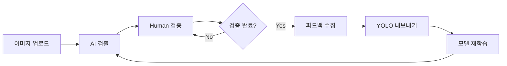

# Feedback Loop Pipeline

> **목적**: 검증된 데이터를 YOLO 재학습용 데이터셋으로 내보내기
> **상태**: ✅ 구현 완료 (2025-12-23)
> **버전**: v8.0

---

## 개요

Feedback Loop Pipeline은 Human-in-the-Loop 검증 과정에서 수집된 데이터를
YOLO 모델 재학습에 사용할 수 있는 형식으로 내보내는 기능을 제공합니다.

```
검증 완료 세션 → 피드백 수집 → YOLO 형식 변환 → 데이터셋 내보내기 → 모델 재학습
```

---

## 핵심 기능

### 1. 검증 데이터 수집
- 승인(approved), 수정(modified) 항목 자동 수집
- 세션별, 기간별 필터링
- 최소 승인율 기준 필터링

### 2. YOLO 형식 내보내기
- 정규화된 바운딩 박스 좌표 (x_center, y_center, width, height)
- classes.txt 자동 생성
- data.yaml (YOLO 설정 파일) 자동 생성
- metadata.json (메타데이터) 저장

### 3. 통계 및 리포트
- 승인/거부/수정 비율 통계
- 클래스별 분포 분석
- 내보내기 이력 관리

---

## API 엔드포인트

### 피드백 통계 조회

```http
GET /feedback/stats?days_back=30
```

**응답** (200):
```json
{
  "total_sessions": 15,
  "total_detections": 450,
  "approved_count": 380,
  "rejected_count": 45,
  "modified_count": 25,
  "approval_rate": 0.844,
  "rejection_rate": 0.100,
  "modification_rate": 0.056
}
```

### 검증 완료 세션 목록

```http
GET /feedback/sessions?min_approved_rate=0.5&days_back=30
```

**응답** (200):
```json
{
  "sessions": [
    {
      "session_id": "abc-123",
      "filename": "drawing.png",
      "stats": {
        "total": 30,
        "approved": 28,
        "rejected": 2,
        "approval_rate": 0.933
      }
    }
  ],
  "count": 15
}
```

### YOLO 데이터셋 내보내기

```http
POST /feedback/export/yolo
Content-Type: application/json
```

**요청 본문**:
```json
{
  "output_name": "dataset_v1",
  "include_rejected": false,
  "min_approved_rate": 0.5,
  "days_back": 30
}
```

**응답** (200):
```json
{
  "success": true,
  "output_path": "/data/yolo_training/dataset_v1",
  "image_count": 150,
  "label_count": 4500,
  "class_distribution": {
    "CT": 850,
    "BUZZER": 320,
    "SMPS": 280
  },
  "timestamp": "20251223_143000",
  "error": null
}
```

### 내보내기 목록 조회

```http
GET /feedback/exports
```

**응답** (200):
```json
{
  "exports": [
    {
      "name": "dataset_v1",
      "path": "/data/yolo_training/dataset_v1",
      "created_at": "20251223_143000",
      "image_count": 150,
      "label_count": 4500,
      "class_count": 14
    }
  ],
  "count": 1
}
```

### 서비스 상태 확인

```http
GET /feedback/health
```

**응답** (200):
```json
{
  "status": "healthy",
  "feedback_path": "/data/feedback",
  "yolo_export_path": "/data/yolo_training",
  "exports_count": 1
}
```

---

## 내보내기 디렉토리 구조

```
/data/yolo_training/dataset_v1/
├── images/
│   ├── session1.jpg
│   ├── session2.jpg
│   └── ...
├── labels/
│   ├── session1.txt
│   ├── session2.txt
│   └── ...
├── classes.txt          # 클래스명 목록
├── data.yaml            # YOLO 설정 파일
└── metadata.json        # 내보내기 메타데이터
```

### YOLO 라벨 형식

```
# labels/session1.txt
0 0.456789 0.234567 0.123456 0.098765
1 0.678901 0.345678 0.111111 0.088888
```

각 줄: `class_id x_center y_center width height` (0-1 정규화)

### data.yaml 형식

```yaml
path: /data/yolo_training/dataset_v1
train: images
val: images
nc: 14
names: ['CT', 'BUZZER', 'SMPS', ...]
```

---

## 백엔드 구현

### 서비스 (`services/feedback_pipeline.py`)

```python
class FeedbackPipelineService:
    def collect_verified_sessions(
        self,
        min_approved_rate: float = 0.5,
        days_back: Optional[int] = None
    ) -> List[Dict]:
        """검증 완료 세션 수집"""

    def export_yolo_dataset(
        self,
        sessions: List[Dict],
        output_name: Optional[str] = None,
        include_rejected: bool = False
    ) -> ExportResult:
        """YOLO 형식 데이터셋 내보내기"""

    def get_feedback_stats(
        self,
        days_back: Optional[int] = None
    ) -> FeedbackStats:
        """피드백 통계 조회"""

    def list_exports(self) -> List[Dict]:
        """내보내기 목록 조회"""
```

### 라우터 (`routers/feedback_router.py`)

```python
router = APIRouter(prefix="/feedback", tags=["feedback"])

@router.get("/stats")
@router.get("/sessions")
@router.post("/export/yolo")
@router.get("/exports")
@router.get("/health")
```

---

## 환경 변수

```bash
# 피드백 데이터 저장 경로
FEEDBACK_DATA_PATH=/data/feedback

# YOLO 내보내기 경로
YOLO_EXPORT_PATH=/data/yolo_training
```

---

## 검증 상태별 처리

| 상태 | 내보내기 포함 | 설명 |
|------|--------------|------|
| `approved` | ✅ | 원본 데이터 사용 |
| `modified` | ✅ | 수정된 데이터 사용 |
| `rejected` | ❌ (옵션) | `include_rejected=true`로 포함 가능 |
| `pending` | ❌ | 검증 미완료 |

---

## 워크플로우



---

## 관련 파일

| 파일 | 설명 |
|------|------|
| `backend/services/feedback_pipeline.py` | 핵심 서비스 |
| `backend/routers/feedback_router.py` | API 라우터 |
| `backend/schemas/feedback.py` | 스키마 정의 |

---

**구현일**: 2025-12-23
