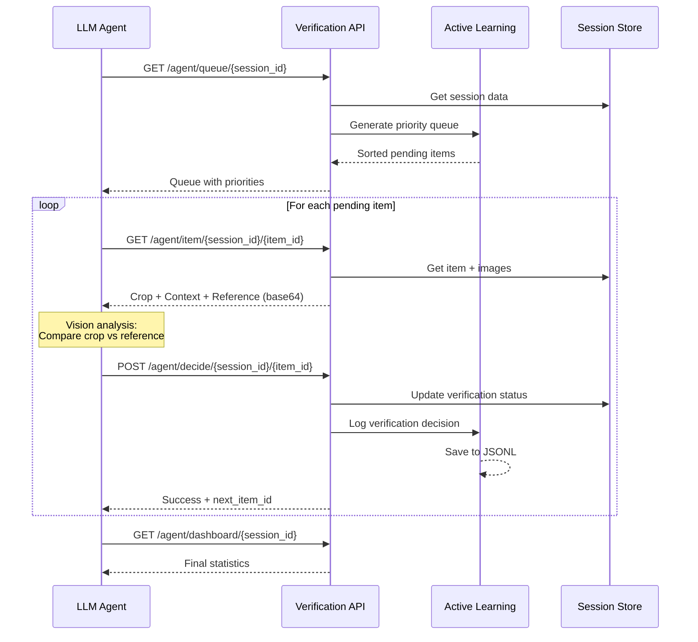

# API Reference

The Agent Verification system exposes two sets of endpoints: the **Verification API** for human/system verification and the **Agent Verification API** optimized for LLM agent automation.

Base URL: `http://localhost:5020`

## Verification API

Prefix: `/verification`

### GET `/verification/queue/{session_id}`

Retrieve the prioritized verification queue for a session.

**Query Parameters**:

| Parameter | Type | Default | Description |
|-----------|------|---------|-------------|
| `item_type` | string | `"dimension"` | Item type: `"dimension"` or `"symbol"` |

**Response**:

```json
{
  "session_id": "abc-123",
  "item_type": "dimension",
  "queue": [
    {
      "id": "item-uuid",
      "item_type": "dimension",
      "data": { "value": "45.2", "unit": "mm", "confidence": 0.65 },
      "confidence": 0.65,
      "priority": "critical",
      "has_relation": false,
      "reason": "Low confidence (0.65)"
    }
  ],
  "stats": {
    "total": 42,
    "verified": 28,
    "pending": 14,
    "critical": 3,
    "high": 2,
    "medium": 6,
    "low": 3,
    "auto_approve_candidates": 3,
    "estimated_review_time_minutes": 4.2
  },
  "thresholds": {
    "auto_approve": 0.9,
    "critical": 0.7
  }
}
```

### POST `/verification/verify/{session_id}`

Submit a verification decision for a single item.

**Request Body**:

```json
{
  "item_id": "item-uuid",
  "item_type": "dimension",
  "action": "modified",
  "modified_data": {
    "modified_value": "45.5",
    "modified_unit": "mm"
  },
  "review_time_seconds": 8.3
}
```

| Field | Type | Required | Description |
|-------|------|----------|-------------|
| `item_id` | string | Yes | Target item ID |
| `item_type` | string | No | `"dimension"` (default) or `"symbol"` |
| `action` | string | Yes | `"approved"`, `"rejected"`, or `"modified"` |
| `modified_data` | object | No | Modified fields (required when action is `"modified"`) |
| `review_time_seconds` | float | No | Time spent reviewing (for analytics) |

**Response**:

```json
{
  "session_id": "abc-123",
  "item_id": "item-uuid",
  "action": "modified",
  "success": true,
  "message": "Item 'item-uuid' verified (modified)"
}
```

### GET `/verification/stats/{session_id}`

Get verification statistics for a session.

**Response**:

```json
{
  "session_id": "abc-123",
  "item_type": "dimension",
  "stats": {
    "total": 42,
    "verified": 38,
    "pending": 4,
    "critical": 1,
    "high": 0,
    "medium": 2,
    "low": 1,
    "auto_approve_candidates": 1,
    "estimated_review_time_minutes": 1.2
  },
  "thresholds": {
    "auto_approve": 0.9,
    "critical": 0.7
  }
}
```

### POST `/verification/bulk-approve/{session_id}`

Bulk approve multiple items at once.

**Request Body**:

```json
{
  "item_ids": ["id-1", "id-2", "id-3"],
  "item_type": "dimension"
}
```

**Response**:

```json
{
  "session_id": "abc-123",
  "item_type": "dimension",
  "requested_count": 3,
  "approved_count": 3,
  "success": true,
  "message": "3 items bulk approved"
}
```

### POST `/verification/auto-approve/{session_id}`

Auto-approve all items with confidence >= auto_approve_threshold.

**Query Parameters**:

| Parameter | Type | Default | Description |
|-----------|------|---------|-------------|
| `item_type` | string | `"dimension"` | Item type to auto-approve |

### PUT /verification/thresholds

Update verification thresholds at runtime.

**Request Body**:

```json
{
  "auto_approve_threshold": 0.85,
  "critical_threshold": 0.6
}
```

**Response**:

```json
{
  "updated": {
    "auto_approve": 0.85,
    "critical": 0.6
  },
  "current_thresholds": {
    "auto_approve": 0.85,
    "critical": 0.6
  }
}
```

### GET /verification/training-data

Export verification logs for model retraining.

**Query Parameters**:

| Parameter | Type | Description |
|-----------|------|-------------|
| `session_id` | string | Filter by session (optional) |
| `action_filter` | string | Filter by action: `"approved"`, `"rejected"`, `"modified"` (optional) |

---

## Agent Verification API

Prefix: `/verification/agent`

Optimized for LLM agent automation (Playwright-friendly, base64 images included).

### GET `/verification/agent/queue/{session_id}`

Get the agent verification queue (pending items only).

**Query Parameters**:

| Parameter | Type | Default | Description |
|-----------|------|---------|-------------|
| `item_type` | string | `"symbol"` | `"symbol"` or `"dimension"` |

**Response**:

```json
{
  "session_id": "abc-123",
  "item_type": "symbol",
  "drawing_type": "electrical",
  "queue": [
    {
      "id": "det-uuid",
      "confidence": 0.72,
      "priority": "medium",
      "reason": "Medium confidence (0.72)",
      "bbox": { "x1": 100, "y1": 200, "x2": 150, "y2": 250 },
      "class_name": "CT",
      "crop_url": "/verification/agent/item/abc-123/det-uuid?item_type=symbol"
    }
  ],
  "total_count": 8,
  "stats": { "total": 45, "verified": 37, "pending": 8 }
}
```

### GET `/verification/agent/item/{session_id}/{item_id}`

Get detailed item information with base64-encoded images.

**Query Parameters**:

| Parameter | Type | Default | Description |
|-----------|------|---------|-------------|
| `item_type` | string | `"symbol"` | `"symbol"` or `"dimension"` |

**Response (symbol)**:

```json
{
  "session_id": "abc-123",
  "item_id": "det-uuid",
  "item_type": "symbol",
  "confidence": 0.72,
  "bbox": { "x1": 100, "y1": 200, "x2": 150, "y2": 250 },
  "verification_status": "pending",
  "class_name": "CT",
  "crop_image": "<base64-encoded PNG>",
  "context_image": "<base64-encoded PNG>",
  "reference_images": ["<base64-encoded PNG>", "<base64-encoded PNG>"],
  "metadata": {
    "model_id": "bom_detector",
    "drawing_type": "electrical",
    "class_id": 2
  }
}
```

**Response (dimension)**:

```json
{
  "session_id": "abc-123",
  "item_id": "dim-uuid",
  "item_type": "dimension",
  "confidence": 0.68,
  "bbox": { "x1": 300, "y1": 400, "x2": 380, "y2": 420 },
  "verification_status": "pending",
  "value": "45.2",
  "raw_text": "45.2±0.1",
  "unit": "mm",
  "tolerance": "±0.1",
  "dimension_type": "length",
  "linked_to": "det-uuid",
  "crop_image": "<base64-encoded PNG>",
  "context_image": "<base64-encoded PNG>",
  "reference_images": []
}
```

### POST `/verification/agent/decide/{session_id}/{item_id}`

Submit an agent verification decision.

**Query Parameters**:

| Parameter | Type | Default | Description |
|-----------|------|---------|-------------|
| `item_type` | string | `"symbol"` | `"symbol"` or `"dimension"` |

**Request Body**:

```json
{
  "action": "modify",
  "modified_class": "PT",
  "reject_reason": null
}
```

| Field | Type | Required | Description |
|-------|------|----------|-------------|
| `action` | string | Yes | `"approve"`, `"reject"`, or `"modify"` |
| `modified_class` | string | Conditional | Required for symbol modify |
| `modified_value` | string | Conditional | For dimension value correction |
| `modified_unit` | string | No | For dimension unit correction |
| `modified_type` | string | No | For dimension type correction |
| `modified_tolerance` | string | No | For tolerance correction |
| `reject_reason` | string | No | Reason: `"not_dimension"`, `"garbage"`, `"duplicate"` |

**Response**:

```json
{
  "success": true,
  "next_item_id": "next-det-uuid",
  "remaining_count": 7,
  "stats": {
    "total": 45,
    "verified": 38,
    "pending": 7
  }
}
```

### GET `/verification/agent/dashboard/{session_id}`

Get verification dashboard for a session (agent vs human breakdown).

### GET `/verification/agent/dashboard/project/{project_id}`

Get aggregated verification dashboard across all sessions in a project.

## Sequence Diagram



## Error Codes

| Status | Meaning | Common Cause |
|--------|---------|-------------|
| 400 | Bad Request | Invalid action, missing required field for modify |
| 404 | Not Found | Session or item ID does not exist |
| 500 | Internal Error | Services not initialized (DI failure) |
