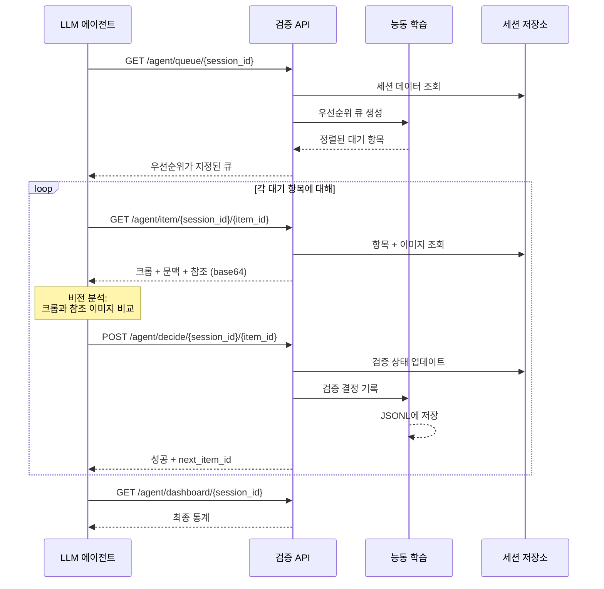

# API 레퍼런스

에이전트 검증 시스템은 두 가지 엔드포인트 세트를 제공합니다: 사람/시스템 검증을 위한 **검증 API (Verification API)**와 LLM 에이전트 자동화에 최적화된 **에이전트 검증 API (Agent Verification API)**.

기본 URL: `http://localhost:5020`

## 검증 API (Verification API)

접두사: `/verification`

### GET `/verification/queue/{session_id}`

세션의 우선순위가 지정된 검증 큐를 조회합니다.

**쿼리 파라미터**:

| 파라미터 | 타입 | 기본값 | 설명 |
|---------|------|-------|------|
| `item_type` | string | `"dimension"` | 항목 유형: `"dimension"` 또는 `"symbol"` |

**응답**:

```json
{
  "session_id": "abc-123",
  "item_type": "dimension",
  "queue": [
    {
      "id": "item-uuid",
      "item_type": "dimension",
      "data": { "value": "45.2", "unit": "mm", "confidence": 0.65 },
      "confidence": 0.65,
      "priority": "critical",
      "has_relation": false,
      "reason": "Low confidence (0.65)"
    }
  ],
  "stats": {
    "total": 42,
    "verified": 28,
    "pending": 14,
    "critical": 3,
    "high": 2,
    "medium": 6,
    "low": 3,
    "auto_approve_candidates": 3,
    "estimated_review_time_minutes": 4.2
  },
  "thresholds": {
    "auto_approve": 0.9,
    "critical": 0.7
  }
}
```

### POST `/verification/verify/{session_id}`

단일 항목에 대한 검증 결정을 제출합니다.

**요청 본문**:

```json
{
  "item_id": "item-uuid",
  "item_type": "dimension",
  "action": "modified",
  "modified_data": {
    "modified_value": "45.5",
    "modified_unit": "mm"
  },
  "review_time_seconds": 8.3
}
```

| 필드 | 타입 | 필수 | 설명 |
|------|------|------|------|
| `item_id` | string | 예 | 대상 항목 ID |
| `item_type` | string | 아니오 | `"dimension"` (기본값) 또는 `"symbol"` |
| `action` | string | 예 | `"approved"`, `"rejected"`, 또는 `"modified"` |
| `modified_data` | object | 아니오 | 수정된 필드 (action이 `"modified"`일 때 필수) |
| `review_time_seconds` | float | 아니오 | 검토에 소요된 시간 (분석용) |

**응답**:

```json
{
  "session_id": "abc-123",
  "item_id": "item-uuid",
  "action": "modified",
  "success": true,
  "message": "Item 'item-uuid' verified (modified)"
}
```

### GET `/verification/stats/{session_id}`

세션의 검증 통계를 조회합니다.

**응답**:

```json
{
  "session_id": "abc-123",
  "item_type": "dimension",
  "stats": {
    "total": 42,
    "verified": 38,
    "pending": 4,
    "critical": 1,
    "high": 0,
    "medium": 2,
    "low": 1,
    "auto_approve_candidates": 1,
    "estimated_review_time_minutes": 1.2
  },
  "thresholds": {
    "auto_approve": 0.9,
    "critical": 0.7
  }
}
```

### POST `/verification/bulk-approve/{session_id}`

여러 항목을 한 번에 일괄 승인합니다.

**요청 본문**:

```json
{
  "item_ids": ["id-1", "id-2", "id-3"],
  "item_type": "dimension"
}
```

**응답**:

```json
{
  "session_id": "abc-123",
  "item_type": "dimension",
  "requested_count": 3,
  "approved_count": 3,
  "success": true,
  "message": "3 items bulk approved"
}
```

### POST `/verification/auto-approve/{session_id}`

신뢰도 >= auto_approve_threshold인 모든 항목을 자동 승인합니다.

**쿼리 파라미터**:

| 파라미터 | 타입 | 기본값 | 설명 |
|---------|------|-------|------|
| `item_type` | string | `"dimension"` | 자동 승인할 항목 유형 |

### PUT /verification/thresholds

검증 임계값을 런타임에 업데이트합니다.

**요청 본문**:

```json
{
  "auto_approve_threshold": 0.85,
  "critical_threshold": 0.6
}
```

**응답**:

```json
{
  "updated": {
    "auto_approve": 0.85,
    "critical": 0.6
  },
  "current_thresholds": {
    "auto_approve": 0.85,
    "critical": 0.6
  }
}
```

### GET /verification/training-data

모델 재학습을 위한 검증 로그를 내보냅니다.

**쿼리 파라미터**:

| 파라미터 | 타입 | 설명 |
|---------|------|------|
| `session_id` | string | 세션별 필터링 (선택 사항) |
| `action_filter` | string | 작업별 필터링: `"approved"`, `"rejected"`, `"modified"` (선택 사항) |

---

## 에이전트 검증 API (Agent Verification API)

접두사: `/verification/agent`

LLM 에이전트 자동화에 최적화되어 있습니다 (Playwright 호환, base64 이미지 포함).

### GET `/verification/agent/queue/{session_id}`

에이전트 검증 큐를 조회합니다 (대기 중인 항목만).

**쿼리 파라미터**:

| 파라미터 | 타입 | 기본값 | 설명 |
|---------|------|-------|------|
| `item_type` | string | `"symbol"` | `"symbol"` 또는 `"dimension"` |

**응답**:

```json
{
  "session_id": "abc-123",
  "item_type": "symbol",
  "drawing_type": "electrical",
  "queue": [
    {
      "id": "det-uuid",
      "confidence": 0.72,
      "priority": "medium",
      "reason": "Medium confidence (0.72)",
      "bbox": { "x1": 100, "y1": 200, "x2": 150, "y2": 250 },
      "class_name": "CT",
      "crop_url": "/verification/agent/item/abc-123/det-uuid?item_type=symbol"
    }
  ],
  "total_count": 8,
  "stats": { "total": 45, "verified": 37, "pending": 8 }
}
```

### GET `/verification/agent/item/{session_id}/{item_id}`

base64 인코딩된 이미지와 함께 상세 항목 정보를 조회합니다.

**쿼리 파라미터**:

| 파라미터 | 타입 | 기본값 | 설명 |
|---------|------|-------|------|
| `item_type` | string | `"symbol"` | `"symbol"` 또는 `"dimension"` |

**응답 (심볼)**:

```json
{
  "session_id": "abc-123",
  "item_id": "det-uuid",
  "item_type": "symbol",
  "confidence": 0.72,
  "bbox": { "x1": 100, "y1": 200, "x2": 150, "y2": 250 },
  "verification_status": "pending",
  "class_name": "CT",
  "crop_image": "<base64-encoded PNG>",
  "context_image": "<base64-encoded PNG>",
  "reference_images": ["<base64-encoded PNG>", "<base64-encoded PNG>"],
  "metadata": {
    "model_id": "bom_detector",
    "drawing_type": "electrical",
    "class_id": 2
  }
}
```

**응답 (치수)**:

```json
{
  "session_id": "abc-123",
  "item_id": "dim-uuid",
  "item_type": "dimension",
  "confidence": 0.68,
  "bbox": { "x1": 300, "y1": 400, "x2": 380, "y2": 420 },
  "verification_status": "pending",
  "value": "45.2",
  "raw_text": "45.2±0.1",
  "unit": "mm",
  "tolerance": "±0.1",
  "dimension_type": "length",
  "linked_to": "det-uuid",
  "crop_image": "<base64-encoded PNG>",
  "context_image": "<base64-encoded PNG>",
  "reference_images": []
}
```

### POST `/verification/agent/decide/{session_id}/{item_id}`

에이전트 검증 결정을 제출합니다.

**쿼리 파라미터**:

| 파라미터 | 타입 | 기본값 | 설명 |
|---------|------|-------|------|
| `item_type` | string | `"symbol"` | `"symbol"` 또는 `"dimension"` |

**요청 본문**:

```json
{
  "action": "modify",
  "modified_class": "PT",
  "reject_reason": null
}
```

| 필드 | 타입 | 필수 | 설명 |
|------|------|------|------|
| `action` | string | 예 | `"approve"`, `"reject"`, 또는 `"modify"` |
| `modified_class` | string | 조건부 | 심볼 수정 시 필수 |
| `modified_value` | string | 조건부 | 치수 값 수정용 |
| `modified_unit` | string | 아니오 | 치수 단위 수정용 |
| `modified_type` | string | 아니오 | 치수 유형 수정용 |
| `modified_tolerance` | string | 아니오 | 공차 수정용 |
| `reject_reason` | string | 아니오 | 사유: `"not_dimension"`, `"garbage"`, `"duplicate"` |

**응답**:

```json
{
  "success": true,
  "next_item_id": "next-det-uuid",
  "remaining_count": 7,
  "stats": {
    "total": 45,
    "verified": 38,
    "pending": 7
  }
}
```

### GET `/verification/agent/dashboard/{session_id}`

세션의 검증 대시보드를 조회합니다 (에이전트 대 사람 분류).

### GET `/verification/agent/dashboard/project/{project_id}`

프로젝트 내 모든 세션에 대한 집계된 검증 대시보드를 조회합니다.

## 시퀀스 다이어그램



## 오류 코드

| 상태 코드 | 의미 | 일반적 원인 |
|----------|------|-----------|
| 400 | 잘못된 요청 (Bad Request) | 유효하지 않은 작업, 수정 시 필수 필드 누락 |
| 404 | 찾을 수 없음 (Not Found) | 세션 또는 항목 ID가 존재하지 않음 |
| 500 | 내부 오류 (Internal Error) | 서비스 미초기화 (DI 실패) |
