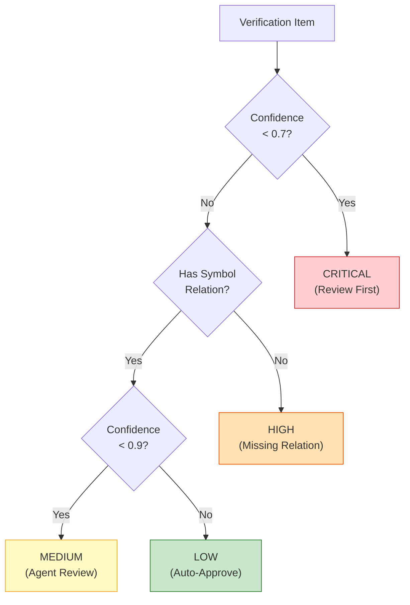
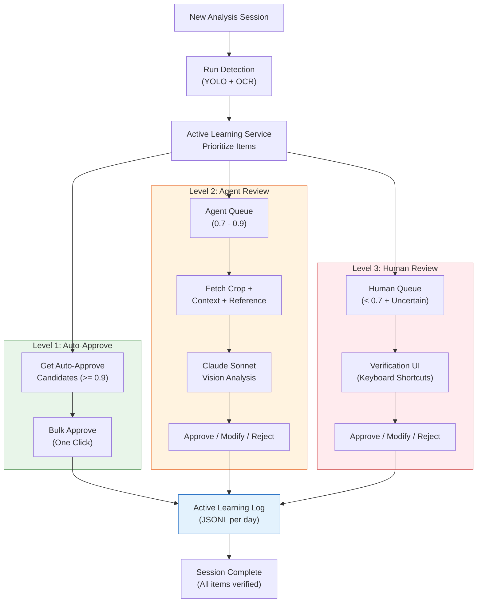

# 3-Level Architecture

The verification system classifies every ML output into one of three levels based on confidence score and contextual signals. Each level uses a different review mechanism optimized for that confidence range.

## Level 1: Auto-Approve

**Confidence >= 0.9** (configurable via `AUTO_APPROVE_THRESHOLD`)

Items with high confidence scores are automatically approved without human or agent intervention. This level handles the bulk of detections and keeps the verification pipeline fast.

| Property | Value |
|----------|-------|
| Handler | System (automatic) |
| Priority | LOW |
| Typical Volume | 60-70% of all items |
| Review Time | 0 seconds (instant) |
| Action | Bulk-approve via `/verification/auto-approve/{session_id}` |

**When to use**: Standard detections where the model has seen many similar training examples. Clear symbols with distinct features, well-formatted dimensions with standard notation.

## Level 2: Agent Review

**Confidence 0.7 - 0.9** (between `CRITICAL_THRESHOLD` and `AUTO_APPROVE_THRESHOLD`)

Borderline items are reviewed by a Claude Sonnet vision model. The agent receives crop images, context images, and reference images for comparison, then makes an approve/reject/modify decision.

| Property | Value |
|----------|-------|
| Handler | Claude Sonnet (multimodal vision) |
| Priority | MEDIUM |
| Typical Volume | 20-25% of all items |
| Review Time | 2-5 seconds per item |
| Actions | approve, reject, modify |

**Agent receives**:
- **Crop image**: Tight bounding box crop of the detected item (base64)
- **Context image**: Wider area around the detection for spatial context (base64)
- **Reference images**: Known-good examples of the detected class for comparison (base64)
- **Metadata**: Confidence score, class name, model ID, drawing type

**When to use**: Partially occluded symbols, unusual orientations, similar-looking classes (e.g., CT vs PT), dimensions with non-standard formatting.

## Level 3: Human Review

**Confidence < 0.7** (`CRITICAL_THRESHOLD`)

Low-confidence and uncertain items require human expert review. These are typically ambiguous detections, novel symbol types, or items where the agent itself is uncertain.

| Property | Value |
|----------|-------|
| Handler | Human operator |
| Priority | CRITICAL / HIGH |
| Typical Volume | 5-15% of all items |
| Review Time | 10-30 seconds per item |
| Actions | approve, reject, modify |

**Additional triggers for human review**:
- Agent returns "uncertain" verdict
- Dimension has no linked symbol (HIGH priority)
- Detection in drawing margin/title block area

## Priority System

Items within each level are further prioritized for review order:



| Priority | Condition | Estimated Review Time |
|----------|-----------|----------------------|
| CRITICAL | confidence < 0.7 | 30 sec/item |
| HIGH | No symbol relation | 20 sec/item |
| MEDIUM | confidence 0.7-0.9 | 10 sec/item |
| LOW | confidence >= 0.9 | 2 sec/item (auto) |

## Confidence Thresholds

Thresholds are configurable at runtime via environment variables or the API:

| Threshold | Default | Env Variable | API Endpoint |
|-----------|---------|-------------|--------------|
| Auto-Approve | 0.9 | `AUTO_APPROVE_THRESHOLD` | `PUT /verification/thresholds` |
| Critical | 0.7 | `CRITICAL_THRESHOLD` | `PUT /verification/thresholds` |

### Tuning Guidelines

- **Increase auto-approve threshold** (e.g., 0.95) when false positives are costly
- **Decrease auto-approve threshold** (e.g., 0.85) when throughput is more important
- **Increase critical threshold** (e.g., 0.8) to route more items to human review
- **Decrease critical threshold** (e.g., 0.5) to rely more on agent review

```json
// Example: Strict mode (more human review)
{
  "auto_approve_threshold": 0.95,
  "critical_threshold": 0.8
}

// Example: Fast mode (more auto-approval)
{
  "auto_approve_threshold": 0.85,
  "critical_threshold": 0.5
}
```

## Supported Item Types

The verification system handles two item types with slightly different workflows:

### Symbol Verification

For YOLO-detected symbols (electrical components, P&ID symbols):

- **Approve**: Confirm the detected class is correct
- **Modify**: Change the class label (e.g., "CT" -> "PT")
- **Reject**: Remove false positive detection

### Dimension Verification

For OCR-extracted dimensions and tolerances:

- **Approve**: Confirm the extracted value is correct
- **Modify**: Correct the value, unit, type, or tolerance
- **Reject**: Mark as not a dimension (garbage, duplicate, etc.)

## Keyboard Shortcuts for Rapid Review

The verification UI supports keyboard shortcuts for efficient review:

| Shortcut | Action | Description |
|----------|--------|-------------|
| `A` | Approve | Accept the current item as-is |
| `R` | Reject | Reject the current item |
| `M` | Modify | Open modification dialog |
| `N` / `Arrow Right` | Next | Skip to next item |
| `P` / `Arrow Left` | Previous | Go back to previous item |
| `Space` | Auto-approve all | Bulk approve remaining LOW priority items |

## Detailed Flow



## Active Learning Pipeline

All verification decisions feed back into the model improvement pipeline:

1. **Log Collection**: Every approve/reject/modify action is stored as JSONL (one file per day)
2. **Training Data Export**: `GET /verification/training-data` extracts labeled data for retraining
3. **Threshold Adjustment**: Statistics from verification logs inform threshold tuning
4. **Model Retraining**: Modified and rejected items provide hard negative/positive examples
