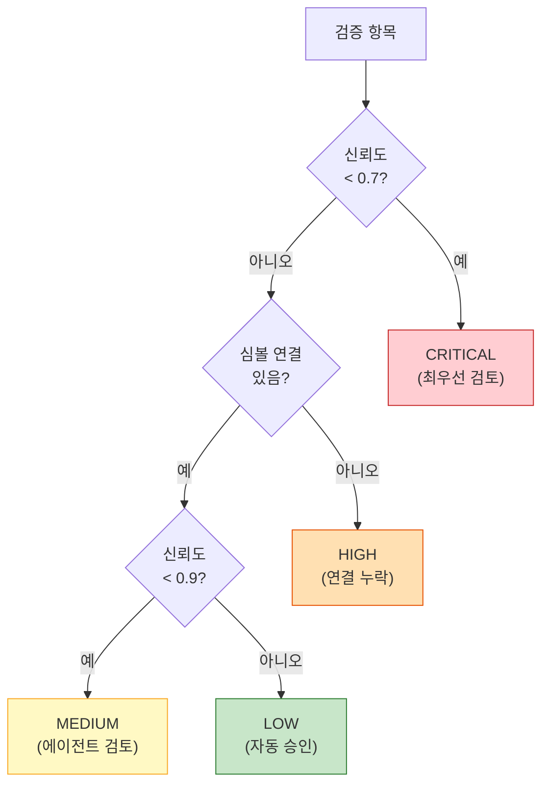
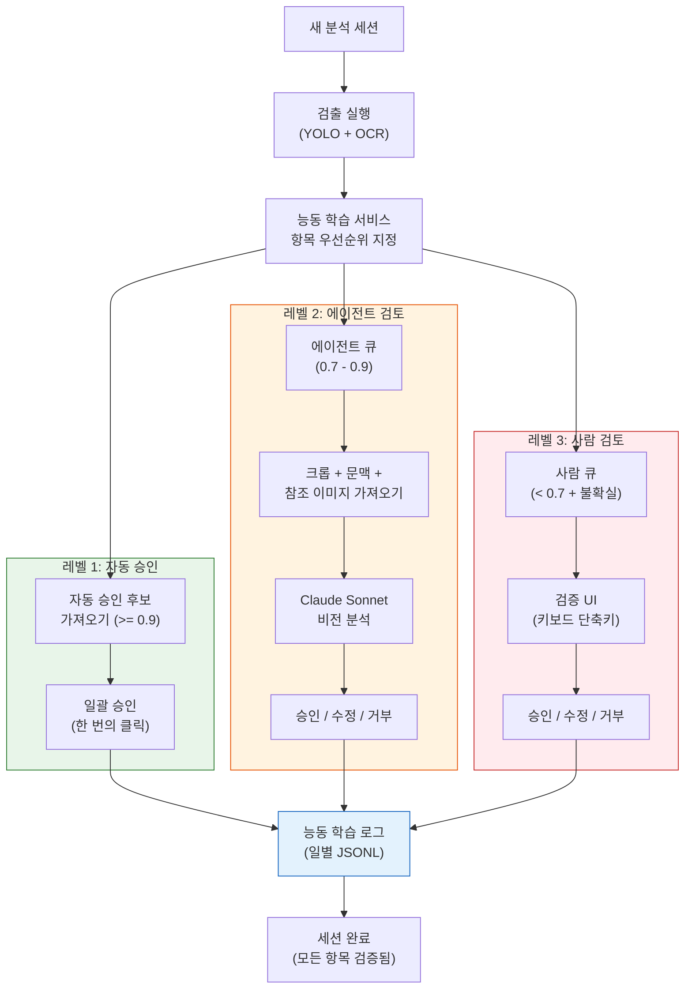

# 3단계 아키텍처

검증 시스템은 신뢰도 점수와 문맥 신호를 기반으로 모든 ML 출력을 세 가지 레벨 중 하나로 분류합니다. 각 레벨은 해당 신뢰도 범위에 최적화된 검토 메커니즘을 사용합니다.

## 레벨 1: 자동 승인 (Auto-Approve)

**신뢰도 >= 0.9** (`AUTO_APPROVE_THRESHOLD`를 통해 설정 가능)

높은 신뢰도 점수를 가진 항목은 사람이나 에이전트의 개입 없이 자동으로 승인됩니다. 이 레벨은 대부분의 검출을 처리하며 검증 파이프라인을 빠르게 유지합니다.

| 속성 | 값 |
|------|-----|
| 처리 주체 | 시스템 (자동) |
| 우선순위 | LOW |
| 일반적 비중 | 전체 항목의 60-70% |
| 검토 시간 | 0초 (즉시) |
| 작업 | `/verification/auto-approve/{session_id}`를 통한 일괄 승인 |

**적용 시기**: 모델이 많은 유사한 학습 예제를 본 표준 검출. 뚜렷한 특징을 가진 명확한 심볼, 표준 표기법으로 잘 포맷된 치수.

## 레벨 2: 에이전트 검토 (Agent Review)

**신뢰도 0.7 - 0.9** (`CRITICAL_THRESHOLD`와 `AUTO_APPROVE_THRESHOLD` 사이)

경계선 항목은 Claude Sonnet 비전 모델에 의해 검토됩니다. 에이전트는 크롭 이미지, 문맥 이미지, 참조 이미지를 받아 비교한 후 승인/거부/수정 결정을 내립니다.

| 속성 | 값 |
|------|-----|
| 처리 주체 | Claude Sonnet (멀티모달 비전) |
| 우선순위 | MEDIUM |
| 일반적 비중 | 전체 항목의 20-25% |
| 검토 시간 | 항목당 2-5초 |
| 작업 | approve, reject, modify |

**에이전트가 수신하는 정보**:
- **크롭 이미지 (Crop image)**: 검출된 항목의 타이트한 바운딩 박스 크롭 (base64)
- **문맥 이미지 (Context image)**: 공간적 문맥을 위한 검출 주변의 넓은 영역 (base64)
- **참조 이미지 (Reference images)**: 비교를 위한 검출된 클래스의 정상 예제 (base64)
- **메타데이터 (Metadata)**: 신뢰도 점수, 클래스 이름, 모델 ID, 도면 유형

**적용 시기**: 부분적으로 가려진 심볼, 비정상적인 방향, 유사한 클래스(예: CT vs PT), 비표준 포맷의 치수.

## 레벨 3: 사람 검토 (Human Review)

**신뢰도 < 0.7** (`CRITICAL_THRESHOLD`)

낮은 신뢰도 및 불확실한 항목은 사람 전문가의 검토가 필요합니다. 이는 일반적으로 모호한 검출, 새로운 심볼 유형, 또는 에이전트 자체가 불확실한 항목입니다.

| 속성 | 값 |
|------|-----|
| 처리 주체 | 사람 운영자 |
| 우선순위 | CRITICAL / HIGH |
| 일반적 비중 | 전체 항목의 5-15% |
| 검토 시간 | 항목당 10-30초 |
| 작업 | approve, reject, modify |

**사람 검토의 추가 트리거**:
- 에이전트가 "불확실(uncertain)" 판정을 반환한 경우
- 치수에 연결된 심볼이 없는 경우 (HIGH 우선순위)
- 도면 여백/표제란 영역에서의 검출

## 우선순위 시스템

각 레벨 내의 항목은 검토 순서를 위해 추가적으로 우선순위가 매겨집니다:



| 우선순위 | 조건 | 예상 검토 시간 |
|---------|------|--------------|
| CRITICAL | 신뢰도 < 0.7 | 항목당 30초 |
| HIGH | 심볼 연결 없음 | 항목당 20초 |
| MEDIUM | 신뢰도 0.7-0.9 | 항목당 10초 |
| LOW | 신뢰도 >= 0.9 | 항목당 2초 (자동) |

## 신뢰도 임계값

임계값은 환경 변수 또는 API를 통해 런타임에 설정 가능합니다:

| 임계값 | 기본값 | 환경 변수 | API 엔드포인트 |
|--------|-------|-----------|--------------|
| 자동 승인 (Auto-Approve) | 0.9 | `AUTO_APPROVE_THRESHOLD` | `PUT /verification/thresholds` |
| 중요 (Critical) | 0.7 | `CRITICAL_THRESHOLD` | `PUT /verification/thresholds` |

### 튜닝 가이드라인

- **자동 승인 임계값 상향** (예: 0.95): 오탐(false positive)의 비용이 큰 경우
- **자동 승인 임계값 하향** (예: 0.85): 처리량이 더 중요한 경우
- **중요 임계값 상향** (예: 0.8): 더 많은 항목을 사람 검토로 라우팅하는 경우
- **중요 임계값 하향** (예: 0.5): 에이전트 검토에 더 의존하는 경우

```json
// 예시: 엄격 모드 (사람 검토 증가)
{
  "auto_approve_threshold": 0.95,
  "critical_threshold": 0.8
}

// 예시: 빠른 모드 (자동 승인 증가)
{
  "auto_approve_threshold": 0.85,
  "critical_threshold": 0.5
}
```

## 지원 항목 유형

검증 시스템은 약간 다른 워크플로우를 가진 두 가지 항목 유형을 처리합니다:

### 심볼 검증

YOLO로 검출된 심볼(전기 부품, P&ID 심볼):

- **승인 (Approve)**: 검출된 클래스가 올바른지 확인
- **수정 (Modify)**: 클래스 레이블 변경 (예: "CT" -> "PT")
- **거부 (Reject)**: 오탐 검출 제거

### 치수 검증

OCR로 추출된 치수 및 공차:

- **승인 (Approve)**: 추출된 값이 올바른지 확인
- **수정 (Modify)**: 값, 단위, 유형 또는 공차 수정
- **거부 (Reject)**: 치수가 아닌 것으로 표시 (노이즈, 중복 등)

## 빠른 검토를 위한 키보드 단축키

검증 UI는 효율적인 검토를 위한 키보드 단축키를 지원합니다:

| 단축키 | 작업 | 설명 |
|--------|------|------|
| `A` | 승인 | 현재 항목을 그대로 수락 |
| `R` | 거부 | 현재 항목을 거부 |
| `M` | 수정 | 수정 대화상자 열기 |
| `N` / `Arrow Right` | 다음 | 다음 항목으로 이동 |
| `P` / `Arrow Left` | 이전 | 이전 항목으로 돌아가기 |
| `Space` | 전체 자동 승인 | 남은 LOW 우선순위 항목 일괄 승인 |

## 상세 흐름



## 능동 학습 파이프라인 (Active Learning Pipeline)

모든 검증 결정은 모델 개선 파이프라인으로 피드백됩니다:

1. **로그 수집**: 모든 승인/거부/수정 작업이 JSONL로 저장됩니다 (일별 파일 1개)
2. **학습 데이터 내보내기**: `GET /verification/training-data`로 재학습용 레이블 데이터를 추출합니다
3. **임계값 조정**: 검증 로그의 통계가 임계값 튜닝에 활용됩니다
4. **모델 재학습**: 수정 및 거부된 항목이 하드 네거티브/포지티브 예제를 제공합니다
