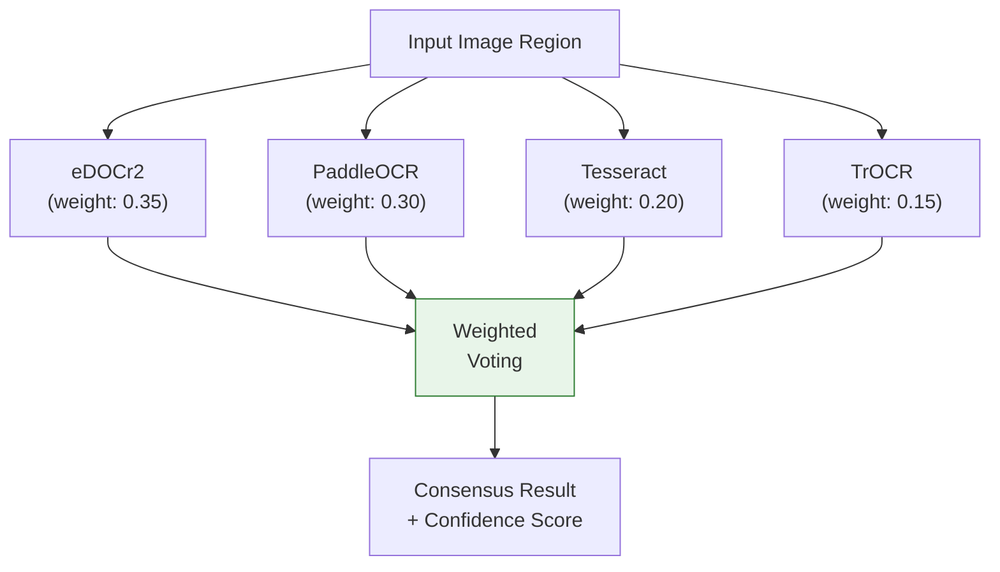
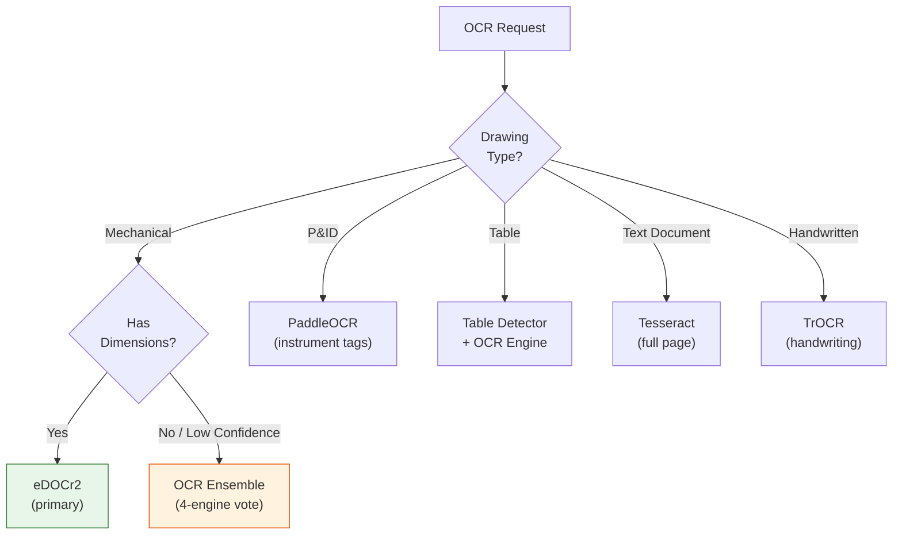

# OCR Processing

The OCR stage extracts text, dimensions, GD&T symbols, and tabular data from engineering drawings. Eight specialized OCR engines are available, with eDOCr2 as the primary engine for Korean dimension recognition and the OCR Ensemble providing weighted voting across four engines.

## Engine Comparison

| Engine | Port | GPU | Languages | Specialization |
|--------|------|-----|-----------|----------------|
| **eDOCr2** | 5002 | Yes | Korean, English | Engineering dimensions, GD&T symbols |
| **PaddleOCR** | 5006 | Yes | 80+ | Multi-language general purpose |
| **Tesseract** | 5008 | No | 100+ | Document OCR, widely supported |
| **TrOCR** | 5009 | Yes | English | Handwritten text recognition |
| **OCR Ensemble** | 5011 | Yes | Multi | 4-engine weighted voting |
| **Surya OCR** | 5013 | Yes | 90+ | Layout-aware, line detection |
| **DocTR** | 5014 | Yes | Multi | Two-stage detection + recognition |
| **EasyOCR** | 5015 | Yes | 80+ | Easy integration, good accuracy |

## Primary Engine: eDOCr2

eDOCr2 is purpose-built for engineering drawing OCR with specialized capabilities:

- **Dimension extraction**: Recognizes linear, angular, and radius dimensions with tolerance values
- **GD&T parsing**: Identifies geometric dimensioning and tolerancing frames
- **Korean support**: Native Korean character recognition for domestic drawings
- **Crop + Upscale**: Optional region cropping and ESRGAN upscaling for small text

### eDOCr2 Parameters

| Parameter | Type | Default | Description |
|-----------|------|---------|-------------|
| `language` | string | `"kor"` | Recognition language |
| `extract_dimensions` | bool | `true` | Extract dimension values |
| `extract_gdt` | bool | `true` | Extract GD&T frames |
| `extract_text` | bool | `true` | Extract general text |
| `extract_tables` | bool | `false` | Extract table content |
| `cluster_threshold` | float | `20.0` | Text clustering distance |
| `visualize` | bool | `false` | Return annotated image |
| `enable_crop_upscale` | bool | `false` | Enable crop + upscale |
| `crop_preset` | string | `"default"` | Crop region preset |
| `upscale_scale` | int | `4` | ESRGAN upscale factor |
| `upscale_denoise` | float | `0.5` | Upscale denoising strength |

## OCR Ensemble

The OCR Ensemble combines results from four engines using weighted voting to maximize accuracy.



### Voting Mechanism

1. Each engine produces candidate text for the same image region.
2. Results are normalized (whitespace, casing) and compared.
3. A weighted vote determines the consensus text.
4. The final confidence score reflects agreement level across engines.

## Engine Selection Logic

The Gateway API selects the appropriate OCR engine based on drawing type and content:



## API Endpoint

### POST /api/v1/ocr

**Request:**

```
Content-Type: multipart/form-data
```

| Field | Type | Required | Description |
|-------|------|----------|-------------|
| `file` | File | Yes | Drawing image or cropped region |
| `engine` | string | No | OCR engine to use (default: `edocr2`) |
| `language` | string | No | Recognition language |

**Response:**

```json
{
  "texts": [
    {
      "text": "125.0 +0.05/-0.02",
      "confidence": 0.94,
      "bbox": [100, 200, 300, 230],
      "type": "dimension"
    }
  ],
  "dimensions": [
    {
      "nominal": 125.0,
      "upper_tolerance": 0.05,
      "lower_tolerance": -0.02,
      "unit": "mm"
    }
  ],
  "engine": "edocr2"
}
```

## Notes

- eDOCr2 should always be the first choice for mechanical drawings with Korean text.
- The Ensemble engine (port 5011) has higher latency due to running four engines in parallel but provides the highest accuracy for ambiguous text.
- Surya OCR is particularly effective for drawings with complex layouts where text orientation varies.
