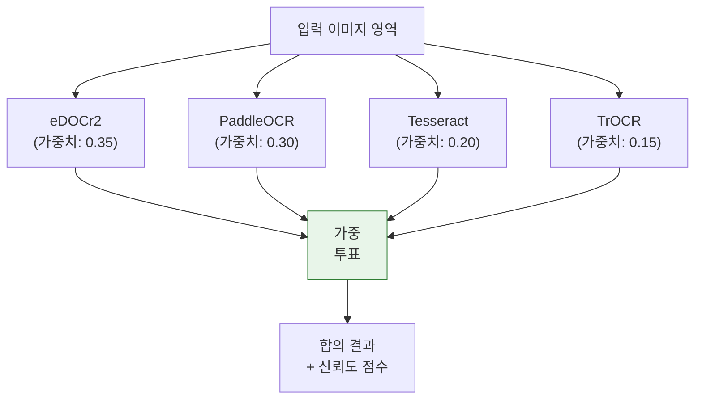
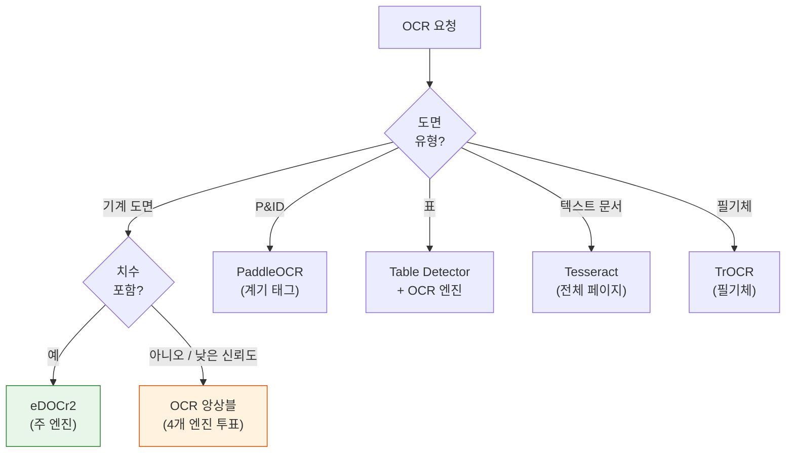

# OCR 처리

OCR 단계는 엔지니어링 도면에서 텍스트, 치수, GD&T 심볼, 표 데이터를 추출합니다. 8개의 특화된 OCR 엔진을 사용할 수 있으며, eDOCr2가 한국어 치수 인식의 주 엔진이고, OCR 앙상블(Ensemble)이 4개 엔진에 대한 가중 투표를 제공합니다.

## 엔진 비교

| 엔진 | 포트 | GPU | 언어 | 전문 분야 |
|------|------|-----|------|----------|
| **eDOCr2** | 5002 | 예 | 한국어, 영어 | 엔지니어링 치수, GD&T 심볼 |
| **PaddleOCR** | 5006 | 예 | 80개 이상 | 다국어 범용 |
| **Tesseract** | 5008 | 아니오 | 100개 이상 | 문서 OCR, 폭넓은 지원 |
| **TrOCR** | 5009 | 예 | 영어 | 필기체 텍스트 인식 |
| **OCR Ensemble** | 5011 | 예 | 다국어 | 4개 엔진 가중 투표 |
| **Surya OCR** | 5013 | 예 | 90개 이상 | 레이아웃 인식, 라인 검출 |
| **DocTR** | 5014 | 예 | 다국어 | 2단계 검출 + 인식 파이프라인 |
| **EasyOCR** | 5015 | 예 | 80개 이상 | 간편한 통합, 우수한 정확도 |

## 주 엔진: eDOCr2

eDOCr2는 엔지니어링 도면 OCR에 특화되어 개발되었으며, 다음과 같은 전문 기능을 갖추고 있습니다:

- **치수 추출**: 공차 값이 포함된 선형, 각도, 반지름 치수를 인식합니다
- **GD&T 파싱**: 기하 공차(GD&T, Geometric Dimensioning and Tolerancing) 프레임을 식별합니다
- **한국어 지원**: 국내 도면을 위한 네이티브 한국어 문자 인식
- **크롭 + 업스케일**: 작은 텍스트를 위한 선택적 영역 크롭 및 ESRGAN 업스케일링

### eDOCr2 파라미터

| 파라미터 | 타입 | 기본값 | 설명 |
|----------|------|--------|------|
| `language` | string | `"kor"` | 인식 언어 |
| `extract_dimensions` | bool | `true` | 치수 값 추출 |
| `extract_gdt` | bool | `true` | GD&T 프레임 추출 |
| `extract_text` | bool | `true` | 일반 텍스트 추출 |
| `extract_tables` | bool | `false` | 표 내용 추출 |
| `cluster_threshold` | float | `20.0` | 텍스트 클러스터링 거리 |
| `visualize` | bool | `false` | 주석 이미지 반환 |
| `enable_crop_upscale` | bool | `false` | 크롭 + 업스케일 활성화 |
| `crop_preset` | string | `"default"` | 크롭 영역 프리셋 |
| `upscale_scale` | int | `4` | ESRGAN 업스케일 배율 |
| `upscale_denoise` | float | `0.5` | 업스케일 노이즈 제거 강도 |

## OCR 앙상블

OCR 앙상블은 4개 엔진의 결과를 가중 투표(Weighted Voting)로 결합하여 정확도를 극대화합니다.



### 투표 메커니즘

1. 각 엔진이 동일한 이미지 영역에 대해 후보 텍스트를 생성합니다.
2. 결과를 정규화(공백, 대소문자)하고 비교합니다.
3. 가중 투표를 통해 합의 텍스트를 결정합니다.
4. 최종 신뢰도 점수는 엔진 간 일치 수준을 반영합니다.

## 엔진 선택 로직

Gateway API는 도면 유형과 내용에 따라 적절한 OCR 엔진을 선택합니다:



## API 엔드포인트

### POST /api/v1/ocr

**요청(Request):**

```
Content-Type: multipart/form-data
```

| 필드 | 타입 | 필수 | 설명 |
|------|------|------|------|
| `file` | File | 예 | 도면 이미지 또는 크롭된 영역 |
| `engine` | string | 아니오 | 사용할 OCR 엔진 (기본값: `edocr2`) |
| `language` | string | 아니오 | 인식 언어 |

**응답(Response):**

```json
{
  "texts": [
    {
      "text": "125.0 +0.05/-0.02",
      "confidence": 0.94,
      "bbox": [100, 200, 300, 230],
      "type": "dimension"
    }
  ],
  "dimensions": [
    {
      "nominal": 125.0,
      "upper_tolerance": 0.05,
      "lower_tolerance": -0.02,
      "unit": "mm"
    }
  ],
  "engine": "edocr2"
}
```

## 참고 사항

- 한국어 텍스트가 포함된 기계 도면에는 항상 eDOCr2를 우선 선택해야 합니다.
- 앙상블 엔진(포트 5011)은 4개 엔진을 병렬로 실행하므로 지연 시간이 더 길지만, 모호한 텍스트에 대해 가장 높은 정확도를 제공합니다.
- Surya OCR은 텍스트 방향이 다양한 복잡한 레이아웃의 도면에서 특히 효과적입니다.
