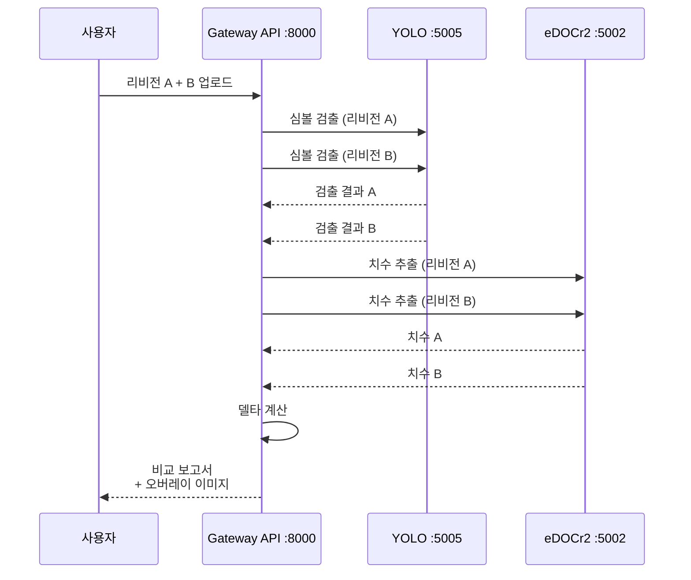
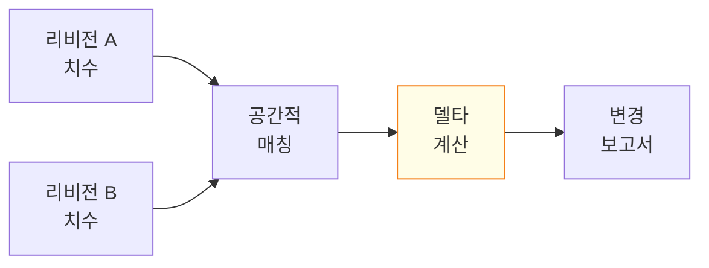

# 리비전 비교

리비전 비교(Revision Comparison) 단계는 엔지니어가 엔지니어링 도면의 여러 리비전을 비교하여 형상, 치수, 주석, BOM 데이터의 변경 사항을 식별할 수 있게 합니다.

## 기능

| 기능 | 설명 |
|------|------|
| **병렬 오버레이(Side-by-Side Overlay)** | 조정 가능한 불투명도로 두 리비전을 겹쳐 표시 |
| **변경 감지(Change Detection)** | 추가, 삭제, 수정된 요소의 자동 식별 |
| **치수 델타(Dimension Delta)** | 리비전 간 치수의 수치 변경 추적 |
| **주석 비교(Annotation Diff)** | 노트, 공차, GD&T 콜아웃의 변경 사항 강조 |
| **시각적 강조(Visual Highlighting)** | 색상 코드 변경 표시 (녹색=추가, 빨간색=삭제, 노란색=수정) |

## 비교 흐름



## 치수 델타 추적

치수 델타는 공간적 근접성과 라벨 유사도를 사용하여 리비전 간 대응하는 치수 주석을 매칭함으로써 계산됩니다.



### 델타 카테고리

| 카테고리 | 기준 | 시각 표시 |
|----------|------|----------|
| **변경 없음(Unchanged)** | 공칭값과 공차가 동일 | 강조 없음 |
| **수정됨(Modified)** | 공칭값 또는 공차가 변경됨 | 노란색 강조 |
| **추가됨(Added)** | 리비전 B에만 치수가 존재 | 녹색 강조 |
| **삭제됨(Removed)** | 리비전 A에만 치수가 존재 | 빨간색 강조 |

### 델타 출력 예시

```json
{
  "deltas": [
    {
      "dimension_id": "D-001",
      "rev_a": { "nominal": 125.0, "tolerance": "+0.05/-0.02" },
      "rev_b": { "nominal": 125.5, "tolerance": "+0.03/-0.03" },
      "change": "modified",
      "nominal_delta": 0.5,
      "tolerance_change": "tightened"
    },
    {
      "dimension_id": "D-015",
      "rev_a": null,
      "rev_b": { "nominal": 45.0, "tolerance": "+/-0.1" },
      "change": "added"
    }
  ],
  "summary": {
    "total_dimensions": 47,
    "unchanged": 38,
    "modified": 7,
    "added": 1,
    "removed": 1
  }
}
```

## 오버레이 시각화

오버레이 모드는 색상 채널을 사용하여 두 리비전을 겹쳐 표시합니다:

- **빨간색 채널**: 리비전 A에만 존재 (삭제된 요소)
- **녹색 채널**: 리비전 B에만 존재 (추가된 요소)
- **흰색/회색**: 두 리비전 모두에 존재하는 변경되지 않은 요소

사용자는 BlueprintFlow UI에서 불투명도를 조정하고 개별 리비전의 가시성을 토글할 수 있습니다.

## 통합

리비전 비교는 다음을 통해 실행됩니다:

1. **BlueprintFlow**: 분석 카테고리의 GT Comparison 노드
2. **Gateway API**: 두 리비전 이미지를 사용한 직접 API 호출
3. **BOM UI**: Blueprint AI BOM 인터페이스의 리비전 선택기

## 참고 사항

- 공간적 매칭은 리비전 간 미세한 위치 이동을 고려하기 위해 설정 가능한 거리 임계값을 사용합니다.
- 축척이나 방향이 다른 도면의 경우, 비교 전에 자동 정렬이 수행됩니다.
- 치수 델타 보고서는 엔지니어링 변경 사항을 문서화하기 위해 최종 견적 PDF의 일부로 내보낼 수 있습니다.
