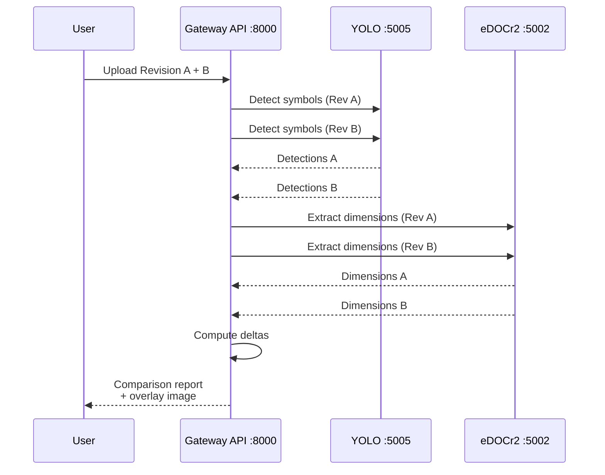
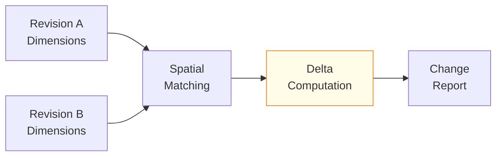

# Revision Comparison

The Revision Comparison stage enables engineers to compare multiple revisions of an engineering drawing, identifying changes in geometry, dimensions, annotations, and BOM data.

## Features

| Feature | Description |
|---------|-------------|
| **Side-by-Side Overlay** | Superimpose two revisions with adjustable opacity |
| **Change Detection** | Automatic identification of added, removed, and modified elements |
| **Dimension Delta** | Track numerical changes in dimensions across revisions |
| **Annotation Diff** | Highlight changes in notes, tolerances, and GD&T callouts |
| **Visual Highlighting** | Color-coded change markers (green=added, red=removed, yellow=modified) |

## Comparison Flow



## Dimension Delta Tracking

Dimension deltas are computed by matching corresponding dimension annotations between revisions using spatial proximity and label similarity.



### Delta Categories

| Category | Criteria | Visual |
|----------|----------|--------|
| **Unchanged** | Nominal and tolerance identical | No highlight |
| **Modified** | Nominal or tolerance changed | Yellow highlight |
| **Added** | Dimension exists only in Rev B | Green highlight |
| **Removed** | Dimension exists only in Rev A | Red highlight |

### Example Delta Output

```json
{
  "deltas": [
    {
      "dimension_id": "D-001",
      "rev_a": { "nominal": 125.0, "tolerance": "+0.05/-0.02" },
      "rev_b": { "nominal": 125.5, "tolerance": "+0.03/-0.03" },
      "change": "modified",
      "nominal_delta": 0.5,
      "tolerance_change": "tightened"
    },
    {
      "dimension_id": "D-015",
      "rev_a": null,
      "rev_b": { "nominal": 45.0, "tolerance": "+/-0.1" },
      "change": "added"
    }
  ],
  "summary": {
    "total_dimensions": 47,
    "unchanged": 38,
    "modified": 7,
    "added": 1,
    "removed": 1
  }
}
```

## Overlay Visualization

The overlay mode superimposes both revisions using color channels:

- **Red channel**: Revision A only (removed elements)
- **Green channel**: Revision B only (added elements)
- **White/Gray**: Unchanged elements present in both revisions

Users can adjust opacity and toggle individual revision visibility in the BlueprintFlow UI.

## Integration

Revision comparison is triggered through:

1. **BlueprintFlow**: GT Comparison node in the analysis category
2. **Gateway API**: Direct API call with two revision images
3. **BOM UI**: Revision selector in the Blueprint AI BOM interface

## Notes

- Spatial matching uses a configurable distance threshold to account for minor shifts between revisions.
- For drawings with different scales or orientations, automatic alignment is performed before comparison.
- Dimension delta reports can be exported as part of the final quote PDF to document engineering changes.
