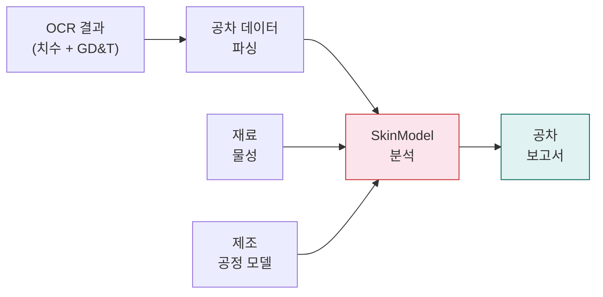
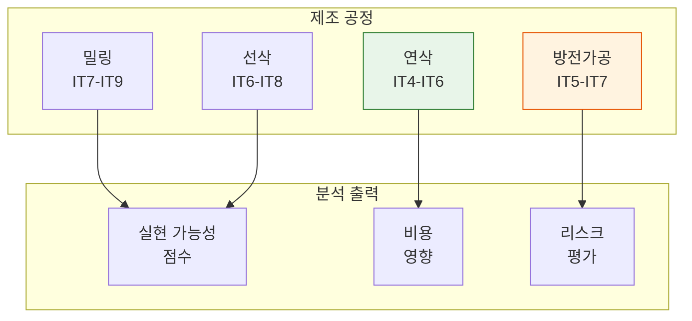

# 공차 분석

공차 분석(Tolerance Analysis) 단계는 SkinModel Shapes를 사용하여 엔지니어링 도면에서 추출된 기하 공차(GD&T, Geometric Dimensioning and Tolerancing) 데이터를 분석합니다. 제조 가능성, 누적 공차(Tolerance Stack-up), 공정 적합성을 평가합니다.

## 개요

| 항목 | 값 |
|------|-----|
| **모델** | SkinModel Shapes |
| **서비스** | SkinModel API |
| **포트** | 5003 |
| **GPU** | 필수 |
| **카테고리** | 분석 |

## 워크플로우



## 파라미터

| 파라미터 | 타입 | 기본값 | 설명 |
|----------|------|--------|------|
| `material_type` | string | `"steel"` | 분석용 재료 유형 (steel, aluminum, plastic 등) |
| `manufacturing_process` | string | `"milling"` | 제조 공정 (milling, turning, grinding 등) |
| `correlation_length` | float | `1.0` | 표면 편차 모델링을 위한 공간 상관 길이 |
| `task` | string | `"analyze"` | 작업 유형 (analyze, simulate, report) |

## 분석 기능

### GD&T 평가

SkinModel은 모든 표준 GD&T 특성을 평가합니다:

| GD&T 유형 | 심볼 | 분석 |
|-----------|------|------|
| **형상(Form)** | 평면도, 직진도, 진원도, 원통도 | 표면 편차 시뮬레이션 |
| **방향(Orientation)** | 직각도, 평행도, 경사도 | 각도 공차 누적 분석 |
| **위치(Location)** | 위치도, 동심도, 대칭도 | 위치 공차 분석 |
| **흔들림(Runout)** | 원주 흔들림, 전체 흔들림 | 회전 편차 모델링 |

### 제조 공정 영향

분석 시 다양한 제조 공정이 달성 가능한 공차에 미치는 영향을 고려합니다:



## API 엔드포인트

### POST /api/v1/tolerance

**요청(Request):**

```
Content-Type: multipart/form-data
```

| 필드 | 타입 | 필수 | 설명 |
|------|------|------|------|
| `file` | File | 예 | GD&T 주석이 포함된 도면 이미지 |
| `material_type` | string | 아니오 | 재료 (기본값: `steel`) |
| `manufacturing_process` | string | 아니오 | 공정 (기본값: `milling`) |
| `correlation_length` | float | 아니오 | 상관 길이 (기본값: `1.0`) |

**응답(Response):**

```json
{
  "tolerances": [
    {
      "feature": "bore_diameter",
      "nominal": 50.0,
      "tolerance": 0.025,
      "gdt_type": "position",
      "feasibility": 0.92,
      "process_capability": 1.33
    }
  ],
  "overall_feasibility": 0.88,
  "recommended_process": "grinding",
  "cost_factor": 1.4
}
```

## 파이프라인과의 통합

공차 분석 단계는 OCR 단계에서 구조화된 치수 및 GD&T 데이터를 전달받습니다:

1. **eDOCr2**가 치수 값과 공차 주석을 추출합니다.
2. **치수 파서(Dimension Parser)**가 원시 OCR 출력을 타입이 지정된 공차 레코드로 구조화합니다.
3. **SkinModel**이 지정된 재료와 공정에 대해 각 공차를 평가합니다.
4. 결과는 비용 산출을 위해 BOM 생성 단계로 전달됩니다.

## 참고 사항

- `correlation_length` 파라미터는 표면 편차의 공간 상관 방식을 제어합니다. 값이 작을수록 더 미세한 표면 텍스처를 모델링합니다.
- 공차 분석 결과는 공정 난이도에 따른 비용 계수를 조정하여 제조 견적에 직접적으로 영향을 미칩니다.
- 여러 결합 부품이 있는 조립체의 경우, 누적 공차 분석이 개별 공차의 누적 효과를 고려합니다.
