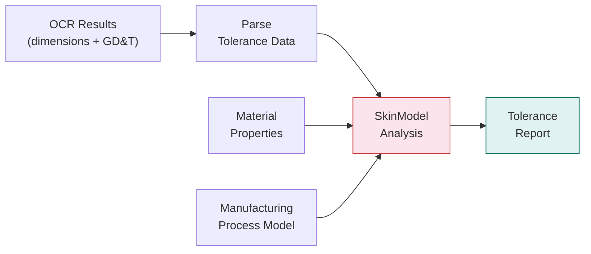
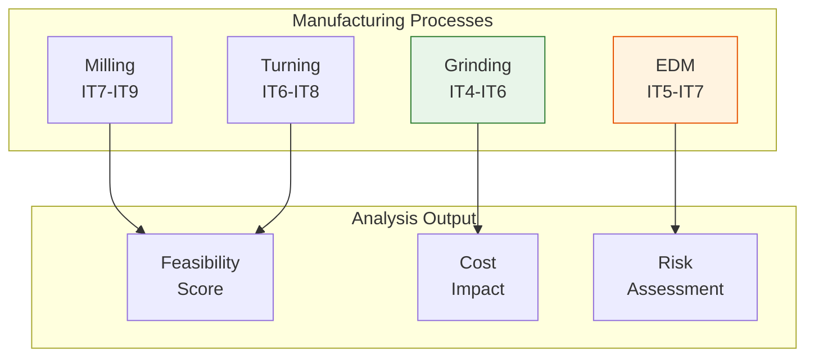

# Tolerance Analysis

The Tolerance Analysis stage uses SkinModel Shapes to analyze Geometric Dimensioning and Tolerancing (GD&T) data extracted from engineering drawings. It evaluates manufacturing feasibility, tolerance stack-ups, and process compatibility.

## Overview

| Property | Value |
|----------|-------|
| **Model** | SkinModel Shapes |
| **Service** | SkinModel API |
| **Port** | 5003 |
| **GPU** | Required |
| **Category** | Analysis |

## Workflow



## Parameters

| Parameter | Type | Default | Description |
|-----------|------|---------|-------------|
| `material_type` | string | `"steel"` | Material type for analysis (steel, aluminum, plastic, etc.) |
| `manufacturing_process` | string | `"milling"` | Manufacturing process (milling, turning, grinding, etc.) |
| `correlation_length` | float | `1.0` | Spatial correlation length for surface deviation modeling |
| `task` | string | `"analyze"` | Task type (analyze, simulate, report) |

## Analysis Capabilities

### GD&T Evaluation

SkinModel evaluates all standard GD&T characteristics:

| GD&T Type | Symbols | Analysis |
|-----------|---------|----------|
| **Form** | Flatness, Straightness, Circularity, Cylindricity | Surface deviation simulation |
| **Orientation** | Perpendicularity, Parallelism, Angularity | Angular tolerance stack-up |
| **Location** | Position, Concentricity, Symmetry | Positional tolerance analysis |
| **Runout** | Circular Runout, Total Runout | Rotational deviation modeling |

### Manufacturing Process Impact

The analysis considers how different manufacturing processes affect achievable tolerances:



## API Endpoint

### POST /api/v1/tolerance

**Request:**

```
Content-Type: multipart/form-data
```

| Field | Type | Required | Description |
|-------|------|----------|-------------|
| `file` | File | Yes | Drawing image with GD&T annotations |
| `material_type` | string | No | Material (default: `steel`) |
| `manufacturing_process` | string | No | Process (default: `milling`) |
| `correlation_length` | float | No | Correlation length (default: `1.0`) |

**Response:**

```json
{
  "tolerances": [
    {
      "feature": "bore_diameter",
      "nominal": 50.0,
      "tolerance": 0.025,
      "gdt_type": "position",
      "feasibility": 0.92,
      "process_capability": 1.33
    }
  ],
  "overall_feasibility": 0.88,
  "recommended_process": "grinding",
  "cost_factor": 1.4
}
```

## Integration with Pipeline

The Tolerance Analysis stage receives structured dimension and GD&T data from the OCR stage:

1. **eDOCr2** extracts dimension values and tolerance annotations.
2. **Dimension Parser** structures raw OCR output into typed tolerance records.
3. **SkinModel** evaluates each tolerance against the specified material and process.
4. Results feed into the BOM generation stage for cost estimation.

## Notes

- The `correlation_length` parameter controls how surface deviations are spatially correlated; smaller values model finer surface textures.
- Tolerance analysis results directly influence the manufacturing quote by adjusting cost factors based on process difficulty.
- For assemblies with multiple mating parts, tolerance stack-up analysis considers the cumulative effect of individual tolerances.
