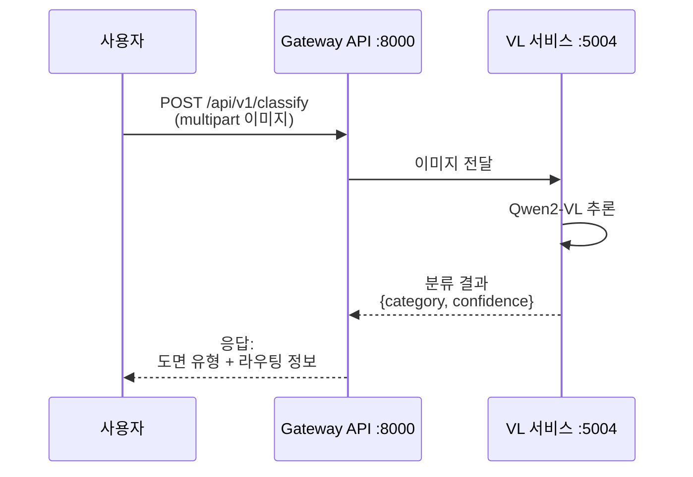
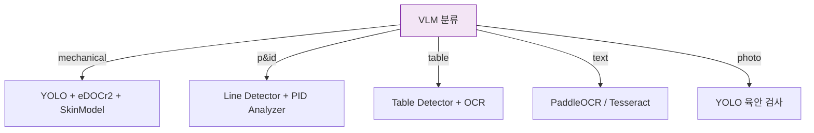

# VLM 분류

시각적 언어 모델(VLM, Vision-Language Model) 단계는 분석 파이프라인의 진입점입니다. 업로드된 도면을 카테고리로 분류하여 이후 처리 경로를 결정합니다.

## 모델

| 항목 | 값 |
|------|-----|
| **모델** | Qwen2-VL |
| **서비스** | VL API |
| **포트** | 5004 |
| **GPU** | 필수 |
| **카테고리** | AI |

## 분류 카테고리

VLM은 업로드된 각 이미지를 다섯 가지 카테고리 중 하나로 분류합니다:

| 카테고리 | 설명 | 후속 처리 경로 |
|----------|------|---------------|
| **mechanical** | 치수와 공차가 포함된 기계 엔지니어링 도면 | YOLO 검출 + eDOCr2 OCR + SkinModel |
| **p&id** | 배관 계장도(P&ID, Piping and Instrumentation Diagram) | Line Detector + PID Analyzer + Design Checker |
| **table** | 표 형식 데이터 (BOM 표, 부품 목록) | Table Detector + OCR |
| **text** | 텍스트 중심 문서 (사양서, 주석) | OCR (PaddleOCR / Tesseract) |
| **photo** | 부품 또는 조립체의 사진 | YOLO 검출 (육안 검사) |

## 시퀀스 흐름



## API 엔드포인트

### POST /api/v1/classify

도면 이미지의 유형을 분류합니다.

**요청(Request):**

```
Content-Type: multipart/form-data
```

| 필드 | 타입 | 필수 | 설명 |
|------|------|------|------|
| `file` | File | 예 | 도면 이미지 (PNG, JPG, TIFF, PDF) |

**응답(Response):**

```json
{
  "category": "mechanical",
  "confidence": 0.95,
  "all_scores": {
    "mechanical": 0.95,
    "p_and_id": 0.02,
    "table": 0.01,
    "text": 0.01,
    "photo": 0.01
  }
}
```

## 라우팅 로직

분류가 완료되면 Gateway API는 도면을 적절한 처리 파이프라인으로 라우팅합니다:



## 참고 사항

- 분류 신뢰도(Confidence)가 0.7 미만인 경우, 에이전트 검증 큐(Agent Verification Queue)를 통한 휴먼 인 더 루프(Human-in-the-Loop) 검토가 실행됩니다.
- VLM은 `describe` 작업 파라미터를 사용하면 도면 내용에 대한 자유 텍스트 설명을 생성할 수도 있습니다.
