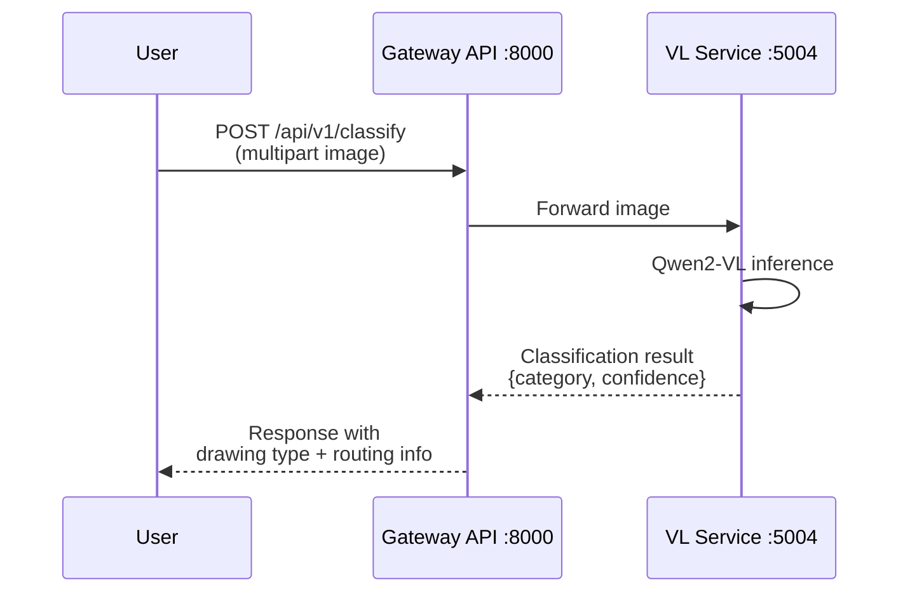
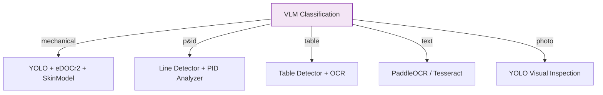

# VLM Classification

The Vision-Language Model (VLM) stage is the entry point of the analysis pipeline. It classifies uploaded drawings into categories that determine the downstream processing path.

## Model

| Property | Value |
|----------|-------|
| **Model** | Qwen2-VL |
| **Service** | VL API |
| **Port** | 5004 |
| **GPU** | Required |
| **Category** | AI |

## Classification Categories

The VLM classifies each uploaded image into one of five categories:

| Category | Description | Downstream Path |
|----------|-------------|-----------------|
| **mechanical** | Mechanical engineering drawings with dimensions and tolerances | YOLO Detection + eDOCr2 OCR + SkinModel |
| **p&id** | Piping and Instrumentation Diagrams | Line Detector + PID Analyzer + Design Checker |
| **table** | Tabular data (BOM tables, parts lists) | Table Detector + OCR |
| **text** | Text-heavy documents (specifications, notes) | OCR (PaddleOCR / Tesseract) |
| **photo** | Photographs of parts or assemblies | YOLO Detection (visual inspection) |

## Sequence Flow



## API Endpoint

### POST /api/v1/classify

Classify a drawing image by type.

**Request:**

```
Content-Type: multipart/form-data
```

| Field | Type | Required | Description |
|-------|------|----------|-------------|
| `file` | File | Yes | Drawing image (PNG, JPG, TIFF, PDF) |

**Response:**

```json
{
  "category": "mechanical",
  "confidence": 0.95,
  "all_scores": {
    "mechanical": 0.95,
    "p_and_id": 0.02,
    "table": 0.01,
    "text": 0.01,
    "photo": 0.01
  }
}
```

## Routing Logic

Once classification is complete, the Gateway API routes the drawing to the appropriate processing pipeline:



## Notes

- Classification confidence below 0.7 triggers a Human-in-the-Loop review via the Agent Verification Queue.
- The VLM can also generate free-text descriptions of drawing content when used with the `describe` task parameter.
