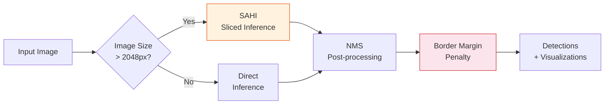

# YOLO Detection

YOLOv11 powers the object detection stage, identifying symbols, components, and annotations across engineering drawings. It supports 73 detection classes and includes SAHI (Slicing Aided Hyper Inference) for high-resolution inputs.

## Overview

| Property | Value |
|----------|-------|
| **Model** | Ultralytics YOLOv11 |
| **Service** | YOLO API |
| **Port** | 5005 |
| **GPU** | Required |
| **Detection Classes** | 73 |
| **Default Confidence** | 0.4 |

## Detection Pipeline



## SAHI Support

For high-resolution engineering drawings (common in A0/A1 formats), SAHI divides the image into overlapping tiles and runs detection on each tile independently. Results are merged with Non-Maximum Suppression (NMS).

| Parameter | Default | Description |
|-----------|---------|-------------|
| `use_sahi` | `false` | Enable sliced inference |
| `slice_height` | `640` | Tile height in pixels |
| `slice_width` | `640` | Tile width in pixels |
| `overlap_ratio` | `0.25` | Overlap between adjacent tiles |

## Detection Margin Penalty

Detections near the image border receive a confidence penalty to reduce false positives from partial symbols at drawing edges. This is particularly important for tiled or cropped drawings where symbols may be cut off.

## Parameters

| Parameter | Type | Default | Description |
|-----------|------|---------|-------------|
| `model_type` | string | `"default"` | Model variant to use |
| `confidence` | float | `0.4` | Minimum confidence threshold |
| `iou` | float | `0.5` | IoU threshold for NMS |
| `imgsz` | int | `640` | Input image size for inference |
| `use_sahi` | bool | `false` | Enable SAHI sliced inference |
| `slice_height` | int | `640` | SAHI tile height |
| `slice_width` | int | `640` | SAHI tile width |
| `overlap_ratio` | float | `0.25` | SAHI tile overlap ratio |
| `visualize` | bool | `false` | Return annotated image |
| `task` | string | `"detect"` | Task type (detect, segment) |

## API Endpoint

### POST /api/v1/detect

**Request:**

```
Content-Type: multipart/form-data
```

| Field | Type | Required | Description |
|-------|------|----------|-------------|
| `file` | File | Yes | Drawing image |
| `confidence` | float | No | Confidence threshold (default: 0.4) |
| `use_sahi` | bool | No | Enable SAHI |

**Response:**

```json
{
  "detections": [
    {
      "class": "dimension_line",
      "confidence": 0.92,
      "bbox": [120, 340, 280, 360],
      "class_id": 5
    }
  ],
  "count": 47,
  "image_size": [2480, 3508],
  "model_type": "default"
}
```

## Detection Classes

The 73 detection classes span multiple categories including:

- **Dimension elements**: dimension lines, arrows, extension lines, leaders
- **GD&T symbols**: flatness, perpendicularity, parallelism, position, etc.
- **Annotations**: notes, balloons, section marks, detail views
- **Drawing elements**: title blocks, revision blocks, BOM tables
- **P&ID symbols**: valves, pumps, instruments, equipment (when using P&ID model)

## Notes

- The default confidence threshold of **0.4** (not 0.5) is tuned for engineering drawings where recall is prioritized over precision.
- For production use with large drawings, enable SAHI with appropriate tile sizes matching the expected symbol density.
- The `visualize` parameter returns a base64-encoded annotated image alongside the JSON detections.
