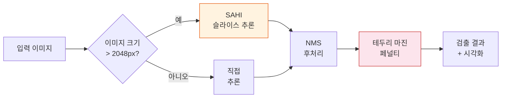

# YOLO 검출

YOLOv11은 객체 검출(Object Detection) 단계를 담당하며, 엔지니어링 도면에서 심볼, 부품, 주석을 식별합니다. 73개의 검출 클래스를 지원하며, 고해상도 입력을 위한 SAHI(Slicing Aided Hyper Inference)를 포함합니다.

## 개요

| 항목 | 값 |
|------|-----|
| **모델** | Ultralytics YOLOv11 |
| **서비스** | YOLO API |
| **포트** | 5005 |
| **GPU** | 필수 |
| **검출 클래스** | 73개 |
| **기본 신뢰도** | 0.4 |

## 검출 파이프라인



## SAHI 지원

고해상도 엔지니어링 도면(A0/A1 포맷에서 흔히 발생)의 경우, SAHI는 이미지를 겹치는 타일로 분할하고 각 타일에 대해 독립적으로 검출을 수행합니다. 결과는 비최대 억제(NMS, Non-Maximum Suppression)를 통해 병합됩니다.

| 파라미터 | 기본값 | 설명 |
|----------|--------|------|
| `use_sahi` | `false` | 슬라이스 추론 활성화 |
| `slice_height` | `640` | 타일 높이 (픽셀) |
| `slice_width` | `640` | 타일 너비 (픽셀) |
| `overlap_ratio` | `0.25` | 인접 타일 간 겹침 비율 |

## 검출 마진 페널티

이미지 테두리 근처의 검출은 신뢰도 페널티를 받아 도면 가장자리의 불완전한 심볼로 인한 오탐(False Positive)을 줄입니다. 이는 심볼이 잘려나갈 수 있는 타일 또는 크롭된 도면에서 특히 중요합니다.

## 파라미터

| 파라미터 | 타입 | 기본값 | 설명 |
|----------|------|--------|------|
| `model_type` | string | `"default"` | 사용할 모델 변형 |
| `confidence` | float | `0.4` | 최소 신뢰도 임계값 |
| `iou` | float | `0.5` | NMS용 IoU 임계값 |
| `imgsz` | int | `640` | 추론용 입력 이미지 크기 |
| `use_sahi` | bool | `false` | SAHI 슬라이스 추론 활성화 |
| `slice_height` | int | `640` | SAHI 타일 높이 |
| `slice_width` | int | `640` | SAHI 타일 너비 |
| `overlap_ratio` | float | `0.25` | SAHI 타일 겹침 비율 |
| `visualize` | bool | `false` | 주석이 달린 이미지 반환 |
| `task` | string | `"detect"` | 작업 유형 (detect, segment) |

## API 엔드포인트

### POST /api/v1/detect

**요청(Request):**

```
Content-Type: multipart/form-data
```

| 필드 | 타입 | 필수 | 설명 |
|------|------|------|------|
| `file` | File | 예 | 도면 이미지 |
| `confidence` | float | 아니오 | 신뢰도 임계값 (기본값: 0.4) |
| `use_sahi` | bool | 아니오 | SAHI 활성화 |

**응답(Response):**

```json
{
  "detections": [
    {
      "class": "dimension_line",
      "confidence": 0.92,
      "bbox": [120, 340, 280, 360],
      "class_id": 5
    }
  ],
  "count": 47,
  "image_size": [2480, 3508],
  "model_type": "default"
}
```

## 검출 클래스

73개의 검출 클래스는 다음과 같은 여러 카테고리에 걸쳐 있습니다:

- **치수 요소**: 치수선, 화살표, 연장선, 지시선
- **GD&T 심볼**: 평면도, 직각도, 평행도, 위치도 등
- **주석**: 노트, 풍선, 단면 표시, 상세 뷰
- **도면 요소**: 표제란(Title Block), 리비전 블록, BOM 표
- **P&ID 심볼**: 밸브, 펌프, 계기, 장비 (P&ID 모델 사용 시)

## 참고 사항

- 기본 신뢰도 임계값 **0.4**(0.5가 아님)는 정밀도(Precision)보다 재현율(Recall)을 우선시하는 엔지니어링 도면에 맞게 튜닝되었습니다.
- 대형 도면의 프로덕션 사용 시, 예상되는 심볼 밀도에 맞는 적절한 타일 크기로 SAHI를 활성화하십시오.
- `visualize` 파라미터는 JSON 검출 결과와 함께 base64 인코딩된 주석 이미지를 반환합니다.
