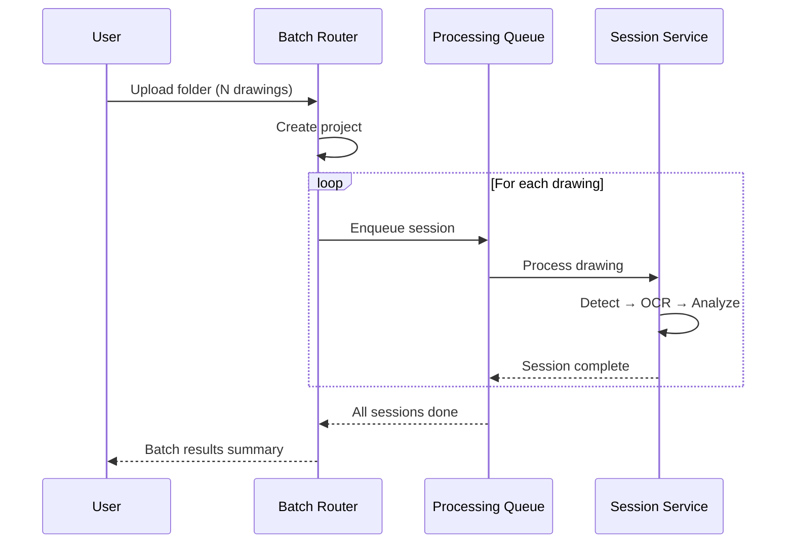
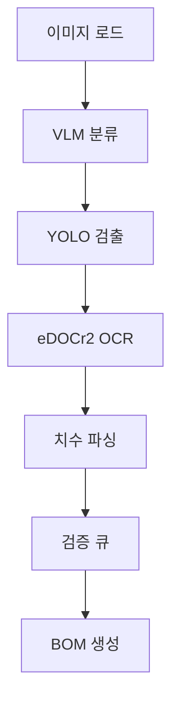

# Batch Processing

## Overview

배치 처리는 폴더 단위로 여러 도면을 한 번에 분석하는 기능입니다.



## API Endpoints

### Start Batch Analysis

```
POST /api/batch/analyze
Content-Type: multipart/form-data
```

| Parameter | Type | Description |
|-----------|------|-------------|
| `files` | File[] | 도면 이미지 파일들 |
| `project_name` | string | 프로젝트 이름 |
| `features` | string[] | 활성화할 기능 목록 |

### Check Batch Status

```
GET /api/batch/status/{project_id}
```

Response:
```json
{
  "project_id": "a444211b",
  "total_sessions": 53,
  "completed": 53,
  "failed": 0,
  "progress_percent": 100.0
}
```

## Processing Pipeline Per Session



## Parallelization

- 세션 간 병렬 처리 (configurable concurrency)
- GPU 서비스 큐 관리로 메모리 초과 방지
- 실패 세션 자동 재시도 (최대 3회)

## Metrics

| Metric | Value (DSE Bearing) |
|--------|---------------------|
| Total sessions | 53 |
| Avg processing time | ~30s/session |
| Dimensions extracted | 2,710 total |
| Avg dimensions/session | 51.1 |
| Success rate | 100% |
