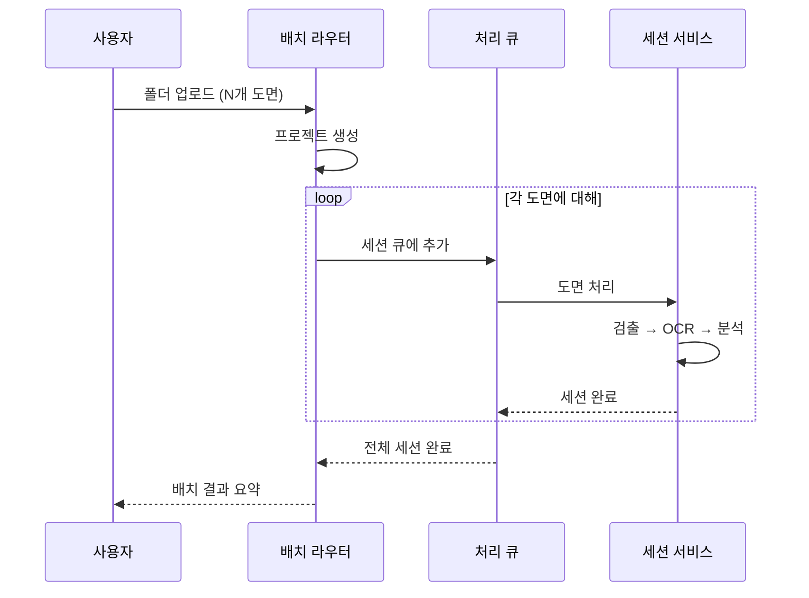
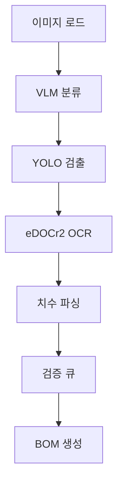

# 배치 처리

## 개요

배치 처리는 폴더 단위로 여러 도면을 한 번에 분석하는 기능입니다.



## API 엔드포인트

### 배치 분석 시작

```
POST /api/batch/analyze
Content-Type: multipart/form-data
```

| 파라미터 | 타입 | 설명 |
|----------|------|------|
| `files` | File[] | 도면 이미지 파일들 |
| `project_name` | string | 프로젝트 이름 |
| `features` | string[] | 활성화할 기능 목록 |

### 배치 상태 확인

```
GET /api/batch/status/{project_id}
```

응답:
```json
{
  "project_id": "a444211b",
  "total_sessions": 53,
  "completed": 53,
  "failed": 0,
  "progress_percent": 100.0
}
```

## 세션별 처리 파이프라인



## 병렬 처리

- 세션 간 병렬 처리 (동시 실행 수 설정 가능)
- GPU 서비스 큐 관리로 메모리 초과 방지
- 실패 세션 자동 재시도 (최대 3회)

## 성능 지표

| 지표 | 값 (DSE Bearing) |
|------|-------------------|
| 전체 세션 수 | 53 |
| 평균 처리 시간 | ~30초/세션 |
| 추출된 치수 | 총 2,710개 |
| 평균 치수/세션 | 51.1 |
| 성공률 | 100% |
