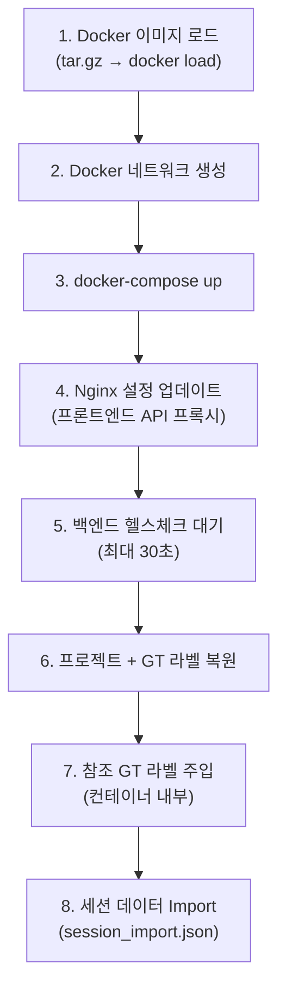

# Export Package

## Package Structure

### Standard Export (ZIP)

```
{filename}_{export_id}_{timestamp}.zip
├── manifest.json          # 매니페스트 (v2.0)
├── session.json           # 세션 데이터 (검출 결과, 이미지 목록, BOM)
├── images/                # 원본 도면 이미지 ({image_id}_{filename})
└── detections/            # 검출 영역 크롭 이미지 (*.jpg)
```

### Self-contained Export (ZIP)

```
{filename}_{export_id}_{timestamp}_self_contained.zip
├── manifest.json          # 매니페스트 (v3.0, 서비스/포트 매핑 포함)
├── session.json           # 세션 데이터
├── session_import.json    # Import 호환 세션 (이미지 base64 임베딩)
├── project.json           # 프로젝트 메타데이터
├── README.md              # Import 가이드
├── images/                # 원본 도면 이미지
├── gt_labels/             # Ground Truth 라벨 파일
├── gt_reference/          # 참조 GT 라벨 + classes.txt
├── docker/
│   ├── docker-compose.yml # 포트 오프셋 적용된 Compose 파일
│   └── images/            # Docker 이미지 tar.gz 파일
└── scripts/
    ├── import.sh          # Linux/macOS import 스크립트
    ├── import.ps1         # Windows PowerShell import 스크립트
    └── nginx.conf         # 프론트엔드 Nginx 설정
```

## Export Formats

| Format | Content | Use Case |
|--------|---------|----------|
| **JSON** | Raw analysis results | API 연동, 후처리 |
| **Excel** | Structured BOM + pricing | 고객 납품, 검토용 |
| **PDF** | Formatted quotation | 공식 견적서 |
| **HTML** | Self-contained viewer | 오프라인 검토 |

## Self-contained Export

서버 없이 독립적으로 실행 가능한 완전 배포 패키지입니다.

### How It Works

1. **서비스 자동 감지**: 워크플로우 노드와 세션 features에서 필요한 Docker 서비스를 자동 추출
2. **Docker 이미지 Export**: 감지된 서비스의 Docker 이미지를 `tar.gz`로 저장
3. **포트 오프셋 적용**: 기존 서비스와 충돌 방지를 위해 포트 오프셋 적용 (기본 +10000)
4. **Import 스크립트 생성**: Linux/Windows용 자동화 스크립트 생성
5. **세션 데이터 임베딩**: 이미지를 base64로 인코딩하여 `session_import.json`에 포함

### Service Detection

워크플로우 노드 타입과 세션 features를 분석하여 필요한 Docker 서비스를 결정합니다.

| Source | Example | Detected Service |
|--------|---------|-----------------|
| Node type `yolo` | YOLO detection node | `yolo-api` |
| Node type `edocr2` | OCR node | `edocr2-v2-api` |
| Feature `symbol_detection` | Session feature | `yolo-api` |
| Feature `table_extraction` | Session feature | `table-detector-api` |
| Backend included | `blueprint-ai-bom-backend` | `blueprint-ai-bom-frontend` (auto) |

`gateway-api`는 항상 포함됩니다.

### Port Offset

```
Original Port + Offset = Mapped Port
  yolo-api:5005  + 10000 = 15005
  gateway:8000   + 10000 = 18000
  bom-backend:5020 + 10000 = 15020
  bom-frontend:3000 + 10000 = 13000
```

## Export Readiness Check

Export 전에 세션의 검증 상태를 확인합니다.

| Condition | Can Export |
|-----------|-----------|
| 모든 이미지 approved/modified | Yes |
| pending 이미지 존재 | No - `"N개의 이미지가 검토 대기 중입니다"` |
| approved 이미지 0개 | No - `"승인/수정된 이미지가 없습니다"` |

## API Endpoints

| Method | Endpoint | Description |
|--------|----------|-------------|
| `GET` | `/api/export/sessions/{id}/preview` | Export 미리보기 (가능 여부 + 예상 크기) |
| `POST` | `/api/export/sessions/{id}` | Standard Export 패키지 생성 |
| `GET` | `/api/export/sessions/{id}/self-contained/preview` | Self-contained 미리보기 (서비스 목록 + 포트 매핑) |
| `POST` | `/api/export/sessions/{id}/self-contained` | Self-contained 패키지 생성 |
| `GET` | `/api/export/sessions/{id}/download/{filename}` | Export 파일 다운로드 |
| `GET` | `/api/export/sessions/{id}/history` | Export 이력 조회 |
| `DELETE` | `/api/export/sessions/{id}/{filename}` | Export 파일 삭제 |

## Naming Convention

파일명은 다음 패턴을 따릅니다:

```
# Standard Export
{session_filename}_{export_id}_{YYYYMMDD_HHMMSS}.zip

# Self-contained Export
{session_filename}_{export_id}_{YYYYMMDD_HHMMSS}_self_contained.zip
```

- `export_id`: UUID 앞 8자리 (예: `a3f2b1c4`)
- `timestamp`: 생성 시점 (예: `20260222_143052`)

## File Size Optimization

| Strategy | Effect | Controlled By |
|----------|--------|---------------|
| `ZIP_DEFLATED` 압축 | JSON/텍스트 파일 50-70% 감소 | 기본 적용 |
| Docker 이미지 gzip 압축 | 이미지 크기 30-50% 감소 | `compress_images` 옵션 |
| Rejected 이미지 제외 | 불필요한 파일 제거 | `include_rejected=false` (기본) |
| Docker 이미지 미포함 | 데이터만 Export | `include_docker=false` |
| 이미지 파일 미포함 | 결과 데이터만 | `include_images=false` |

## Import Process

Self-contained 패키지의 8단계 자동 Import 프로세스:



Linux/macOS: `chmod +x scripts/import.sh && ./scripts/import.sh`
Windows: `.\scripts\import.ps1`
