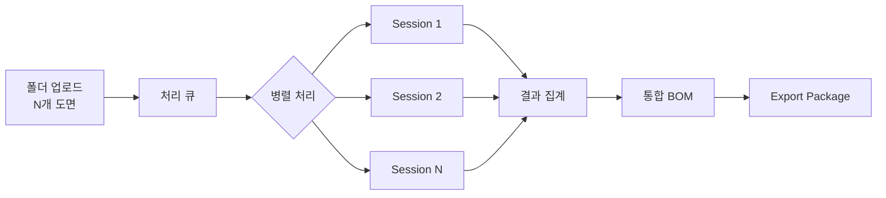
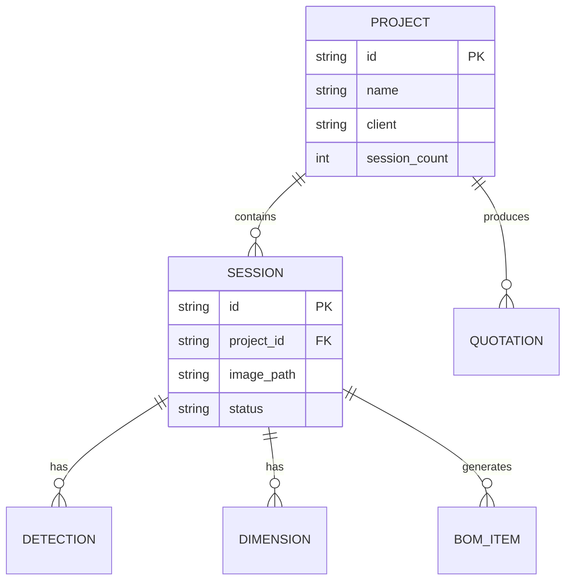

# Batch Processing & Delivery

대량의 도면을 일괄 분석하고 납품 가능한 패키지로 내보내는 시스템입니다.

## Pipeline Overview

## Key Capabilities

| Feature | Description |
|---------|-------------|
| **Batch Analysis** | 폴더 단위 도면 일괄 처리 |
| **Project Management** | 프로젝트 → 세션 계층 관리 |
| **Export Package** | JSON + Excel + PDF 납품 |
| **Self-contained Export** | 서버 없이 독립 실행 가능 |

## Real-World Example

**DSE Bearing Turbine Project:**
- 53 sessions (53개 도면)
- 2,710 dimensions extracted (평균 51.1/session)
- 7 assembly groups (T3~T8 + THRUST)
- 100% batch completion rate

## Project Hierarchy

## Sub-pages

| Page | Description |
|------|-------------|
| [Batch Processing](./batch-processing) | 대량 도면 일괄 분석 상세 |
| [Project Management](./project-management) | 프로젝트 계층 관리 |
| [Export Package](./export-package) | 납품 패키지 생성 |
