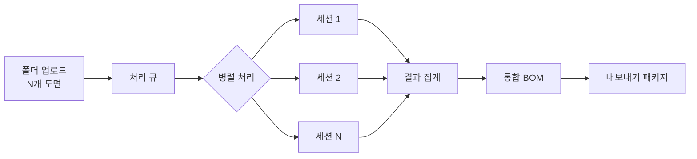
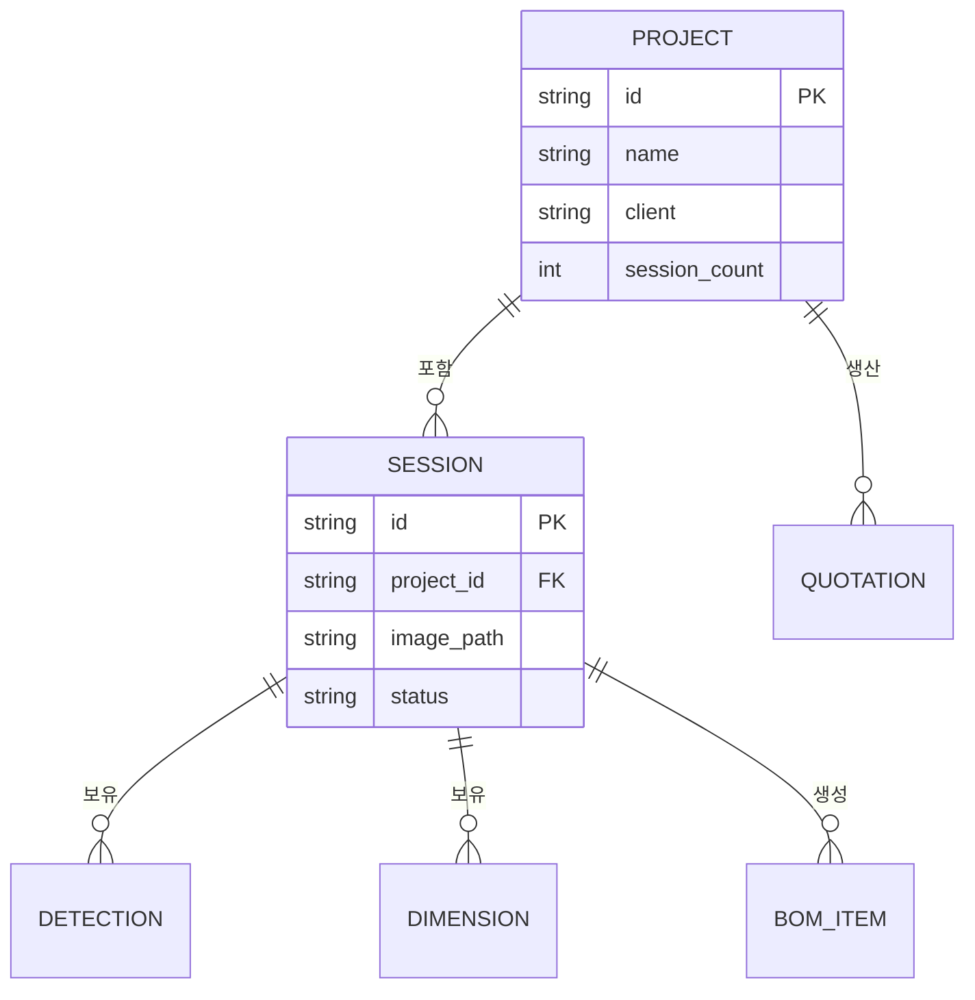

# 배치 처리 및 납품

대량의 도면을 일괄 분석하고 납품 가능한 패키지로 내보내는 시스템입니다.

## 파이프라인 개요

## 주요 기능

| 기능 | 설명 |
|------|------|
| **배치 분석 (Batch Analysis)** | 폴더 단위 도면 일괄 처리 |
| **프로젝트 관리 (Project Management)** | 프로젝트 → 세션 계층 관리 |
| **내보내기 패키지 (Export Package)** | JSON + Excel + PDF 납품 |
| **독립 실행 내보내기 (Self-contained Export)** | 서버 없이 독립 실행 가능 |

## 실제 사례

**DSE Bearing Turbine 프로젝트:**
- 53개 세션 (53개 도면)
- 2,710개 치수 추출 (평균 51.1개/세션)
- 7개 조립 그룹 (T3~T8 + THRUST)
- 배치 완료율 100%

## 프로젝트 계층 구조

## 하위 페이지

| 페이지 | 설명 |
|--------|------|
| [배치 처리](./batch-processing) | 대량 도면 일괄 분석 상세 |
| [프로젝트 관리](./project-management) | 프로젝트 계층 관리 |
| [내보내기 패키지](./export-package) | 납품 패키지 생성 |
