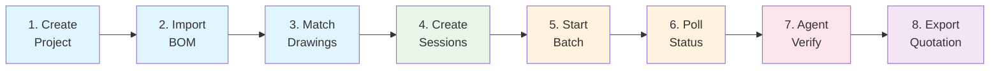

# Customer Onboarding Guide

## Overview

신규 고객 프로젝트 셋업에 필요한 8개 API 호출을 자동화하는 CLI 도구입니다.
프로젝트 생성 → BOM 임포트 → 도면 매칭 → 세션 생성 → 일괄 분석 → 검증 → 견적 내보내기까지 한 번에 수행합니다.

### 전제조건

- Blueprint AI BOM 서버 실행 중 (`http://localhost:5020`)
- Python 3.10+ (httpx 설치됨)
- BOM 견적 프로젝트의 경우: BOM PDF 파일 + 도면 폴더

### 8-Phase Pipeline



| Phase | API Endpoint | 설명 |
|-------|-------------|------|
| 1 | `POST /projects` | 프로젝트 생성 → project_id 획득 |
| 2 | `POST /projects/{id}/import-bom` | BOM PDF 업로드 (BOM 타입만) |
| 3 | `POST /projects/{id}/match-drawings` | 도면번호 → 파일 매칭 (BOM 타입만) |
| 4 | `POST /projects/{id}/create-sessions` | 매칭된 도면으로 세션 일괄 생성 |
| 5 | `POST /analysis/batch/{id}` | 백그라운드 일괄 분석 시작 |
| 6 | `GET /analysis/batch/{id}/status` | 분석 진행률 폴링 |
| 7 | subprocess: `agent_verify.py` | Agent 검증 (선택사항) |
| 8 | `POST /projects/{id}/quotation/export` | 견적서 PDF/Excel 내보내기 |

---

## Quick Start

### BOM 견적 프로젝트 (TECHCROSS)

```bash
cd blueprint-ai-bom

python scripts/onboard.py \
    --preset techcross_bwms \
    --name "TECHCROSS BWMS 2026-Q1" \
    --bom-pdf /data/customers/techcross/bom.pdf \
    --drawing-folder /data/customers/techcross/drawings/ \
    --verify
```

### P&ID 분석 프로젝트

```bash
python scripts/onboard.py \
    --preset pid_standard \
    --name "P&ID Analysis - Plant A" \
    --customer "Samsung Engineering"
```

### 일반 제조 도면 분석

```bash
python scripts/onboard.py \
    --name "General Manufacturing" \
    --customer "Test Corp" \
    --type general \
    --dry-run
```

---

## CLI Reference

### Usage

```
python scripts/onboard.py [OPTIONS]
```

### Mode Options

| Flag | 설명 |
|------|------|
| `--interactive`, `-i` | 단계별 프롬프트로 진행 |
| `--config FILE` | YAML/JSON 설정 파일 사용 |
| `--list-presets` | 사용 가능한 프리셋 목록 출력 |

### Project Options

| Flag | 설명 | 기본값 |
|------|------|--------|
| `--name` | 프로젝트 이름 (필수) | - |
| `--customer` | 고객사명 (필수) | - |
| `--type` | `bom_quotation`, `pid_detection`, `general` | `general` |
| `--description` | 프로젝트 설명 | - |
| `--preset` | 고객 프리셋 이름 | - |

### BOM Options

| Flag | 설명 |
|------|------|
| `--bom-pdf` | BOM PDF 파일 경로 |
| `--drawing-folder` | 도면 폴더 경로 |

### Analysis Options

| Flag | 설명 | 기본값 |
|------|------|--------|
| `--features` | 활성화할 기능 목록 | 프리셋에 따름 |
| `--template` | 템플릿 이름 | - |
| `--root-drawing` | 루트 어셈블리 도면번호 | - |
| `--force-rerun` | 이미 분석된 세션 재실행 | `false` |

### Verification Options

| Flag | 설명 | 기본값 |
|------|------|--------|
| `--verify` | Agent 검증 활성화 | `false` |
| `--verify-item-type` | `symbol`, `dimension`, `both` | `both` |
| `--verify-threshold` | L1 auto-approve 임계값 | `0.9` |
| `--verify-l1-only` | L1만 실행 (LLM 미사용) | `false` |

### Export Options

| Flag | 설명 | 기본값 |
|------|------|--------|
| `--export-format` | `pdf` 또는 `excel` | `pdf` |
| `--export-notes` | 견적서 비고 | - |

### Control Options

| Flag | 설명 | 기본값 |
|------|------|--------|
| `--dry-run` | API 호출 없이 계획만 출력 | `false` |
| `--resume-project` | 재개할 프로젝트 ID | - |
| `--resume-from` | 재개 시작 단계 (1-8) | `0` |
| `--api-base` | BOM API URL | `http://localhost:5020` |
| `--verbose`, `-v` | 상세 로그 | `false` |

---

## YAML Configuration

설정 파일로 반복 실행을 간소화할 수 있습니다.

```yaml
# project.yaml
preset: techcross_bwms
name: "TECHCROSS BWMS 2026-Q1"
customer: "TECHCROSS"
description: "1분기 정기 견적"

bom_pdf_path: /data/customers/techcross/bom.pdf
drawing_folder: /data/customers/techcross/drawings/

verify: true
verify_item_type: both
verify_threshold: 0.9

export_format: pdf
export_notes: "2026-Q1 정기 견적"
```

실행:

```bash
python scripts/onboard.py --config project.yaml
```

### Schema

| 필드 | 타입 | 필수 | 설명 |
|------|------|------|------|
| `preset` | string | N | 고객 프리셋 (기본값 먼저 적용, 명시 필드가 오버라이드) |
| `name` | string | Y | 프로젝트 이름 |
| `customer` | string | Y | 고객사명 |
| `project_type` | string | N | `bom_quotation`, `pid_detection`, `general` |
| `description` | string | N | 프로젝트 설명 |
| `bom_pdf_path` | string | N | BOM PDF 파일 경로 |
| `drawing_folder` | string | N | 도면 폴더 경로 |
| `features` | list | N | 활성화할 기능 목록 |
| `template_name` | string | N | 템플릿 이름 |
| `verify` | bool | N | Agent 검증 활성화 |
| `verify_item_type` | string | N | 검증 항목 타입 |
| `export_format` | string | N | 내보내기 형식 |

---

## Project Type Walkthroughs

### BOM Quotation (BOM 견적)

1단계 ~ 8단계 전체 수행. BOM PDF에서 파트를 추출하고, 도면을 매칭하여 세션을 생성한 후 일괄 분석합니다.

```bash
python scripts/onboard.py \
    --preset dse_bearing \
    --name "DSE Bearing 2026-01" \
    --bom-pdf /data/dse/bom.pdf \
    --drawing-folder /data/dse/drawings/ \
    --verify --export-format excel
```

### P&ID Detection (P&ID 분석)

Phase 2~3(BOM)을 건너뛰고 세션 생성부터 시작합니다. P&ID 심볼 검출 + 연결 분석에 특화됩니다.

```bash
python scripts/onboard.py \
    --preset pid_standard \
    --name "P&ID Analysis - Line 3" \
    --customer "Samsung Engineering" \
    --verify --verify-item-type symbol
```

### General Manufacturing (일반 제조)

범용 도면 분석. 심볼 검출 + 치수 OCR + 타이틀 블록 OCR을 수행합니다.

```bash
python scripts/onboard.py \
    --name "General Batch" \
    --customer "Test" \
    --type general
```

---

## Customer Presets

| Preset | Customer | Project Type | Features | Export | Verify |
|--------|----------|-------------|----------|--------|--------|
| `techcross_bwms` | TECHCROSS | bom_quotation | dimension_ocr, table_extraction, bom_generation, title_block_ocr | PDF | Yes (both) |
| `dse_bearing` | DSE | bom_quotation | dimension_ocr, table_extraction, bom_generation, title_block_ocr | Excel | Yes (dimension) |
| `pid_standard` | - | pid_detection | symbol_detection, pid_connectivity, gt_comparison | PDF | Yes (symbol) |
| `general_manufacturing` | - | general | symbol_detection, dimension_ocr, title_block_ocr | PDF | No |

프리셋 확인:

```bash
python scripts/onboard.py --list-presets
```

---

## Resume (재개)

파이프라인이 중간에 실패하면 실패 지점부터 재개할 수 있습니다.

```bash
# Phase 5에서 실패한 경우
python scripts/onboard.py \
    --resume-project abc123-def456 \
    --resume-from 5
```

상태 파일(`onboard_state_{project_id}.json`)이 자동으로 각 Phase 완료 시 저장됩니다.

---

## Troubleshooting

### 서버 연결 실패

```
네트워크 오류 (최대 재시도 초과): ...
```

- BOM 서버가 실행 중인지 확인: `curl -s http://localhost:5020/health`
- `--api-base` 옵션으로 올바른 URL 지정

### BOM PDF 파싱 실패

```
Phase 2: Import BOM [FAIL]
```

- PDF 파일이 BOM 테이블을 포함하는지 확인
- PDF 파일 경로가 서버 컨테이너에서 접근 가능한지 확인

### 배치 분석 타임아웃

```
배치 분석 타임아웃 (1800초)
```

- 도면 수가 많은 경우 `--root-drawing`으로 범위 축소
- `--resume-project` + `--resume-from 5`로 재시도

### 검증 실패

```
Phase 7: Agent Verification [FAIL]
```

- Anthropic API 키 설정 확인 (`ANTHROPIC_API_KEY` 환경변수)
- `--verify-l1-only`로 LLM 없이 실행 가능
