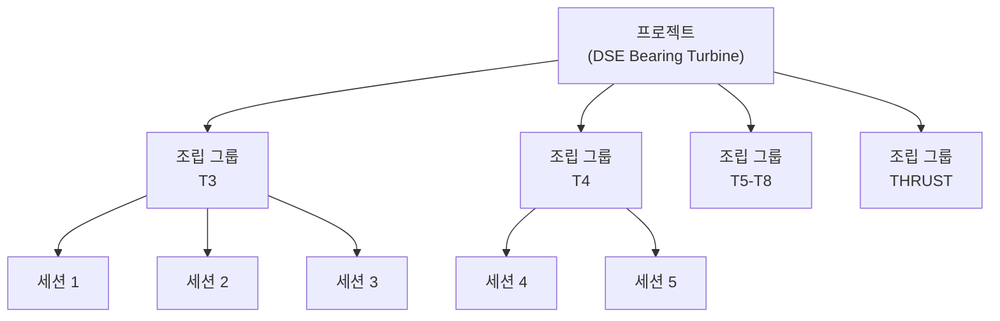
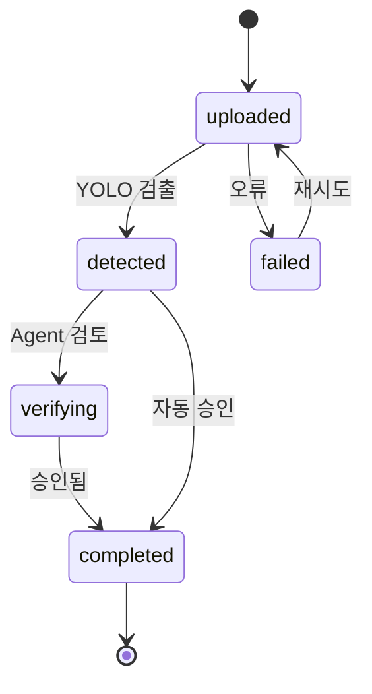
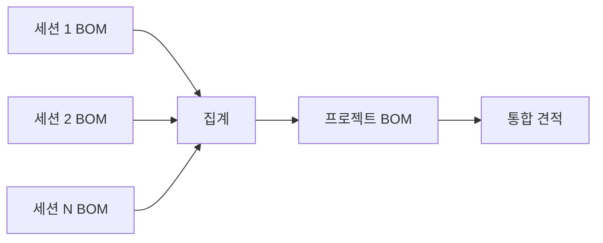

# 프로젝트 관리

## 계층 구조



## 프로젝트 구조

| 레벨 | 설명 | 예시 |
|------|------|------|
| **프로젝트 (Project)** | 최상위 단위, 고객/프로젝트별 | DSE Bearing Turbine |
| **조립 그룹 (Assembly Group)** | 조립 그룹별 분류 | T3, T4, T5-T8, THRUST |
| **세션 (Session)** | 개별 도면 분석 단위 | Drawing #1 (a444211b-001) |

## 프로젝트 타입

프로젝트 생성 시 타입별 기본 기능이 자동 설정됩니다.

| 타입 | 도면 타입 | 기본 기능 |
|------|----------|----------|
| `bom_quotation` | `dimension_bom` | `dimension_ocr`, `table_extraction`, `bom_generation`, `title_block_ocr` |
| `pid_detection` | `pid` | `symbol_detection`, `pid_connectivity`, `gt_comparison` |
| `general` | `auto` | `symbol_detection`, `dimension_ocr`, `title_block_ocr` |

## 세션 상태



| 상태 | 설명 |
|------|------|
| `uploaded` | 도면 업로드 완료, 분석 대기 |
| `detected` | 객체 검출 완료, 검증 대기 |
| `verifying` | Agent 검증 진행 중 |
| `completed` | 분석 및 검증 완료 |
| `failed` | 분석 실패 (재시도 가능) |

## 세션-프로젝트 관계

세션은 `project_id`로 프로젝트에 연결됩니다. 프로젝트 상세 조회 시 하위 세션 목록과 통계가 실시간으로 집계됩니다.

```python
# 프로젝트 통계 자동 집계 필드
{
    "session_count": 12,       # 전체 세션 수
    "completed_count": 8,      # completed 상태 세션 수
    "pending_count": 4,        # uploaded/detected/verifying 상태 세션 수
    "bom_item_count": 45,      # BOM 전체 항목 수
    "quotation_item_count": 32,# 견적 대상 (Part) 수
    "quoted_count": 20,        # 견적 완료 수
    "total_quotation": 15400.0 # 총 견적가
}
```

## API 엔드포인트

### 프로젝트 CRUD

| 메서드 | 엔드포인트 | 설명 |
|--------|-----------|------|
| `POST` | `/api/projects` | 프로젝트 생성 (name, customer, project_type 필수) |
| `GET` | `/api/projects` | 프로젝트 목록 (customer 필터, limit 지원) |
| `GET` | `/api/projects/{id}` | 프로젝트 상세 (세션 목록 + 템플릿 정보 포함) |
| `PUT` | `/api/projects/{id}` | 프로젝트 수정 (변경 필드만 전송) |
| `DELETE` | `/api/projects/{id}` | 프로젝트 삭제 (`?delete_sessions=true`로 세션 동시 삭제) |

### BOM 워크플로우

| 메서드 | 엔드포인트 | 설명 |
|--------|-----------|------|
| `POST` | `/api/projects/{id}/import-bom` | BOM PDF 업로드 및 계층 파싱 |
| `GET` | `/api/projects/{id}/bom-hierarchy` | BOM 계층 트리 조회 |
| `POST` | `/api/projects/{id}/match-drawings` | 도면번호 - 파일 매칭 |
| `POST` | `/api/projects/{id}/create-sessions` | 매칭된 도면으로 세션 일괄 생성 |
| `POST` | `/api/projects/{id}/upload-batch` | 도면 파일 일괄 업로드 |

## BOM 집계

프로젝트 레벨에서 전체 세션의 BOM을 통합합니다:



BOM 집계 규칙:

- **도면번호 기준 중복 제거**: 동일 도면이 복수 Assembly에 속할 경우 하나의 세션으로 통합
- **수량 합산**: 그룹 내 모든 BOM 라인의 quantity를 합산하여 `bom_quantity`에 저장
- **어셈블리 귀속 추적**: `assembly_refs` 배열로 세션이 속한 Assembly 목록 관리
- **어셈블리 그룹별 소계**: Assembly/Subassembly/Part 3단계 계층으로 구분
- **프로젝트 총합 계산**: `total_quotation` 필드에 전 세션 견적 합산

## 데이터 저장소

프로젝트 데이터는 파일 시스템 기반으로 저장되며, 메모리 캐시로 빠른 조회를 지원합니다.

```
/app/data/projects/{project_id}/
├── project.json       # 프로젝트 메타데이터
├── bom_source.pdf     # 원본 BOM PDF
├── bom_items.json     # 파싱된 BOM 계층 데이터
├── gt_labels/         # Ground Truth 라벨 파일
└── references/        # 참조 도면 폴더
```
