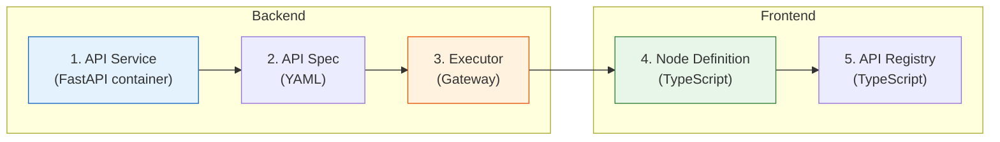

# Custom API

BlueprintFlow can be extended with custom API nodes. This guide covers the full process: scaffolding a new service, registering an executor, and defining the node in the frontend.

## Overview

Adding a custom API node requires changes in three layers:



## Step 1: Scaffold the API Service

Use the `create_api.py` script to generate a new service with Docker support:

```bash
python scripts/create_api.py my-custom-api --port 5025 --category detection
```

This creates:

```
models/my-custom-api-api/
  api_server.py          # FastAPI application
  Dockerfile             # Container definition
  requirements.txt       # Python dependencies
  tests/
    test_api.py          # Basic test suite
```

### API Server Template

The generated `api_server.py` follows the standard pattern:

```python
from fastapi import FastAPI, File, UploadFile
from fastapi.responses import JSONResponse

app = FastAPI(title="My Custom API", version="1.0.0")

@app.get("/health")
async def health():
    return {"status": "healthy"}

@app.post("/process")
async def process(file: UploadFile = File(...)):
    # Your processing logic here
    contents = await file.read()
    result = run_inference(contents)
    return JSONResponse(content=result)
```

## Step 2: Define the API Spec

Create a YAML spec in `gateway-api/api_specs/`:

```yaml
# gateway-api/api_specs/my-custom-api.yaml
name: my-custom-api
display_name: My Custom API
port: 5025
category: detection
health_endpoint: /health
process_endpoint: /process
parameters:
  - name: threshold
    type: float
    default: 0.5
    description: Detection confidence threshold
  - name: mode
    type: string
    default: "default"
    enum: ["default", "precise", "fast"]
    description: Processing mode
```

## Step 3: Register the Executor

Create an executor in `gateway-api/blueprintflow/executors/`:

```python
# gateway-api/blueprintflow/executors/my_custom_api_executor.py
from .base_executor import BaseExecutor

class MyCustomAPIExecutor(BaseExecutor):
    SERVICE_PORT = 5025
    ENDPOINT = "/process"

    async def execute(self, params: dict, inputs: dict) -> dict:
        """Execute the custom API node."""
        file_data = inputs.get("image")
        form_data = {
            "threshold": params.get("threshold", 0.5),
            "mode": params.get("mode", "default"),
        }
        response = await self.call_service(
            file_data=file_data,
            form_data=form_data,
        )
        return response
```

Register it in the executor registry:

```python
# gateway-api/blueprintflow/executors/executor_registry.py
from .my_custom_api_executor import MyCustomAPIExecutor

registry = {
    # ... existing executors ...
    "my_custom_api": MyCustomAPIExecutor(),
}
```

## Step 4: Define the Node

Add the node definition in the frontend:

```typescript
// web-ui/src/config/nodeDefinitions.ts
{
  type: 'my_custom_api',
  label: 'My Custom API',
  category: 'detection',
  description: 'Custom detection with configurable modes',
  icon: 'Scan',
  parameters: [
    {
      name: 'threshold',
      type: 'number',
      default: 0.5,
      min: 0,
      max: 1,
      step: 0.05,
      label: 'Confidence Threshold',
    },
    {
      name: 'mode',
      type: 'select',
      default: 'default',
      options: ['default', 'precise', 'fast'],
      label: 'Processing Mode',
    },
  ],
  inputs: ['image'],
  outputs: ['detections', 'annotated_image'],
}
```

## Step 5: Register the API Endpoint

Add the endpoint to the API registry:

```typescript
// web-ui/src/config/apiRegistry.ts
{
  id: 'my-custom-api',
  name: 'My Custom API',
  port: 5025,
  healthEndpoint: '/health',
  processEndpoint: '/process',
  category: 'detection',
}
```

## Docker Integration

Add the service to `docker-compose.yml`:

```yaml
my-custom-api:
  build:
    context: ./models/my-custom-api-api
  ports:
    - "5025:5025"
  networks:
    - ax_poc_network
  deploy:
    resources:
      reservations:
        devices:
          - capabilities: [gpu]
  healthcheck:
    test: ["CMD", "curl", "-f", "http://localhost:5025/health"]
    interval: 30s
    timeout: 10s
    retries: 3
```

## Checklist

After completing all steps, verify:

| Step | Verification |
|------|-------------|
| API Service | `curl http://localhost:5025/health` returns `{"status": "healthy"}` |
| API Spec | File exists at `gateway-api/api_specs/my-custom-api.yaml` |
| Executor | Registered in `executor_registry.py` |
| Node Definition | Appears in BlueprintFlow sidebar under correct category |
| API Registry | Health status shows green in Dashboard |
| Docker | Container runs and passes healthcheck |

## Notes

- Always define parameters in the API spec YAML first, then mirror them in the node definition. Never add parameters to the frontend that do not exist in the spec.
- The `category` must be one of: `input`, `detection`, `ocr`, `segmentation`, `preprocessing`, `analysis`, `knowledge`, `ai`, `control`. Do not use `api` as a category.
- GPU allocation can be configured dynamically through the Dashboard without modifying Docker files.
