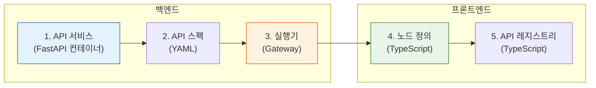

# 커스텀 API

BlueprintFlow는 커스텀 API 노드로 확장할 수 있습니다. 이 가이드에서는 새 서비스 스캐폴딩, 실행기(Executor) 등록, 프론트엔드 노드 정의까지의 전체 과정을 다룹니다.

## 개요

커스텀 API 노드를 추가하려면 세 개의 레이어에서 변경이 필요합니다:



## 1단계: API 서비스 스캐폴딩

`create_api.py` 스크립트를 사용하여 Docker 지원이 포함된 새 서비스를 생성합니다:

```bash
python scripts/create_api.py my-custom-api --port 5025 --category detection
```

생성되는 파일 구조:

```
models/my-custom-api-api/
  api_server.py          # FastAPI 애플리케이션
  Dockerfile             # 컨테이너 정의
  requirements.txt       # Python 의존성
  tests/
    test_api.py          # 기본 테스트 스위트
```

### API 서버 템플릿

생성되는 `api_server.py`는 표준 패턴을 따릅니다:

```python
from fastapi import FastAPI, File, UploadFile
from fastapi.responses import JSONResponse

app = FastAPI(title="My Custom API", version="1.0.0")

@app.get("/health")
async def health():
    return {"status": "healthy"}

@app.post("/process")
async def process(file: UploadFile = File(...)):
    # 처리 로직을 여기에 작성합니다
    contents = await file.read()
    result = run_inference(contents)
    return JSONResponse(content=result)
```

## 2단계: API 스펙 정의

`gateway-api/api_specs/`에 YAML 스펙을 생성합니다:

```yaml
# gateway-api/api_specs/my-custom-api.yaml
name: my-custom-api
display_name: My Custom API
port: 5025
category: detection
health_endpoint: /health
process_endpoint: /process
parameters:
  - name: threshold
    type: float
    default: 0.5
    description: Detection confidence threshold
  - name: mode
    type: string
    default: "default"
    enum: ["default", "precise", "fast"]
    description: Processing mode
```

## 3단계: 실행기 등록

`gateway-api/blueprintflow/executors/`에 실행기를 생성합니다:

```python
# gateway-api/blueprintflow/executors/my_custom_api_executor.py
from .base_executor import BaseExecutor

class MyCustomAPIExecutor(BaseExecutor):
    SERVICE_PORT = 5025
    ENDPOINT = "/process"

    async def execute(self, params: dict, inputs: dict) -> dict:
        """커스텀 API 노드를 실행합니다."""
        file_data = inputs.get("image")
        form_data = {
            "threshold": params.get("threshold", 0.5),
            "mode": params.get("mode", "default"),
        }
        response = await self.call_service(
            file_data=file_data,
            form_data=form_data,
        )
        return response
```

실행기 레지스트리에 등록합니다:

```python
# gateway-api/blueprintflow/executors/executor_registry.py
from .my_custom_api_executor import MyCustomAPIExecutor

registry = {
    # ... 기존 실행기 ...
    "my_custom_api": MyCustomAPIExecutor(),
}
```

## 4단계: 노드 정의

프론트엔드에 노드 정의를 추가합니다:

```typescript
// web-ui/src/config/nodeDefinitions.ts
{
  type: 'my_custom_api',
  label: 'My Custom API',
  category: 'detection',
  description: 'Custom detection with configurable modes',
  icon: 'Scan',
  parameters: [
    {
      name: 'threshold',
      type: 'number',
      default: 0.5,
      min: 0,
      max: 1,
      step: 0.05,
      label: 'Confidence Threshold',
    },
    {
      name: 'mode',
      type: 'select',
      default: 'default',
      options: ['default', 'precise', 'fast'],
      label: 'Processing Mode',
    },
  ],
  inputs: ['image'],
  outputs: ['detections', 'annotated_image'],
}
```

## 5단계: API 엔드포인트 등록

API 레지스트리에 엔드포인트를 추가합니다:

```typescript
// web-ui/src/config/apiRegistry.ts
{
  id: 'my-custom-api',
  name: 'My Custom API',
  port: 5025,
  healthEndpoint: '/health',
  processEndpoint: '/process',
  category: 'detection',
}
```

## Docker 통합

`docker-compose.yml`에 서비스를 추가합니다:

```yaml
my-custom-api:
  build:
    context: ./models/my-custom-api-api
  ports:
    - "5025:5025"
  networks:
    - ax_poc_network
  deploy:
    resources:
      reservations:
        devices:
          - capabilities: [gpu]
  healthcheck:
    test: ["CMD", "curl", "-f", "http://localhost:5025/health"]
    interval: 30s
    timeout: 10s
    retries: 3
```

## 체크리스트

모든 단계를 완료한 후 다음을 확인합니다:

| 단계 | 검증 방법 |
|------|----------|
| API 서비스 | `curl http://localhost:5025/health`가 `{"status": "healthy"}`를 반환하는지 확인 |
| API 스펙 | `gateway-api/api_specs/my-custom-api.yaml` 파일이 존재하는지 확인 |
| 실행기 | `executor_registry.py`에 등록되었는지 확인 |
| 노드 정의 | BlueprintFlow 사이드바에서 올바른 카테고리에 표시되는지 확인 |
| API 레지스트리 | 대시보드에서 헬스 상태가 녹색으로 표시되는지 확인 |
| Docker | 컨테이너가 실행되고 헬스체크를 통과하는지 확인 |

## 참고 사항

- 항상 API 스펙 YAML에 파라미터를 먼저 정의한 후, 노드 정의에 반영하십시오. 스펙에 없는 파라미터를 프론트엔드에 추가하지 마십시오.
- `category`는 `input`, `detection`, `ocr`, `segmentation`, `preprocessing`, `analysis`, `knowledge`, `ai`, `control` 중 하나여야 합니다. `api`를 카테고리로 사용하지 마십시오.
- GPU 할당은 Docker 파일을 수정하지 않고도 대시보드를 통해 동적으로 설정할 수 있습니다.
