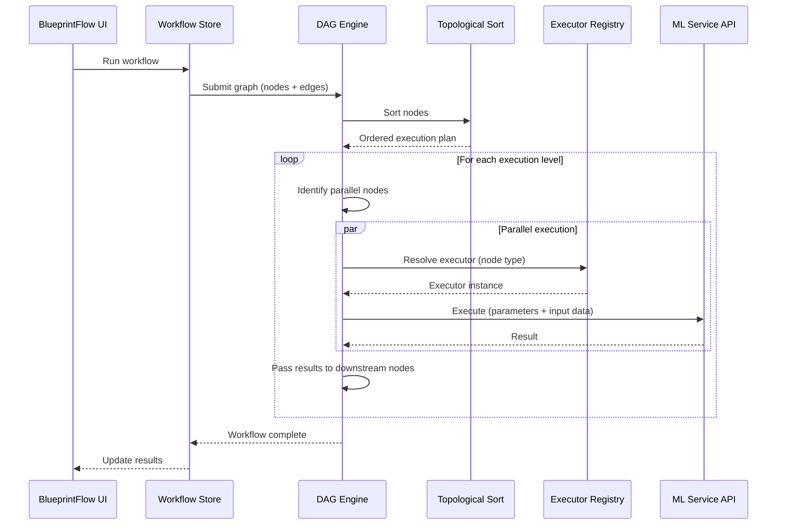
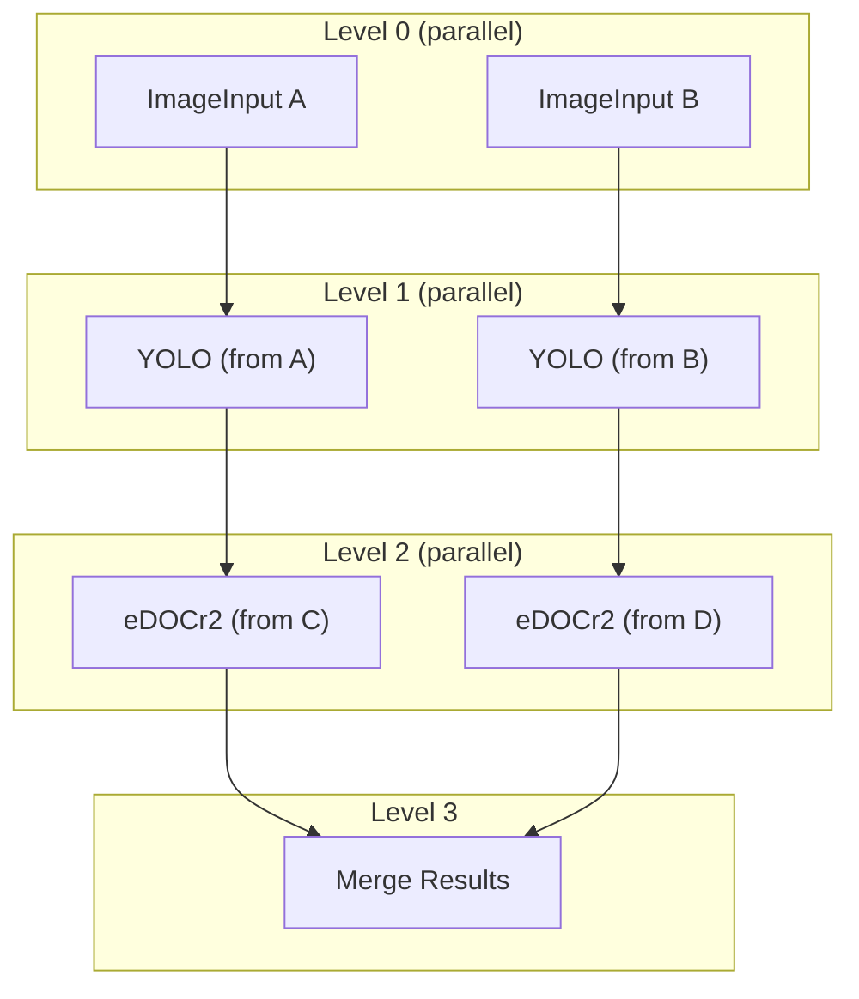
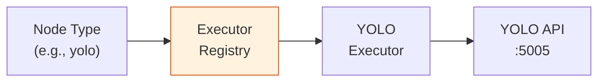

# DAG Engine

The DAG (Directed Acyclic Graph) Engine is the execution runtime for BlueprintFlow workflows. It takes a workflow graph, determines execution order via topological sort, runs independent branches in parallel, and routes each node to its registered executor.

## Execution Flow



## Topological Sort

The engine uses Kahn's algorithm for topological sorting:

1. Compute in-degree for every node in the graph.
2. Enqueue all nodes with in-degree 0 (source nodes).
3. Process nodes level by level, decrementing in-degrees of downstream nodes.
4. Nodes at the same level have no dependencies on each other and can run in parallel.



## Parallel Execution

Nodes within the same topological level are dispatched concurrently:

- Each node execution is an independent async task.
- The engine waits for all tasks in a level to complete before advancing to the next level.
- Failed nodes mark their downstream subgraph as skipped (unless an error handler is connected).

## Executor Registry

The Executor Registry maps node types to their execution handlers. Each executor knows how to:

1. Prepare the request payload from node parameters and upstream outputs.
2. Call the appropriate service endpoint.
3. Parse and normalize the response for downstream consumption.



### Registry Location

| File | Purpose |
|------|---------|
| `gateway-api/blueprintflow/executors/executor_registry.py` | Central registry mapping node types to executors |
| `gateway-api/blueprintflow/executors/*.py` | Individual executor implementations |

### Registration Pattern

Executors are registered at startup:

```python
# executor_registry.py
registry = {
    "yolo": YOLOExecutor(),
    "edocr2": EDOCr2Executor(),
    "vl": VLExecutor(),
    "skinmodel": SkinModelExecutor(),
    # ... 29+ executors
}
```

Each executor implements a common interface:

```python
class BaseExecutor:
    async def execute(self, params: dict, inputs: dict) -> dict:
        """Execute the node with given parameters and upstream inputs."""
        ...
```

## Error Handling

| Scenario | Behavior |
|----------|----------|
| Node timeout | Mark node as failed, skip downstream subgraph |
| API unreachable | Retry once, then fail with connection error |
| Invalid parameters | Fail immediately with validation error |
| Partial success | Report per-node status in workflow result |

## Data Flow

Data flows through the graph via edges. Each edge carries the output of the source node to the input of the target node:

- **Single output**: The entire result object is passed downstream.
- **Selective output**: Nodes can specify which output fields to forward using port mappings.
- **Merge node**: Combines multiple upstream outputs into a single object for downstream nodes.

## Notes

- The DAG Engine validates the graph for cycles before execution. Cyclic graphs are rejected with an error.
- Execution progress is reported in real-time through WebSocket updates to the UI.
- The Gateway API (port 8000) hosts the DAG Engine and manages all service-to-service communication.
