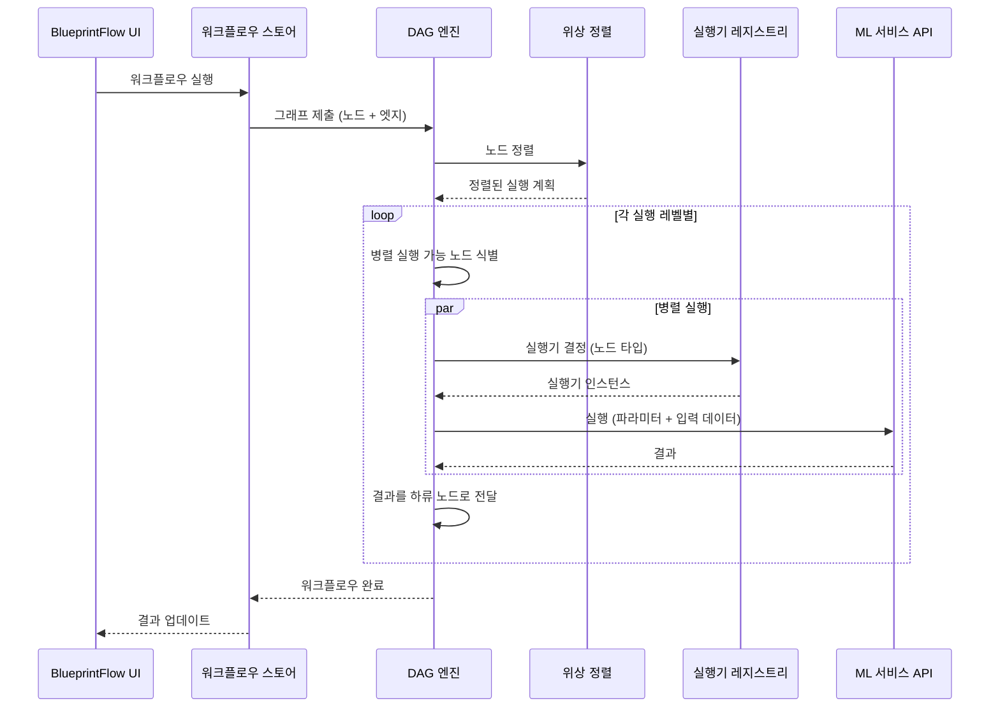
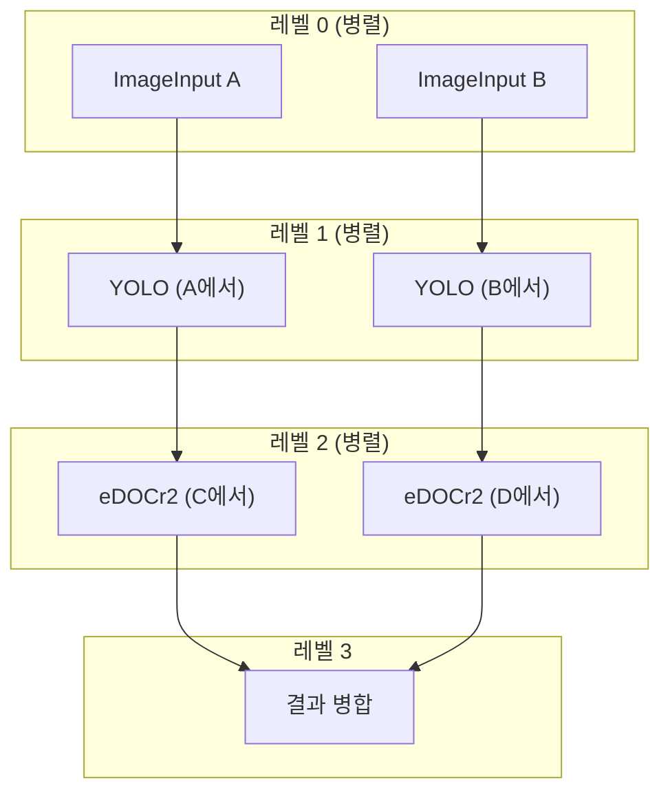
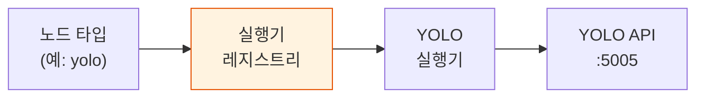

# DAG 엔진

DAG(Directed Acyclic Graph, 방향성 비순환 그래프) 엔진은 BlueprintFlow 워크플로우의 실행 런타임입니다. 워크플로우 그래프를 입력받아 위상 정렬(Topological Sort)을 통해 실행 순서를 결정하고, 독립적인 브랜치를 병렬로 실행하며, 각 노드를 등록된 실행기(Executor)로 라우팅합니다.

## 실행 흐름



## 위상 정렬 (Topological Sort)

엔진은 칸 알고리즘(Kahn's Algorithm)을 사용하여 위상 정렬을 수행합니다:

1. 그래프의 모든 노드에 대해 진입 차수(In-degree)를 계산합니다.
2. 진입 차수가 0인 모든 노드(소스 노드)를 큐에 넣습니다.
3. 레벨별로 노드를 처리하면서 하류 노드의 진입 차수를 감소시킵니다.
4. 같은 레벨에 있는 노드는 서로 의존성이 없으므로 병렬로 실행할 수 있습니다.



## 병렬 실행

같은 위상 정렬 레벨 내의 노드는 동시에 디스패치됩니다:

- 각 노드 실행은 독립적인 비동기 태스크(Async Task)입니다.
- 엔진은 한 레벨의 모든 태스크가 완료될 때까지 기다린 후 다음 레벨로 진행합니다.
- 실패한 노드는 하류 서브그래프를 건너뜀(Skip)으로 표시합니다 (에러 핸들러가 연결된 경우 제외).

## 실행기 레지스트리 (Executor Registry)

실행기 레지스트리는 노드 타입을 실행 핸들러에 매핑합니다. 각 실행기는 다음을 수행합니다:

1. 노드 파라미터와 상류 출력으로부터 요청 페이로드를 준비합니다.
2. 적절한 서비스 엔드포인트를 호출합니다.
3. 하류 소비를 위해 응답을 파싱하고 정규화합니다.



### 레지스트리 위치

| 파일 | 용도 |
|------|------|
| `gateway-api/blueprintflow/executors/executor_registry.py` | 노드 타입을 실행기에 매핑하는 중앙 레지스트리 |
| `gateway-api/blueprintflow/executors/*.py` | 개별 실행기 구현체 |

### 등록 패턴

실행기는 시작 시 등록됩니다:

```python
# executor_registry.py
registry = {
    "yolo": YOLOExecutor(),
    "edocr2": EDOCr2Executor(),
    "vl": VLExecutor(),
    "skinmodel": SkinModelExecutor(),
    # ... 29개 이상의 실행기
}
```

각 실행기는 공통 인터페이스를 구현합니다:

```python
class BaseExecutor:
    async def execute(self, params: dict, inputs: dict) -> dict:
        """주어진 파라미터와 상류 입력으로 노드를 실행합니다."""
        ...
```

## 에러 처리

| 시나리오 | 동작 |
|----------|------|
| 노드 타임아웃 | 노드를 실패로 표시하고 하류 서브그래프를 건너뜀 |
| API 연결 불가 | 1회 재시도 후 연결 에러로 실패 처리 |
| 유효하지 않은 파라미터 | 유효성 검증 에러로 즉시 실패 |
| 부분 성공 | 워크플로우 결과에 노드별 상태를 보고 |

## 데이터 흐름

데이터는 엣지(Edge)를 통해 그래프를 따라 흐릅니다. 각 엣지는 소스 노드의 출력을 타겟 노드의 입력으로 전달합니다:

- **단일 출력**: 전체 결과 객체가 하류로 전달됩니다.
- **선택적 출력**: 노드가 포트 매핑을 사용하여 전달할 출력 필드를 지정할 수 있습니다.
- **병합 노드(Merge Node)**: 여러 상류 출력을 하나의 객체로 결합하여 하류 노드에 전달합니다.

## 참고 사항

- DAG 엔진은 실행 전에 그래프의 순환(Cycle)을 검증합니다. 순환이 있는 그래프는 에러와 함께 거부됩니다.
- 실행 진행 상태는 WebSocket 업데이트를 통해 UI에 실시간으로 보고됩니다.
- Gateway API (포트 8000)가 DAG 엔진을 호스팅하며 모든 서비스 간 통신을 관리합니다.
