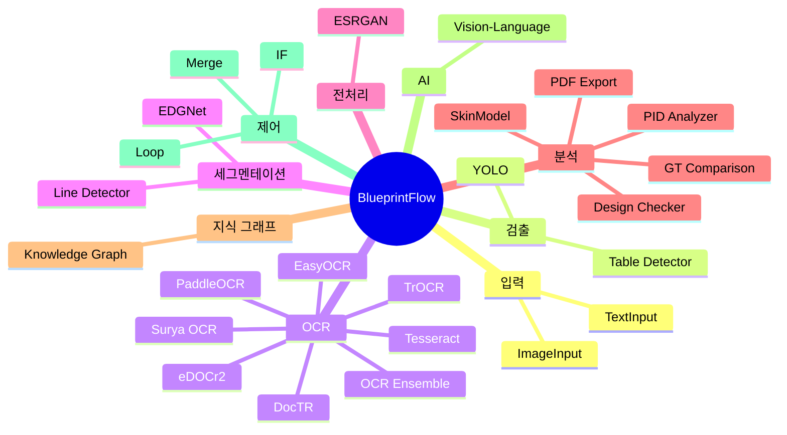
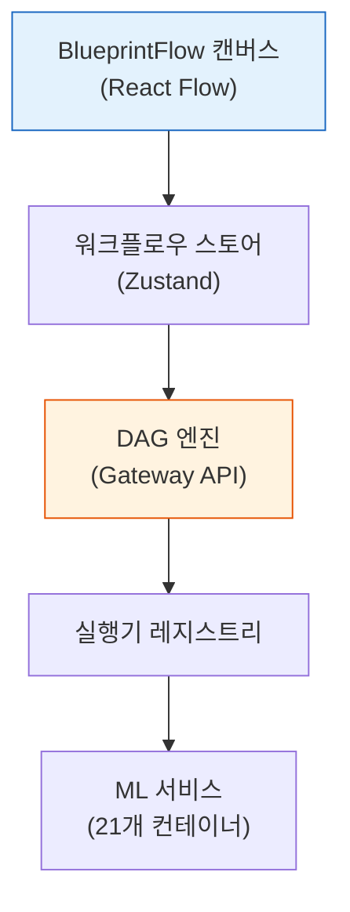

# BlueprintFlow

BlueprintFlow는 엔지니어가 캔버스 위에서 처리 노드를 연결하여 맞춤형 분석 파이프라인(Analysis Pipeline)을 구성할 수 있는 비주얼 워크플로우 빌더입니다. React Flow를 기반으로 구축되었으며, 검출(Detection), OCR, 분석(Analysis), 내보내기(Export) 단계를 방향성 비순환 그래프(DAG, Directed Acyclic Graph)로 조립할 수 있는 드래그 앤 드롭 인터페이스를 제공합니다.

## 주요 기능

- **29개 이상의 노드 타입**: 9개 카테고리로 구성
- **DAG 실행 엔진**: 위상 정렬(Topological Sort) 및 병렬 브랜치 실행
- **사전 구성 템플릿**: 일반적인 분석 워크플로우용
- **실시간 실행**: 노드별 진행 상태 추적
- **커스텀 API 통합**: 스캐폴딩 도구를 통한 확장

## 노드 카테고리

## 아키텍처

## 하위 페이지

| 페이지 | 설명 |
|--------|------|
| [노드 카탈로그](./node-catalog.md) | 29개 이상의 모든 노드 타입과 파라미터에 대한 전체 레퍼런스 |
| [DAG 엔진](./dag-engine.md) | 실행 엔진 내부 구조: 위상 정렬, 병렬 처리, 실행기 레지스트리 |
| [템플릿](./templates.md) | 일반적인 분석 시나리오를 위한 사전 구성 워크플로우 템플릿 |
| [커스텀 API](./custom-api.md) | 커스텀 API 노드 및 실행기 추가 가이드 |

## 빠른 시작

1. `http://localhost:5173/blueprintflow/builder`에서 **BlueprintFlow 빌더**로 이동합니다.
2. 사이드바에서 노드를 캔버스로 드래그합니다.
3. 출력을 입력에 연결하여 데이터 흐름을 정의합니다.
4. 속성 패널에서 노드 파라미터를 설정합니다.
5. **실행(Run)**을 클릭하여 워크플로우를 실행합니다.

## 프론트엔드 파일 위치

| 파일 | 용도 |
|------|------|
| `web-ui/src/pages/blueprintflow/BlueprintFlowBuilder.tsx` | 메인 빌더 페이지 |
| `web-ui/src/config/nodeDefinitions.ts` | 노드 타입 정의 (29개 이상의 노드, 70개 이상의 파라미터) |
| `web-ui/src/config/apiRegistry.ts` | API 엔드포인트 레지스트리 |
| `web-ui/src/store/workflowStore.ts` | 워크플로우 상태 관리 |
