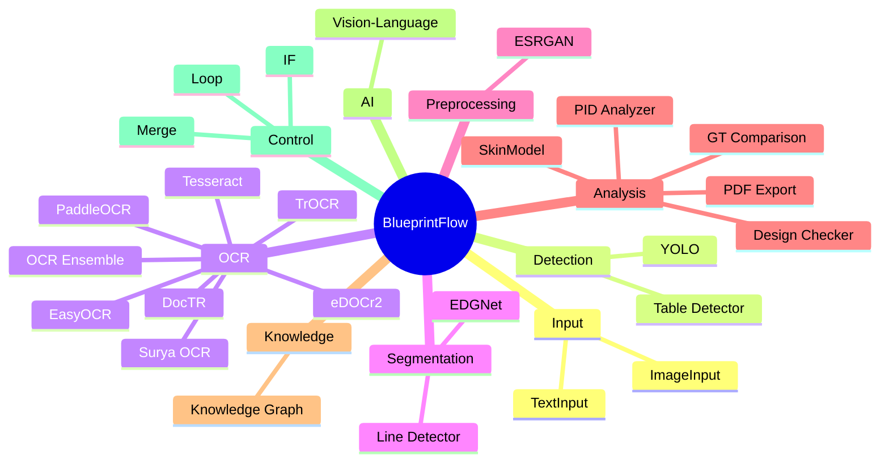
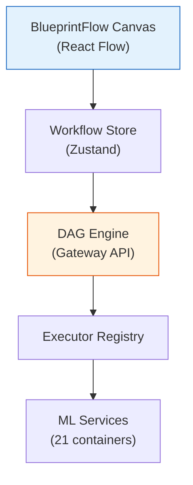

# BlueprintFlow

BlueprintFlow is a visual workflow builder that allows engineers to compose custom analysis pipelines by connecting processing nodes on a canvas. Built with React Flow, it provides a drag-and-drop interface for assembling detection, OCR, analysis, and export stages into a directed acyclic graph (DAG).

## Key Features

- **29+ Node Types** across 9 categories
- **DAG Execution Engine** with topological sort and parallel branch execution
- **Pre-built Templates** for common analysis workflows
- **Real-time Execution** with progress tracking per node
- **Custom API Integration** via scaffold tooling

## Node Categories

## Architecture

## Sub-pages

| Page | Description |
|------|-------------|
| [Node Catalog](./node-catalog.md) | Complete reference of all 29+ node types with parameters |
| [DAG Engine](./dag-engine.md) | Execution engine internals: topological sort, parallelism, executor registry |
| [Templates](./templates.md) | Pre-built workflow templates for common analysis scenarios |
| [Custom API](./custom-api.md) | Guide to adding custom API nodes and executors |

## Quick Start

1. Navigate to **BlueprintFlow Builder** at `http://localhost:5173/blueprintflow/builder`.
2. Drag nodes from the sidebar onto the canvas.
3. Connect outputs to inputs to define the data flow.
4. Configure node parameters in the properties panel.
5. Click **Run** to execute the workflow.

## Frontend Location

| File | Purpose |
|------|---------|
| `web-ui/src/pages/blueprintflow/BlueprintFlowBuilder.tsx` | Main builder page |
| `web-ui/src/config/nodeDefinitions.ts` | Node type definitions (29+ nodes, 70+ parameters) |
| `web-ui/src/config/apiRegistry.ts` | API endpoint registry |
| `web-ui/src/store/workflowStore.ts` | Workflow state management |
