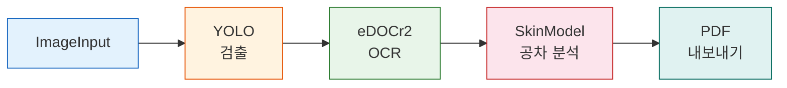
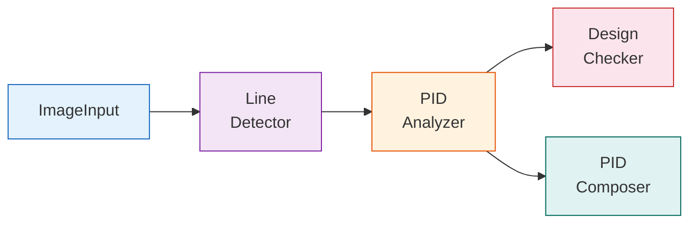
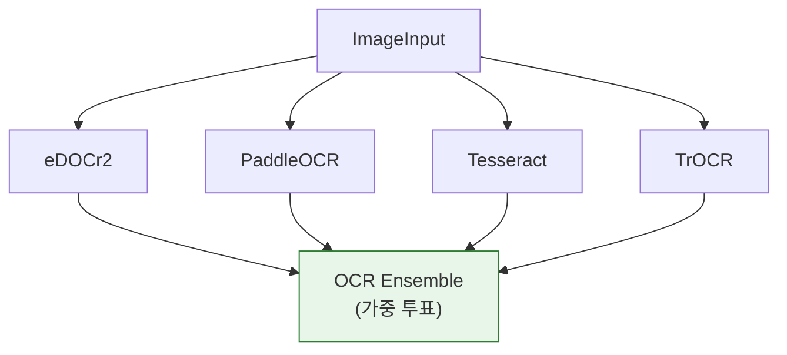
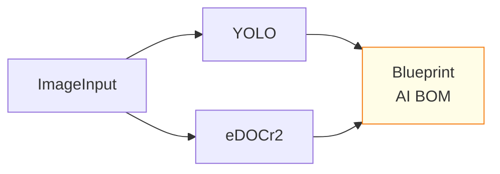

# 템플릿

BlueprintFlow에는 일반적인 분석 시나리오를 위한 사전 구성 워크플로우 템플릿이 포함되어 있습니다. 템플릿은 노드를 추가, 제거 또는 재설정하여 커스터마이징할 수 있는 시작점을 제공합니다.

## 제공 템플릿

| 템플릿 | 설명 | 사용 노드 |
|--------|------|----------|
| **표준 분석 (Standard Analysis)** | 기계 도면 전체 분석 파이프라인 | ImageInput, YOLO, eDOCr2, SkinModel, PDF Export |
| **P&ID 분석** | 배관 계장도(P&ID) 분석 | ImageInput, Line Detector, PID Analyzer, Design Checker, PID Composer |
| **OCR 비교** | 다중 엔진 OCR + 앙상블 투표 방식 | ImageInput, eDOCr2, PaddleOCR, Tesseract, TrOCR, OCR Ensemble |
| **BOM 생성** | 자재 명세서(BOM) 추출 및 검증 | ImageInput, YOLO, eDOCr2, Blueprint AI BOM |
| **리비전 비교 (Revision Diff)** | 두 도면 리비전 비교 | ImageInput (x2), YOLO (x2), eDOCr2 (x2), GT Comparison |

## 표준 분석 (Standard Analysis)

가장 일반적으로 사용되는 템플릿입니다. 기계 도면의 엔드투엔드(End-to-End) 분석을 수행합니다.



**기본 파라미터:**

| 노드 | 파라미터 | 값 |
|------|----------|-----|
| YOLO | `confidence` | `0.4` |
| YOLO | `use_sahi` | `true` |
| eDOCr2 | `extract_dimensions` | `true` |
| eDOCr2 | `extract_gdt` | `true` |
| SkinModel | `material_type` | `"steel"` |
| SkinModel | `manufacturing_process` | `"milling"` |

## P&ID 분석

배관 계장도(Piping and Instrumentation Diagram) 전용 템플릿입니다.



## OCR 비교

4개의 OCR 엔진을 병렬로 실행하고 앙상블(Ensemble) 투표 메커니즘을 통해 결과를 비교합니다.



## BOM 생성

도면에서 부품 및 치수를 추출하여 자재 명세서(Bill of Materials)를 생성합니다.



**BOM 기능:**

| 기능 | 설명 |
|------|------|
| `verification` | 추출된 데이터의 에이전트 지원 검증 |
| `gt_comparison` | 정확도를 위한 정답 데이터(Ground Truth) 비교 |
| `bom_generation` | 구조화된 BOM 테이블 생성 |
| `dimension_extraction` | 치수 및 공차 추출 |

## 템플릿 구조

템플릿은 노드, 엣지, 기본 파라미터 값을 포함하는 JSON 워크플로우 설정으로 정의됩니다:

```json
{
  "name": "Standard Analysis",
  "description": "Full mechanical drawing analysis pipeline",
  "nodes": [
    {
      "id": "input-1",
      "type": "imageInput",
      "position": { "x": 0, "y": 200 },
      "data": {}
    },
    {
      "id": "yolo-1",
      "type": "yolo",
      "position": { "x": 300, "y": 200 },
      "data": {
        "confidence": 0.4,
        "use_sahi": true
      }
    }
  ],
  "edges": [
    {
      "source": "input-1",
      "target": "yolo-1"
    }
  ]
}
```

## 템플릿 커스터마이징

1. 사이드바의 **템플릿** 패널에서 템플릿을 불러옵니다.
2. 사전 연결된 노드가 캔버스에 배치됩니다.
3. 선택한 노드의 **속성** 패널에서 파라미터를 수정합니다.
4. 특정 사용 사례에 맞게 노드를 추가하거나 제거합니다.
5. 향후 재사용을 위해 커스터마이징된 워크플로우를 저장합니다.

## 참고 사항

- 템플릿 파라미터는 `gateway-api/api_specs/*.yaml`에서 검증된 기본값을 사용합니다. API 스펙에 정의된 파라미터만 포함됩니다.
- 템플릿은 JSON 파일로 내보내어 팀원 간에 공유할 수 있습니다.
- YOLO의 기본 신뢰도(confidence) 값 **0.4**는 기계 도면에 최적화되어 의도적으로 설정된 값입니다.
