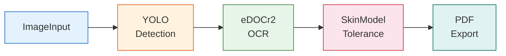
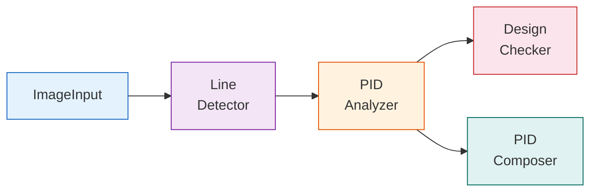
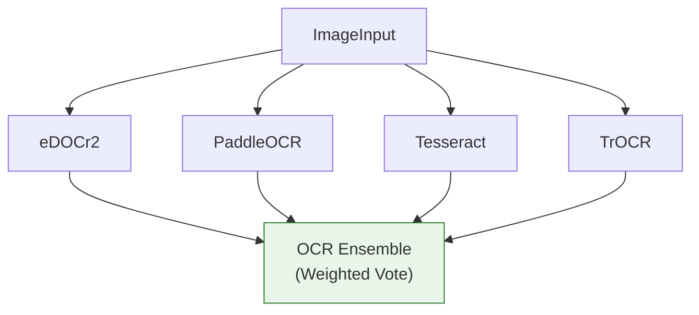
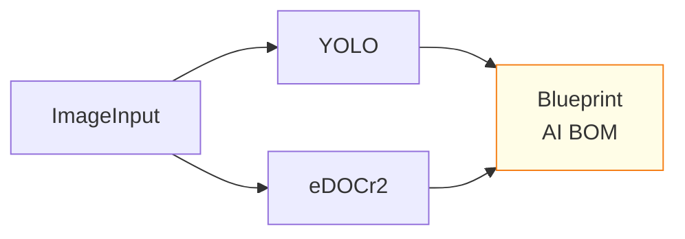

# Templates

BlueprintFlow includes pre-built workflow templates for common analysis scenarios. Templates provide a starting point that can be customized by adding, removing, or reconfiguring nodes.

## Available Templates

| Template | Description | Nodes Used |
|----------|-------------|------------|
| **Standard Analysis** | Full mechanical drawing analysis pipeline | ImageInput, YOLO, eDOCr2, SkinModel, PDF Export |
| **P&ID Analysis** | Piping and Instrumentation Diagram analysis | ImageInput, Line Detector, PID Analyzer, Design Checker, PID Composer |
| **OCR Comparison** | Multi-engine OCR with ensemble voting | ImageInput, eDOCr2, PaddleOCR, Tesseract, TrOCR, OCR Ensemble |
| **BOM Generation** | Bill of Materials extraction and verification | ImageInput, YOLO, eDOCr2, Blueprint AI BOM |
| **Revision Diff** | Compare two drawing revisions | ImageInput (x2), YOLO (x2), eDOCr2 (x2), GT Comparison |

## Standard Analysis

The most commonly used template. Performs end-to-end analysis of a mechanical engineering drawing.



**Default Parameters:**

| Node | Parameter | Value |
|------|-----------|-------|
| YOLO | `confidence` | `0.4` |
| YOLO | `use_sahi` | `true` |
| eDOCr2 | `extract_dimensions` | `true` |
| eDOCr2 | `extract_gdt` | `true` |
| SkinModel | `material_type` | `"steel"` |
| SkinModel | `manufacturing_process` | `"milling"` |

## P&ID Analysis

Specialized template for Piping and Instrumentation Diagrams.



## OCR Comparison

Runs four OCR engines in parallel and compares results through the Ensemble voting mechanism.



## BOM Generation

Extracts components and dimensions from drawings to generate a Bill of Materials.



**BOM Features:**

| Feature | Description |
|---------|-------------|
| `verification` | Agent-assisted verification of extracted data |
| `gt_comparison` | Ground truth comparison for accuracy |
| `bom_generation` | Structured BOM table creation |
| `dimension_extraction` | Dimension and tolerance extraction |

## Template Structure

Templates are defined as JSON workflow configurations containing nodes, edges, and default parameter values:

```json
{
  "name": "Standard Analysis",
  "description": "Full mechanical drawing analysis pipeline",
  "nodes": [
    {
      "id": "input-1",
      "type": "imageInput",
      "position": { "x": 0, "y": 200 },
      "data": {}
    },
    {
      "id": "yolo-1",
      "type": "yolo",
      "position": { "x": 300, "y": 200 },
      "data": {
        "confidence": 0.4,
        "use_sahi": true
      }
    }
  ],
  "edges": [
    {
      "source": "input-1",
      "target": "yolo-1"
    }
  ]
}
```

## Customizing Templates

1. Load a template from the **Templates** panel in the sidebar.
2. The template populates the canvas with pre-connected nodes.
3. Modify parameters in the **Properties** panel for any selected node.
4. Add or remove nodes as needed for your specific use case.
5. Save the customized workflow for future reuse.

## Notes

- Template parameters use validated defaults from `gateway-api/api_specs/*.yaml`. Only parameters defined in the API specification are included.
- Templates can be exported and shared as JSON files between team members.
- The YOLO confidence default of **0.4** is intentional and tuned for engineering drawings.
