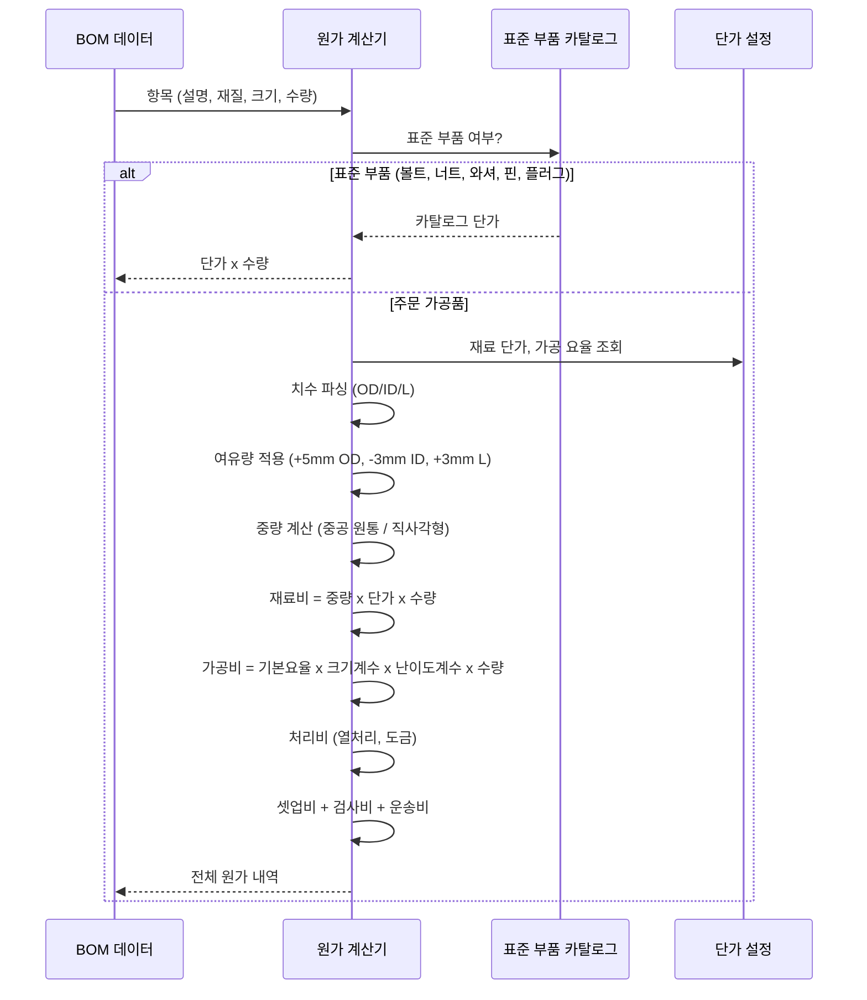

# 견적 엔진 (Pricing Engine)

견적 엔진은 재료 중량, 가공 복잡도, 열처리 및 수량을 기반으로 각 BOM 항목의 제조 원가를 계산합니다. 치수 기반으로 계산되는 주문 가공품과 카탈로그 기반의 표준 부품(볼트, 너트, 와셔)을 모두 지원합니다.

## 원가 계산 흐름



## 재료 단가 데이터베이스

재료 단가는 `pricing_config.json`에 kg당 가격으로 저장되어 있습니다:

| 재질 | 코드 | 단가 (KRW/kg) | 밀도 (g/cm3) |
|------|------|-------------:|-------------|
| SS400 (KS) | SS400 | 1,500 | 7.85 |
| S45C | S45C | 2,200 | 7.85 |
| SCM440 | SCM440 | 3,500 | 7.85 |
| SUS304 | SUS304 | 8,000 | 7.93 |
| SUS316 | SUS316 | 12,000 | 7.98 |
| SNCM439 | SNCM439 | 4,500 | 7.85 |
| Babbitt | BABBITT | 25,000 | 7.27 |
| 기본값 | -- | 1,500 | 7.85 |

재질 매칭은 부분 매칭 및 접미사 제거를 지원합니다 (예: `SCM440+QT`는 `SCM440`에 매칭).

## 수량 기반 할인 단계

수량 할인은 재료비에 적용됩니다:

| 수량 범위 | 할인율 |
|----------|--------|
| 1 - 9 | 0% |
| 10 - 49 | 5% |
| 50 - 99 | 10% |
| 100+ | 15% |

## 가공 공정 계수

### 크기 계수

부품 중량에 따라 기본 가공 요율에 크기 계수가 적용됩니다:

| 중량 범위 | 크기 계수 |
|----------|----------|
| < 1 kg | 0.3x |
| 1 - 10 kg | 0.5x |
| 10 - 50 kg | 1.0x |
| 50 - 200 kg | 1.5x |
| > 200 kg | 2.0x |

### 난이도 계수

난이도 계수는 부품 설명, 재질 및 치수로부터 산출됩니다:

| 키워드 | 추가 계수 |
|--------|----------|
| Keyway / Key Way | +0.3 |
| Groove | +0.2 |
| Thread / Tapping | +0.2 |
| Grinding | +0.3 |
| Lapping | +0.4 |
| Boring | +0.2 |
| Slot | +0.15 |
| Hole | +0.1 |
| Chamfer | +0.05 |
| Assembly (ASSY) | +0.15 |

**재질 난이도**:

| 재질 유형 | 추가 계수 |
|----------|----------|
| SUS / 스테인리스 | +0.3 |
| SCM / SNCM | +0.15 |
| Babbitt | +0.2 |

**치수 난이도**:

| 조건 | 추가 계수 |
|------|----------|
| 벽 두께 비율 > 0.85 (극박벽) | +0.4 |
| 벽 두께 비율 > 0.75 (박벽) | +0.2 |
| OD > 800mm (대형 부품) | +0.15 |

최대 난이도 계수는 3.0x로 제한됩니다.

## 원가 계산 수식

주문 가공품의 경우:

```
Weight = pi/4 * ((OD/10)^2 - (ID/10)^2) * (L/10) * density / 1000  [kg]

Material Cost = Weight * Unit_Price * Quantity * (1 - Qty_Discount/100) * (1 + Scrap_Rate/100)
Machining Cost = Base_Rate * Size_Factor * Difficulty_Factor * Quantity
Treatment Cost = SUM(Treatment_Rate * Weight * Quantity)  [각 처리별]
Setup Cost = Fixed_Amount  [수량이 임계값 이하인 경우]
Inspection Cost = Base_Subtotal * Inspection_Rate/100
Transport Cost = Weight * Quantity * Transport_Per_Kg

Subtotal = Material_Cost * (1 + Material_Margin/100)
         + Machining_Cost * (1 + Labor_Margin/100)
         + Treatment_Cost
         + Setup_Cost
         + Inspection_Cost
         + Transport_Cost
```

직사각형/판재 부품의 경우:

```
Weight = (L/10) * (W/10) * (T/10) * density / 1000  [kg]
```

## 여유량 규칙

원자재 치수에는 완성 치수에 대한 가공 여유량이 포함됩니다:

| 치수 | 여유량 | 방향 |
|------|--------|------|
| OD (외경) | +5 mm | 과대 |
| ID (내경) | -3 mm | 과소 |
| 길이 | +3 mm | 과대 |
| 직사각형 (각 변) | +3 mm | 과대 |

features 목록에 `"no_material_allowance"`를 전달하면 여유량 적용을 비활성화할 수 있습니다.

## 열처리 및 표면 처리

처리 방법은 부품 설명과 재질 사양에서 자동으로 감지됩니다:

| 처리 | 요율 (KRW/kg) |
|------|-------------:|
| 담금질 + 뜨임 (QT) | 800 |
| 뜨임 (Tempering) | 500 |
| 노멀라이징 (Normalizing) | 400 |
| 침탄 (Carburizing) | 1,200 |
| 질화 (Nitriding) | 1,500 |
| 고주파 열처리 (Induction Hardening) | 1,000 |
| 크롬 도금 (Chrome Plating) | 2,000 |
| 경질 크롬 도금 (Hard Chrome Plating) | 2,500 |
| 용사 (Thermal Spray) | 3,000 |
| 배빗 라이닝 (Babbitt Lining) | 5,000 |

## 표준 부품 카탈로그

표준 체결류 및 피팅은 치수 기반 계산 대신 카탈로그 데이터베이스에서 단가를 조회합니다:

### 지원 부품 유형

| 부품 유형 | 규격 패턴 예시 | 단가 산출 방법 |
|----------|--------------|--------------|
| **볼트** | M24x120L, M16x80 | base_price + per_mm x 길이 |
| **너트** | M16x1.5p, M24 | 직경별 base_price |
| **와셔** | NL16SS, 12x22x... | 직경별 base_price |
| **핀** | D24x57L, D10 | base_price + per_mm x 길이 |
| **플러그** | 0.25"NPT, 1/4"NPT | NPT 규격별 base_price |
| **클립** | Wire Clip | base_price |

### 규격 파싱

견적 엔진은 다양한 규격 표기를 파싱합니다:

```
Bolts:    M24X120L  -> diameter=24mm, length=120mm
Nuts:     M16x1.5p  -> diameter=16mm, pitch=1.5mm
Washers:  NL16SS    -> diameter=16mm, material=stainless
Pins:     D24x57L   -> diameter=24mm, length=57mm
Plugs:    0.25"NPT  -> diameter=10.3mm (NPT 공칭)
```

## BOM 데이터로부터의 치수 추출

견적 엔진은 다음 우선순위에 따라 여러 소스에서 치수를 추출합니다:

1. **BOM 데이터 치수 필드**: 치수 분석에서 얻은 명시적 OD/ID/Length 값
2. **메타데이터 크기 필드**: `OD670XID440X29.5T` 같은 문자열에서 파싱
3. **설명 필드**: `BEARING ASSY(360X190)` 같은 패턴에서 추출
4. **중량 추정 폴백**: 치수 데이터가 없을 때 부품명 기반 중량 조회

### 중량 추정 (폴백)

치수 데이터가 없을 때 엔진은 부품명 기반의 추정 중량을 사용합니다:

| 부품명 | 추정 중량 (kg) |
|--------|-------------:|
| Bearing Casing | 80.0 |
| Bearing Assembly | 120.0 |
| Housing | 100.0 |
| Thrust Casing | 60.0 |
| Bearing Ring | 25.0 |
| Thrust Pad | 8.0 |
| Liner Pad | 5.0 |
| Shaft | 50.0 |
| Cover | 5.0 |
| Shim | 0.5 |
| Bolt | 0.3 |
| Nut | 0.1 |
| Washer | 0.05 |

## 원가 출처 추적

각 원가 내역에는 계산 출처가 태깅됩니다:

| 출처 | 설명 |
|------|------|
| `calculated` | 추출된 치수를 기반으로 한 완전 계산 |
| `estimated` | 부품명에서 추정한 중량 (치수 없음) |
| `standard_catalog` | 표준 부품 카탈로그 단가 조회 |
| `none` | 원가 데이터 없음 |
