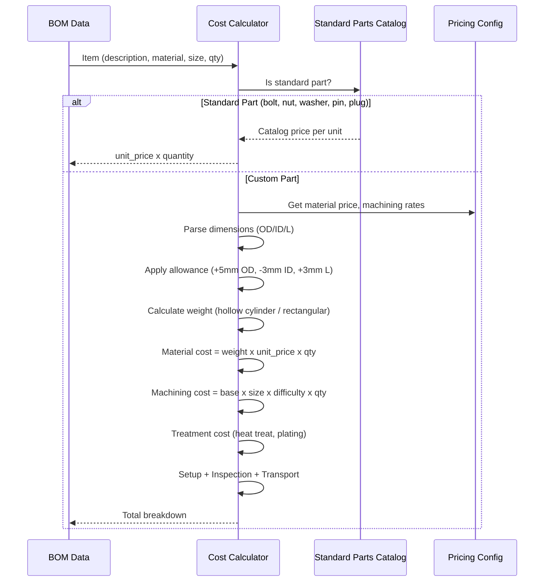

# Pricing Engine

The Pricing Engine calculates manufacturing costs for each BOM item based on material weight, machining complexity, heat treatment, and quantity. It supports both custom-machined parts (calculated from dimensions) and standard catalog parts (bolts, nuts, washers).

## Cost Calculation Flow



## Material Cost Database

Material prices are stored in `pricing_config.json` with per-kilogram pricing:

| Material | Code | Unit Price (KRW/kg) | Density (g/cm3) |
|----------|------|--------------------:|-----------------|
| SS400 (KS) | SS400 | 1,500 | 7.85 |
| S45C | S45C | 2,200 | 7.85 |
| SCM440 | SCM440 | 3,500 | 7.85 |
| SUS304 | SUS304 | 8,000 | 7.93 |
| SUS316 | SUS316 | 12,000 | 7.98 |
| SNCM439 | SNCM439 | 4,500 | 7.85 |
| Babbitt | BABBITT | 25,000 | 7.27 |
| DEFAULT | -- | 1,500 | 7.85 |

Material matching supports partial matching and suffix stripping (e.g., `SCM440+QT` matches `SCM440`).

## Quantity-Based Pricing Tiers

Quantity discounts are applied to material costs:

| Quantity Range | Discount |
|---------------|----------|
| 1 - 9 | 0% |
| 10 - 49 | 5% |
| 50 - 99 | 10% |
| 100+ | 15% |

## Manufacturing Process Multipliers

### Size Factor

Based on part weight, a size factor is applied to the base machining rate:

| Weight Range | Size Factor |
|-------------|------------|
| < 1 kg | 0.3x |
| 1 - 10 kg | 0.5x |
| 10 - 50 kg | 1.0x |
| 50 - 200 kg | 1.5x |
| > 200 kg | 2.0x |

### Difficulty Factor

The difficulty factor is calculated from part description, material, and dimensions:

| Keyword | Additional Factor |
|---------|-----------------|
| Keyway / Key Way | +0.3 |
| Groove | +0.2 |
| Thread / Tapping | +0.2 |
| Grinding | +0.3 |
| Lapping | +0.4 |
| Boring | +0.2 |
| Slot | +0.15 |
| Hole | +0.1 |
| Chamfer | +0.05 |
| Assembly (ASSY) | +0.15 |

**Material difficulty**:

| Material Type | Additional Factor |
|--------------|-----------------|
| SUS / Stainless | +0.3 |
| SCM / SNCM | +0.15 |
| Babbitt | +0.2 |

**Dimensional difficulty**:

| Condition | Additional Factor |
|-----------|-----------------|
| Wall ratio > 0.85 (very thin wall) | +0.4 |
| Wall ratio > 0.75 (thin wall) | +0.2 |
| OD > 800mm (large part) | +0.15 |

Maximum difficulty factor is capped at 3.0x.

## Cost Calculation Formula

For custom-machined parts:

```
Weight = pi/4 * ((OD/10)^2 - (ID/10)^2) * (L/10) * density / 1000  [kg]

Material Cost = Weight * Unit_Price * Quantity * (1 - Qty_Discount/100) * (1 + Scrap_Rate/100)
Machining Cost = Base_Rate * Size_Factor * Difficulty_Factor * Quantity
Treatment Cost = SUM(Treatment_Rate * Weight * Quantity)  [for each treatment]
Setup Cost = Fixed_Amount  [if quantity <= threshold]
Inspection Cost = Base_Subtotal * Inspection_Rate/100
Transport Cost = Weight * Quantity * Transport_Per_Kg

Subtotal = Material_Cost * (1 + Material_Margin/100)
         + Machining_Cost * (1 + Labor_Margin/100)
         + Treatment_Cost
         + Setup_Cost
         + Inspection_Cost
         + Transport_Cost
```

For rectangular/plate parts:

```
Weight = (L/10) * (W/10) * (T/10) * density / 1000  [kg]
```

## Allowance Rules

Raw material dimensions include machining allowance added to finished dimensions:

| Dimension | Allowance | Direction |
|-----------|-----------|-----------|
| OD (outer diameter) | +5 mm | Oversized |
| ID (inner diameter) | -3 mm | Undersized |
| Length | +3 mm | Oversized |
| Rectangular (each edge) | +3 mm | Oversized |

The allowance can be disabled by passing `"no_material_allowance"` in the features list.

## Heat Treatment and Surface Treatment

Treatments are automatically detected from part description and material specification:

| Treatment | Rate (KRW/kg) |
|-----------|-------------:|
| Quenching + Tempering (QT) | 800 |
| Tempering | 500 |
| Normalizing | 400 |
| Carburizing | 1,200 |
| Nitriding | 1,500 |
| Induction Hardening | 1,000 |
| Chrome Plating | 2,000 |
| Hard Chrome Plating | 2,500 |
| Thermal Spray | 3,000 |
| Babbitt Lining | 5,000 |

## Standard Parts Catalog

Standard fasteners and fittings are priced from a catalog database rather than calculated from dimensions:

### Supported Part Types

| Part Type | Size Pattern Examples | Pricing Method |
|-----------|----------------------|---------------|
| **Bolt** | M24x120L, M16x80 | base_price + per_mm x length |
| **Nut** | M16x1.5p, M24 | base_price by diameter |
| **Washer** | NL16SS, 12x22x... | base_price by diameter |
| **Pin** | D24x57L, D10 | base_price + per_mm x length |
| **Plug** | 0.25"NPT, 1/4"NPT | base_price by NPT size |
| **Clip** | Wire Clip | base_price |

### Size Parsing

The engine parses various size notations:

```
Bolts:    M24X120L  -> diameter=24mm, length=120mm
Nuts:     M16x1.5p  -> diameter=16mm, pitch=1.5mm
Washers:  NL16SS    -> diameter=16mm, material=stainless
Pins:     D24x57L   -> diameter=24mm, length=57mm
Plugs:    0.25"NPT  -> diameter=10.3mm (NPT nominal)
```

## Dimension Extraction from BOM Data

The engine extracts dimensions from multiple sources in order of priority:

1. **BOM data dimensions field**: Explicit OD/ID/Length values from dimension analysis
2. **Metadata size field**: Parsed from strings like `OD670XID440X29.5T`
3. **Description field**: Extracted from patterns like `BEARING ASSY(360X190)`
4. **Weight estimate fallback**: Part-name-based weight lookup when no dimensions available

### Weight Estimates (Fallback)

When no dimensional data is available, the engine uses part-name-based estimates:

| Part Name | Estimated Weight (kg) |
|-----------|---------------------:|
| Bearing Casing | 80.0 |
| Bearing Assembly | 120.0 |
| Housing | 100.0 |
| Thrust Casing | 60.0 |
| Bearing Ring | 25.0 |
| Thrust Pad | 8.0 |
| Liner Pad | 5.0 |
| Shaft | 50.0 |
| Cover | 5.0 |
| Shim | 0.5 |
| Bolt | 0.3 |
| Nut | 0.1 |
| Washer | 0.05 |

## Cost Source Tracking

Each cost breakdown is tagged with its calculation source:

| Source | Description |
|--------|-------------|
| `calculated` | Full calculation from extracted dimensions |
| `estimated` | Weight estimated from part name (no dimensions) |
| `standard_catalog` | Standard part catalog price lookup |
| `none` | No cost data available |
