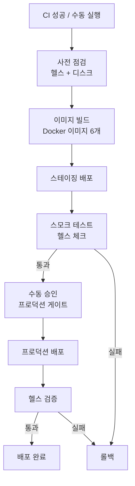

# CD 파이프라인

## 워크플로우



## 트리거

```yaml
on:
  workflow_run:
    workflows: ["CI"]
    types: [completed]
    branches: [main]
  workflow_dispatch:  # 수동 트리거
```

## 배포 단계

### 1. 사전 점검(Pre-check)

- 현재 서비스 건강 상태 확인
- 디스크 공간 확인
- Docker 데몬 상태 확인

### 2. 이미지 빌드(Build Images)

6개 핵심 이미지 빌드:

| 이미지 | 소스 경로 |
|--------|----------|
| `gateway-api` | `gateway-api/` |
| `web-ui` | `web-ui/` |
| `blueprint-ai-bom-backend` | `blueprint-ai-bom/backend/` |
| `blueprint-ai-bom-frontend` | `blueprint-ai-bom/frontend/` |
| `yolo-api` | `models/yolo-api/` |
| `edocr2-v2-api` | `models/edocr2-v2-api/` |

### 3. 스테이징 배포(Staging Deploy)

- 스테이징 환경에 새 이미지 배포
- 5분 안정화 대기

### 4. 스모크 테스트(Smoke Tests)

```bash
# 모든 서비스 헬스 체크
curl -s http://staging:8000/api/v1/health
curl -s http://staging:5020/health
# ... 전체 포트
```

### 5. 프로덕션 배포 (수동 승인 필요)

- GitHub Environment 보호 규칙 적용
- 승인 후 프로덕션 배포 시작

### 6. 롤백(Rollback)

실패 시 이전 버전으로 자동 롤백:

```bash
docker-compose pull  # 이전 태그 이미지
docker-compose up -d
```

## 환경 변수

| 변수 | 설명 |
|------|------|
| `DEPLOY_ENV` | 스테이징 / 프로덕션 |
| `IMAGE_TAG` | Docker 이미지 태그 (git SHA) |
| `ROLLBACK_TAG` | 이전 안정 태그 |
