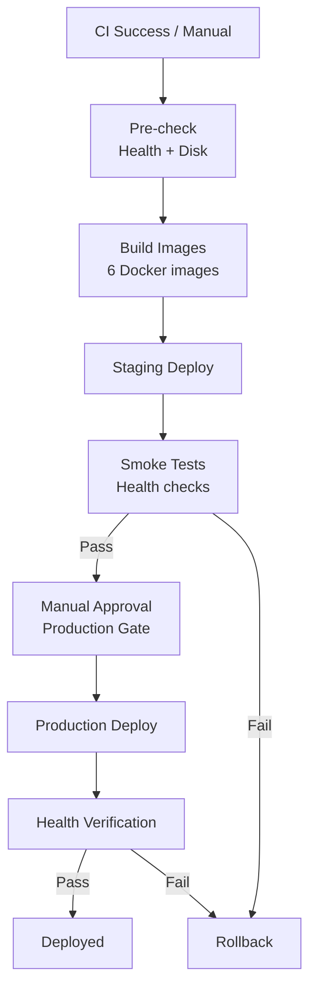

# CD Pipeline

## Workflow



## Trigger

```yaml
on:
  workflow_run:
    workflows: ["CI"]
    types: [completed]
    branches: [main]
  workflow_dispatch:  # Manual trigger
```

## Deployment Stages

### 1. Pre-check

- 현재 서비스 건강 상태 확인
- 디스크 공간 확인
- Docker daemon 상태 확인

### 2. Build Images

6개 핵심 이미지 빌드:

| Image | Source |
|-------|--------|
| `gateway-api` | `gateway-api/` |
| `web-ui` | `web-ui/` |
| `blueprint-ai-bom-backend` | `blueprint-ai-bom/backend/` |
| `blueprint-ai-bom-frontend` | `blueprint-ai-bom/frontend/` |
| `yolo-api` | `models/yolo-api/` |
| `edocr2-v2-api` | `models/edocr2-v2-api/` |

### 3. Staging Deploy

- Staging 환경에 새 이미지 배포
- 5분 안정화 대기

### 4. Smoke Tests

```bash
# Health check all services
curl -s http://staging:8000/api/v1/health
curl -s http://staging:5020/health
# ... all ports
```

### 5. Production Deploy (Manual Approval)

- GitHub Environment protection rule
- 승인 후 프로덕션 배포 시작

### 6. Rollback

실패 시 이전 버전으로 자동 롤백:

```bash
docker-compose pull  # Previous tagged images
docker-compose up -d
```

## Environment Variables

| Variable | Description |
|----------|-------------|
| `DEPLOY_ENV` | staging / production |
| `IMAGE_TAG` | Docker image tag (git SHA) |
| `ROLLBACK_TAG` | Previous stable tag |
