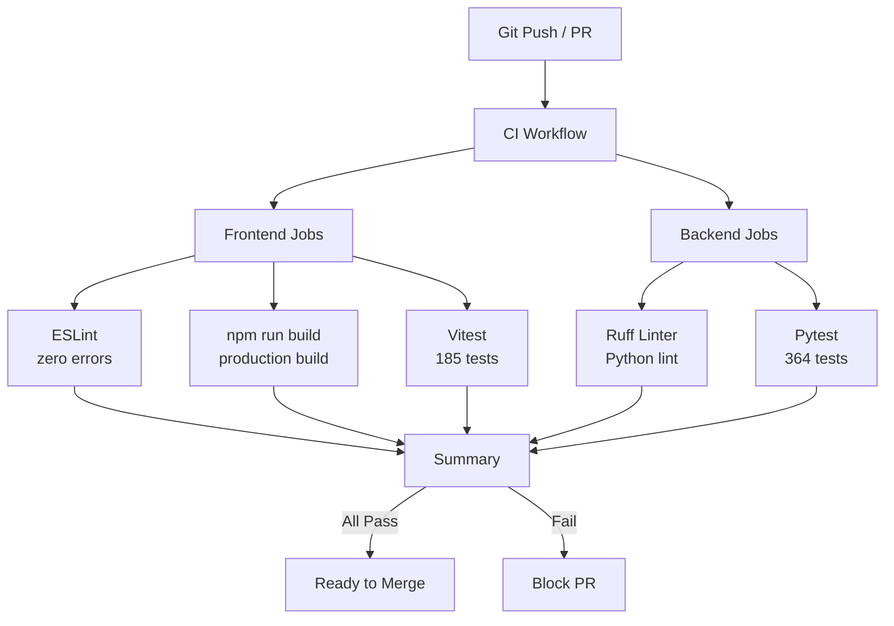

# CI Pipeline

## Workflow



## Trigger

```yaml
on:
  push:
    branches: [main, develop]
  pull_request:
    branches: [main, develop]
```

## Jobs

### Frontend

| Step | Command | Duration |
|------|---------|----------|
| Install | `npm ci` | ~30s |
| Lint | `npm run lint` | ~10s |
| Build | `npm run build` | ~30s |
| Test | `npm run test:run` | ~15s |

### Backend

| Step | Command | Duration |
|------|---------|----------|
| Install | `pip install -r requirements.txt` | ~30s |
| Lint | `ruff check .` | ~5s |
| Test | `pytest tests/ -v` | ~60s |

## Test Summary

| Suite | Tests | Framework |
|-------|-------|-----------|
| Frontend (web-ui) | 185 | Vitest |
| Backend (gateway-api) | 364 | Pytest |
| **Total** | **549** | - |

## Quality Gates

| Gate | Criteria | Status |
|------|----------|--------|
| TypeScript Build | 0 errors | Required |
| ESLint | 0 errors | Required |
| Frontend Tests | All pass | Required |
| Ruff | 0 errors | Required |
| Backend Tests | All pass | Required |
