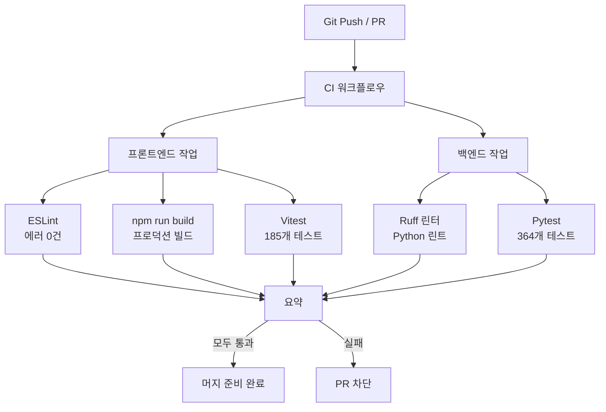

# CI 파이프라인

## 워크플로우



## 트리거

```yaml
on:
  push:
    branches: [main, develop]
  pull_request:
    branches: [main, develop]
```

## 작업(Jobs)

### 프론트엔드

| 단계 | 명령어 | 소요 시간 |
|------|--------|----------|
| 설치 | `npm ci` | ~30초 |
| 린트 | `npm run lint` | ~10초 |
| 빌드 | `npm run build` | ~30초 |
| 테스트 | `npm run test:run` | ~15초 |

### 백엔드

| 단계 | 명령어 | 소요 시간 |
|------|--------|----------|
| 설치 | `pip install -r requirements.txt` | ~30초 |
| 린트 | `ruff check .` | ~5초 |
| 테스트 | `pytest tests/ -v` | ~60초 |

## 테스트 요약

| 테스트 스위트 | 테스트 수 | 프레임워크 |
|--------------|----------|-----------|
| 프론트엔드 (web-ui) | 185 | Vitest |
| 백엔드 (gateway-api) | 364 | Pytest |
| **합계** | **549** | - |

## 품질 게이트(Quality Gates)

| 게이트 | 기준 | 상태 |
|--------|------|------|
| TypeScript 빌드 | 에러 0건 | 필수 |
| ESLint | 에러 0건 | 필수 |
| 프론트엔드 테스트 | 전체 통과 | 필수 |
| Ruff | 에러 0건 | 필수 |
| 백엔드 테스트 | 전체 통과 | 필수 |
