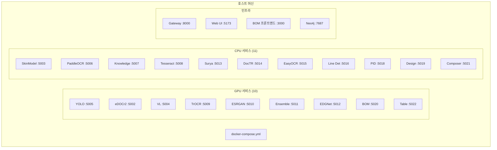

# Docker Compose

## 서비스 아키텍처



## 컨테이너 설정

### GPU 서비스 예시

```yaml
yolo-api:
  build: ./models/yolo-api
  container_name: yolo-api
  ports:
    - "5005:5005"
  volumes:
    - ./models/yolo-api/weights:/app/weights
  deploy:
    resources:
      reservations:
        devices:
          - driver: nvidia
            count: 1
            capabilities: [gpu]
  networks:
    - ax_poc_network
```

### CPU 서비스 예시

```yaml
paddleocr-api:
  build: ./models/paddleocr-api
  container_name: paddleocr-api
  ports:
    - "5006:5006"
  networks:
    - ax_poc_network
```

## 네트워크

```yaml
networks:
  ax_poc_network:
    driver: bridge
```

모든 서비스는 `ax_poc_network` 브리지 네트워크를 공유합니다.

## 볼륨

| 볼륨 | 용도 |
|------|------|
| `./models/*/weights` | ML 모델 가중치 |
| `./data/` | 공유 데이터 디렉토리 |
| `neo4j_data` | Neo4j 데이터베이스 |

## 명령어

```bash
# 모든 서비스 시작
docker-compose up -d

# 특정 서비스 시작
docker-compose up -d yolo-api

# 로그 확인
docker logs yolo-api -f

# 서비스 재빌드
docker-compose build --no-cache yolo-api
docker-compose up -d yolo-api

# 전체 헬스 체크
for port in 5002 5003 5004 5005 5006 5007 5008 5009 5010 5011 5012 5013 5014 5015 5016 5018 5019 5020 5021 5022; do
  echo "Port $port: $(curl -s http://localhost:$port/health | jq -r .status)"
done
```

## 오버라이드 파일

`docker-compose.override.yml`로 로컬 개발 환경을 커스터마이징할 수 있습니다:

```yaml
# docker-compose.override.yml (커밋 대상 아님)
services:
  yolo-api:
    deploy:
      resources:
        reservations:
          devices:
            - driver: nvidia
              device_ids: ['0']
              capabilities: [gpu]
```
