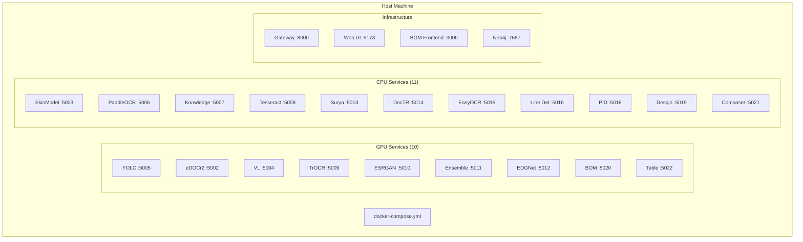

# Docker Compose

## Service Architecture



## Container Configuration

### GPU Service Example

```yaml
yolo-api:
  build: ./models/yolo-api
  container_name: yolo-api
  ports:
    - "5005:5005"
  volumes:
    - ./models/yolo-api/weights:/app/weights
  deploy:
    resources:
      reservations:
        devices:
          - driver: nvidia
            count: 1
            capabilities: [gpu]
  networks:
    - ax_poc_network
```

### CPU Service Example

```yaml
paddleocr-api:
  build: ./models/paddleocr-api
  container_name: paddleocr-api
  ports:
    - "5006:5006"
  networks:
    - ax_poc_network
```

## Network

```yaml
networks:
  ax_poc_network:
    driver: bridge
```

All services share the `ax_poc_network` bridge network.

## Volumes

| Volume | Purpose |
|--------|---------|
| `./models/*/weights` | ML model weights |
| `./data/` | Shared data directory |
| `neo4j_data` | Neo4j database |

## Commands

```bash
# Start all services
docker-compose up -d

# Start specific service
docker-compose up -d yolo-api

# View logs
docker logs yolo-api -f

# Rebuild service
docker-compose build --no-cache yolo-api
docker-compose up -d yolo-api

# Health check all
for port in 5002 5003 5004 5005 5006 5007 5008 5009 5010 5011 5012 5013 5014 5015 5016 5018 5019 5020 5021 5022; do
  echo "Port $port: $(curl -s http://localhost:$port/health | jq -r .status)"
done
```

## Override File

`docker-compose.override.yml`로 로컬 개발 환경을 커스터마이징:

```yaml
# docker-compose.override.yml (not committed)
services:
  yolo-api:
    deploy:
      resources:
        reservations:
          devices:
            - driver: nvidia
              device_ids: ['0']
              capabilities: [gpu]
```
